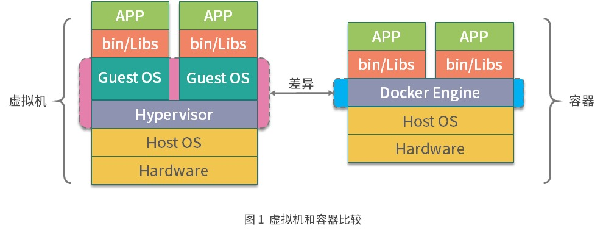
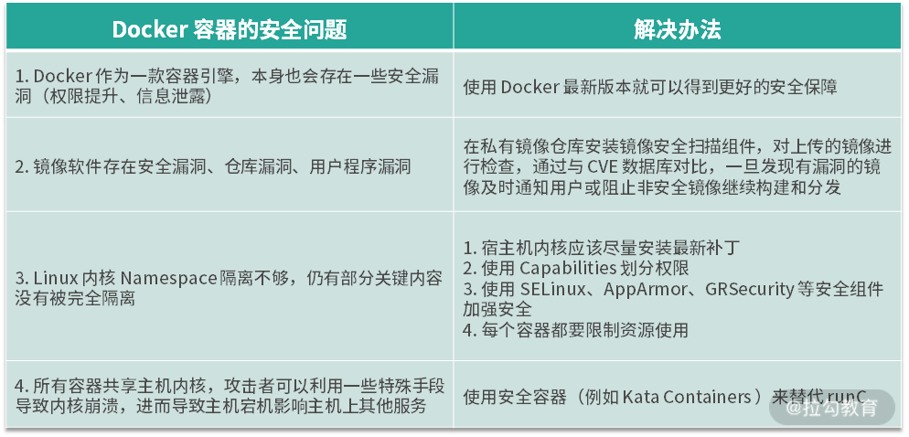

#### Docker 核心概念

Docker 主要是基于 Namespace、cgroups 和联合文件系统这三大核心技术实现的

镜像
镜像是什么呢？通俗地讲，它是一个只读的文件和文件夹组合。它包含了容器运行时所需要的所有基础文件和配置信息，是容器启动的基础。所以你想启动一个容器，那首先必须要有一个镜像。镜像是 Docker 容器启动的先决条件。

容器
容器是什么呢？容器是 Docker 的另一个核心概念。通俗地讲，容器是镜像的运行实体。镜像是静态的只读文件，而容器带有运行时需要的可写文件层，并且容器中的进程属于运行状态。即容器运行着真正的应用进程。容器有初建、运行、停止、暂停和删除五种状态。

虽然容器的本质是主机上运行的一个进程，但是容器有自己独立的命名空间隔离和资源限制。也就是说，在容器内部，无法看到主机上的进程、环境变量、网络等信息，这是容器与直接运行在主机上进程的本质区别。

仓库
Docker 的镜像仓库类似于代码仓库，用来存储和分发 Docker 镜像。镜像仓库分为公共镜像仓库和私有镜像仓库。

目前，Docker Hub 是 Docker 官方的公开镜像仓库，它不仅有很多应用或者操作系统的官方镜像，还有很多组织或者个人开发的镜像供我们免费存放、下载、研究和使用。除了公开镜像仓库，你也可以构建自己的私有镜像仓库


#### Docker 架构

Docker 整体架构采用 C/S（客户端 / 服务器）模式，主要由客户端和服务端两大部分组成。客户端负责发送操作指令，服务端负责接收和处理指令。客户端和服务端通信有多种方式，既可以在同一台机器上通过UNIX套接字通信，也可以通过网络连接远程通信。

Docker 客户端
Docker 客户端其实是一种泛称。其中 docker 命令是 Docker 用户与 Docker 服务端交互的主要方式。除了使用 docker 命令的方式，还可以使用直接请求 REST API 的方式与 Docker 服务端交互，甚至还可以使用各种语言的 SDK 与 Docker 服务端交互。目前社区维护着 Go、Java、Python、PHP 等数十种语言的 SDK，足以满足你的日常需求。

Docker 服务端
Docker 服务端是 Docker 所有后台服务的统称。其中 dockerd 是一个非常重要的后台管理进程，它负责响应和处理来自 Docker 客户端的请求，然后将客户端的请求转化为 Docker 的具体操作。例如镜像、容器、网络和挂载卷等具体对象的操作和管理。

Docker 从诞生到现在，服务端经历了多次架构重构。起初，服务端的组件是全部集成在 docker 二进制里。但是从 1.11 版本开始， dockerd 已经成了独立的二进制，此时的容器也不是直接由 dockerd 来启动了，而是集成了 containerd、runC 等多个组件。

虽然 Docker 的架构在不停重构，但是各个模块的基本功能和定位并没有变化。它和一般的 C/S 架构系统一样，Docker 服务端模块负责和 Docker 客户端交互，并管理 Docker 的容器、镜像、网络等资源。


 Docker 的两个至关重要的组件：runC和containerd。

runC是 Docker 官方按照 OCI 容器运行时标准的一个实现。通俗地讲，runC 是一个用来运行容器的轻量级工具，是真正用来运行容器的。

containerd是 Docker 服务端的一个核心组件，它是从dockerd中剥离出来的 ，它的诞生完全遵循 OCI 标准，是容器标准化后的产物。containerd通过 containerd-shim 启动并管理 runC，可以说containerd真正管理了容器的生命周期。


dockerd通过 gRPC 与containerd通信，由于dockerd与真正的容器运行时，runC中间有了containerd这一 OCI 标准层，使得dockerd可以确保接口向下兼容。


#### 镜像的操作可分为：

拉取镜像，使用docker pull命令拉取远程仓库的镜像到本地 ；

重命名镜像，使用docker tag命令“重命名”镜像 ；

查看镜像，使用docker image ls或docker images命令查看本地已经存在的镜像 ；

删除镜像，使用docker rmi命令删除无用镜像 ；

构建镜像，构建镜像有两种方式。第一种方式是使用docker build命令基于 Dockerfile 构建镜像，也是我比较推荐的镜像构建方式；第二种方式是使用docker commit命令基于已经运行的容器提交为镜像。


#### Dockerfile

```dockerfile
FROM centos:7
COPY nginx.repo /etc/yum.repos.d/nginx.repo
RUN yum install -y nginx
EXPOSE 80
ENV HOST=mynginx
CMD ["nginx","-g","daemon off;"]

```

第一行表示我要基于 centos:7 这个镜像来构建自定义镜像。这里需要注意，每个 Dockerfile 的第一行除了注释都必须以 FROM 开头。

第二行表示拷贝本地文件 nginx.repo 文件到容器内的 /etc/yum.repos.d 目录下。这里拷贝 nginx.repo 文件是为了添加 nginx 的安装源。

第三行表示在容器内运行yum install -y nginx命令，安装 nginx 服务到容器内，执行完第三行命令，容器内的 nginx 已经安装完成。

第四行声明容器内业务（nginx）使用 80 端口对外提供服务。

第五行定义容器启动时的环境变量 HOST=mynginx，容器启动后可以获取到环境变量 HOST 的值为 mynginx。

第六行定义容器的启动命令，命令格式为 json 数组。这里设置了容器的启动命令为 nginx ，并且添加了 nginx 的启动参数 -g 'daemon off;' ，使得 nginx 以前台的方式启动。


#### 镜像的实现原理

其实 Docker 镜像是由一系列镜像层（layer）组成的，每一层代表了镜像构建过程中的一次提交。下面以一个镜像构建的 Dockerfile 来说明镜像是如何分层的。

```dockerfile
FROM busybox

COPY test /tmp/test

RUN mkdir /tmp/testdir

```

上面的 Dockerfile 由三步组成：

第一行基于 busybox 创建一个镜像层；

第二行拷贝本机 test 文件到镜像内；

第三行在 /tmp 文件夹下创建一个目录 testdir。

分层的结构使得 Docker 镜像非常轻量，每一层根据镜像的内容都有一个唯一的 ID 值，当不同的镜像之间有相同的镜像层时，便可以实现不同的镜像之间共享镜像层的效果。


#### 容器（Container）是什么？

容器是基于镜像创建的可运行实例，并且单独存在，一个镜像可以创建出多个容器。运行容器化环境时，实际上是在容器内部创建该文件系统的读写副本。 这将添加一个容器层，该层允许修改镜像的整个副本。


容器的生命周期

容器的生命周期是容器可能处于的状态，容器的生命周期分为 5 种。

1. created：初建状态
2. running：运行状态
3. stopped：停止状态
4. paused： 暂停状态
5. deleted：删除状态

（1）创建并启动容器

容器十分轻量，用户可以随时创建和删除它。我们可以使用`docker create`命令来创建容器

如果使用`docker create`命令创建的容器处于停止状态，我们可以使用`docker start`命令来启动它.

容器启动有两种方式：

1. 使用`docker start`命令基于已经创建好的容器直接启动 。
2. 使用`docker run`命令直接基于镜像新建一个容器并启动，相当于先执行`docker create`命令从镜像创建容器，然后再执行`docker start`命令启动容器。

使用`docker run`的命令如下:

复制代码

```
$ docker run -it --name=busybox busybox
```

当使用`docker run`创建并启动容器时，Docker 后台执行的流程为：

- Docker 会检查本地是否存在 busybox 镜像，如果镜像不存在则从 Docker Hub 拉取 busybox 镜像；
- 使用 busybox 镜像创建并启动一个容器；
- 分配文件系统，并且在镜像只读层外创建一个读写层；
- 从 Docker IP 池中分配一个 IP 给容器；
- 执行用户的启动命令运行镜像。

上述命令中， -t 参数的作用是分配一个伪终端，-i 参数则可以终端的 STDIN 打开，同时使用 -it 参数可以让我们进入交互模式。 在交互模式下，用户可以通过所创建的终端来输入命令.

（2）终止容器

容器启动后，如果我们想停止运行中的容器，可以使用`docker stop`命令。命令格式为 docker stop [-t|--time[=10]]。该命令首先会向运行中的容器发送 SIGTERM 信号，如果容器内 1 号进程接受并能够处理 SIGTERM，则等待 1 号进程处理完毕后退出，如果等待一段时间后，容器仍然没有退出，则会发送 SIGKILL 强制终止容器。

（3）进入容器

处于运行状态的容器可以通过`docker attach`、`docker exec`、`nsenter`等多种方式进入容器。

使用**`docker attach`命令**进入容器

使用 docker attach ，进入我们上一步创建好的容器，如下所示。

复制代码

```
$ docker attach busybox

/ # ps aux

PID   USER     TIME  COMMAND

    1 root      0:00 sh

    7 root      0:00 ps aux

/ #
```

注意：当我们同时使用`docker attach`命令同时在多个终端运行时，所有的终端窗口将同步显示相同内容，当某个命令行窗口的命令阻塞时，其他命令行窗口同样也无法操作。
由于`docker attach`命令不够灵活，因此我们一般不会使用`docker attach`进入容器。下面我介绍一个更加灵活的进入容器的方式`docker exec`

使用 docker exec 命令进入容器

Docker 从 1.3 版本开始，提供了一个更加方便地进入容器的命令`docker exec`，我们可以通过`docker exec -it CONTAINER`的方式进入到一个已经运行中的容器，如下所示。

复制代码

```
$ docker exec -it busybox sh

/ # ps aux

PID   USER     TIME  COMMAND

    1 root      0:00 sh

    7 root      0:00 sh

   12 root      0:00 ps aux
```

我们进入容器后，可以看到容器内有两个`sh`进程，这是因为以`exec`的方式进入容器，会单独启动一个 sh 进程，每个窗口都是独立且互不干扰的，也是使用最多的一种方式。

（4）删除容器

我们已经掌握了用 Docker 命令创建、启动和终止容器。那如何删除处于终止状态或者运行中的容器呢？删除容器命令的使用方式如下：`docker rm [OPTIONS] CONTAINER [CONTAINER...]`。

如果要删除一个停止状态的容器，可以使用`docker rm`命令删除。

复制代码

```
docker rm busybox
```

如果要删除正在运行中的容器，必须添加 -f (或 --force) 参数， Docker 会发送 SIGKILL 信号强制终止正在运行的容器。

复制代码

```
docker rm -f busybox
```


#### 生产中编写最优 Dockerfile

（1）RUN
RUN指令在构建时将会生成一个新的镜像层并且执行RUN指令后面的内容。

使用RUN指令时应该尽量遵循以下原则：

当RUN指令后面跟的内容比较复杂时，建议使用反斜杠（\） 结尾并且换行；

RUN指令后面的内容尽量按照字母顺序排序，提高可读性。

例如，我想在官方的 CentOS 镜像下安装一些软件，一个建议的 Dockerfile 指令如下：

```dockerfile
FROM centos:7
RUN yum install -y automake \
                   curl \
                   python \
                   vim
```

（2）CMD 和 ENTRYPOINT
CMD和ENTRYPOINT指令都是容器运行的命令入口，这两个指令使用中有很多相似的地方，但是也有一些区别。

这两个指令的相同之处，CMD和ENTRYPOINT的基本使用格式分为两种。

第一种为CMD/ENTRYPOINT["command" , "param"]。这种格式是使用 Linux 的exec实现的， 一般称为exec模式，这种书写格式为CMD/ENTRYPOINT后面跟 json 数组，也是Docker 推荐的使用格式。

另外一种格式为CMD/ENTRYPOINTcommand param ，这种格式是基于 shell 实现的， 通常称为shell模式。当使用shell模式时，Docker 会以 /bin/sh -c command 的方式执行命令。

使用 exec 模式启动容器时，容器的 1 号进程就是 CMD/ENTRYPOINT 中指定的命令，而使用 shell 模式启动容器时相当于我们把启动命令放在了 shell 进程中执行，等效于执行 /bin/sh -c "task command" 命令。因此 shell 模式启动的进程在容器中实际上并不是 1 号进程。

这两个指令的区别：

Dockerfile 中如果使用了ENTRYPOINT指令，启动 Docker 容器时需要使用 --entrypoint 参数才能覆盖 Dockerfile 中的ENTRYPOINT指令 ，而使用CMD设置的命令则可以被docker run后面的参数直接覆盖。

ENTRYPOINT指令可以结合CMD指令使用，也可以单独使用，而CMD指令只能单独使用。

看到这里你也许会问，我什么时候应该使用ENTRYPOINT,什么时候使用CMD呢？

如果你希望你的镜像足够灵活，推荐使用CMD指令。如果你的镜像只执行单一的具体程序，并且不希望用户在执行docker run时覆盖默认程序，建议使用ENTRYPOINT。

最后再强调一下，无论使用CMD还是ENTRYPOINT，都尽量使用exec模式。

（3）ADD 和 COPY
ADD和COPY指令功能类似，都是从外部往容器内添加文件。但是COPY指令只支持基本的文件和文件夹拷贝功能，ADD则支持更多文件来源类型，比如自动提取 tar 包，并且可以支持源文件为 URL 格式。

那么在日常应用中，我们应该使用哪个命令向容器里添加文件呢？你可能在想，既然ADD指令支持的功能更多，当然应该使用ADD指令了。然而事实恰恰相反，我更推荐你使用COPY指令，因为COPY指令更加透明，仅支持本地文件向容器拷贝，而且使用COPY指令可以更好地利用构建缓存，有效减小镜像体积。

当你想要使用ADD向容器中添加 URL 文件时，请尽量考虑使用其他方式替代。例如你想要在容器中安装 memtester（一种内存压测工具），你应该避免使用以下格式：

```dockerfile
ADD http://pyropus.ca/software/memtester/old-versions/memtester-4.3.0.tar.gz /tmp/
RUN tar -xvf /tmp/memtester-4.3.0.tar.gz -C /tmp
RUN make -C /tmp/memtester-4.3.0 && make -C /tmp/memtester-4.3.0 install
```

下面是推荐写法：

```dockerfile
RUN wget -O /tmp/memtester-4.3.0.tar.gz http://pyropus.ca/software/memtester/old-versions/memtester-4.3.0.tar.gz \
&& tar -xvf /tmp/memtester-4.3.0.tar.gz -C /tmp \
&& make -C /tmp/memtester-4.3.0 && make -C /tmp/memtester-4.3.0 install
```


#### Docker 与虚拟机区别



虚拟机是通过管理系统(Hypervisor)模拟出 CPU、内存、网络等硬件，然后在这些模拟的硬件上创建客户内核和操作系统。这样做的好处就是虚拟机有自己的内核和操作系统，并且硬件都是通过虚拟机管理系统模拟出来的，用户程序无法直接使用到主机的操作系统和硬件资源，因此虚拟机也对隔离性和安全性有着更好的保证。

而 Docker 容器则是通过 Linux 内核的 Namespace 技术实现了文件系统、进程、设备以及网络的隔离，然后再通过 Cgroups 对 CPU、 内存等资源进行限制，最终实现了容器之间相互不受影响，由于容器的隔离性仅仅依靠内核来提供，因此容器的隔离性也远弱于虚拟机。

你可能会问，既然虚拟机安全性这么好，为什么我们还要用容器呢？这是因为容器与虚拟机相比，容器的性能损耗非常小，并且镜像也非常小，而且在业务快速开发和迭代的今天，容器秒级的启动等特性也非常匹配业务快速迭代的业务场景。



资源限制

在生产环境中，建议每个容器都添加相应的资源限制。下面给出一些执行docker run命令启动容器时可以传递的资源限制参数：

例如我想要启动一个 1 核 2G 的容器，并且限制在容器内最多只能创建 1000 个 PID，启动命令如下：

```dockerfile
  --cpus                          限制 CPU 配额
  -m, --memory                    限制内存配额
  --pids-limit                    限制容器的 PID 个数
```

例如我想要启动一个 1 核 2G 的容器，并且限制在容器内最多只能创建 1000 个 PID，启动命令如下：


```dockerfile
$ docker run -it --cpus=1 -m=2048m --pids
```

-limit=1000 busybox sh
推荐在生产环境中限制 CPU、内存、PID 等资源，这样即便应用程序有漏洞，也不会导致主机的资源完全耗尽，最大限度降低安全风险。


#### 容器监控

1、使用 docker stats 命令
使用 Docker 自带的docker stats命令可以很方便地看到主机上所有容器的 CPU、内存、网络 IO、磁盘 IO、PID 等资源的使用情况。下面我们可以具体操作看看。

首先在主机上使用以下命令启动一个资源限制为 1 核 2G 的 nginx 容器：
$ docker run --cpus=1 -m=2g --name=nginx  -d nginx
容器启动后，可以使用docker stats命令查看容器的资源使用状态:
$ docker stats nginx
通过docker stats命令可以看到容器的运行状态如下：
CONTAINER           CPU %               MEM USAGE / LIMIT   MEM %               NET I/O             BLOCK I/O           PIDS
f742a467b6d8        0.00%               1.387 MiB / 2 GiB   0.07%               656 B / 656 B       0 B / 9.22 kB       2
从容器的运行状态可以看出，docker stats命令确实可以获取并显示 Docker 容器运行状态。但是它的缺点也很明显，因为它只能获取本机数据，无法查看历史监控数据，没有可视化展示面板。

2、cAdvisor

生产环境中我们通常使用另一种容器监控解决方案 cAdvisor。cAdvisor 是谷歌开源的一款通用的容器监控解决方案。cAdvisor 不仅可以采集机器上所有运行的容器信息，还提供了基础的查询界面和 HTTP 接口，更方便与外部系统结合。所以，cAdvisor很快成了容器指标监控最常用组件，并且 Kubernetes 也集成了 cAdvisor 作为容器监控指标的默认工具。


监控原理
我们知道 Docker 是基于 Namespace、Cgroups 和联合文件系统实现的。其中 Cgroups 不仅可以用于容器资源的限制，还可以提供容器的资源使用率。无论何种监控方案的实现，底层数据都来源于 Cgroups。

Cgroups 的工作目录为/sys/fs/cgroup，/sys/fs/cgroup目录下包含了 Cgroups 的所有内容。Cgroups包含很多子系统，可以用来对不同的资源进行限制。例如对CPU、内存、PID、磁盘 IO等资源进行限制和监控。

为了更详细的了解 Cgroups 的子系统，我们通过 ls -l 命令查看/sys/fs/cgroup文件夹，可以看到很多目录：

```
$ sudo ls -l /sys/fs/cgroup/
total 0
dr-xr-xr-x 5 root root  0 Jul  9 19:32 blkio
lrwxrwxrwx 1 root root 11 Jul  9 19:32 cpu -> cpu,cpuacct
dr-xr-xr-x 5 root root  0 Jul  9 19:32 cpu,cpuacct
lrwxrwxrwx 1 root root 11 Jul  9 19:32 cpuacct -> cpu,cpuacct
dr-xr-xr-x 3 root root  0 Jul  9 19:32 cpuset
dr-xr-xr-x 5 root root  0 Jul  9 19:32 devices
dr-xr-xr-x 3 root root  0 Jul  9 19:32 freezer
dr-xr-xr-x 3 root root  0 Jul  9 19:32 hugetlb
dr-xr-xr-x 5 root root  0 Jul  9 19:32 memory
lrwxrwxrwx 1 root root 16 Jul  9 19:32 net_cls -> net_cls,net_prio
dr-xr-xr-x 3 root root  0 Jul  9 19:32 net_cls,net_prio
lrwxrwxrwx 1 root root 16 Jul  9 19:32 net_prio -> net_cls,net_prio
dr-xr-xr-x 3 root root  0 Jul  9 19:32 perf_event
dr-xr-xr-x 5 root root  0 Jul  9 19:32 pids
dr-xr-xr-x 5 root root  0 Jul  9 19:32 systemd
```

这些目录代表了 Cgroups 的子系统，Docker 会在每一个 Cgroups 子系统下创建 docker 文件夹


#### Namespace技术实现资源隔离

Docker 是使用 Linux 的 Namespace 技术实现各种资源隔离的。那么究竟什么是 Namespace，各种 Namespace 都有什么作用，为什么 Docker 需要 Namespace呢？

##### 什么是 Namespace？

下面是 Namespace 的维基百科定义：

> Namespace 是 Linux 内核的一项功能，该功能对内核资源进行分区，以使一组进程看到一组资源，而另一组进程看到另一组资源。Namespace 的工作方式通过为一组资源和进程设置相同的 Namespace 而起作用，但是这些 Namespace 引用了不同的资源。资源可能存在于多个 Namespace 中。这些资源可以是进程 ID、主机名、用户 ID、文件名、与网络访问相关的名称和进程间通信。

简单来说，Namespace 是 Linux 内核的一个特性，该特性可以实现在同一主机系统中，对进程 ID、主机名、用户 ID、文件名、网络和进程间通信等资源的隔离。Docker 利用 Linux 内核的 Namespace 特性，实现了每个容器的资源相互隔离，从而保证容器内部只能访问到自己 Namespace 的资源。

最新的 Linux 5.6 内核中提供了 8 种类型的 Namespace：

| Namespace 名称                   | 作用                                      | 内核版本 |
| -------------------------------- | ----------------------------------------- | -------- |
| Mount（mnt）                     | 隔离挂载点                                | 2.4.19   |
| Process ID (pid)                 | 隔离进程 ID                               | 2.6.24   |
| Network (net)                    | 隔离网络设备，端口号等                    | 2.6.29   |
| Interprocess Communication (ipc) | 隔离 System V IPC 和 POSIX message queues | 2.6.19   |
| UTS Namespace(uts)               | 隔离主机名和域名                          | 2.6.19   |
| User Namespace (user)            | 隔离用户和用户组                          | 3.8      |
| Control group (cgroup) Namespace | 隔离 Cgroups 根目录                       | 4.6      |
| Time Namespace                   | 隔离系统时间                              | 5.6      |

虽然 Linux 内核提供了8种 Namespace，但是最新版本的 Docker 只使用了其中的前6 种，分别为Mount Namespace、PID Namespace、Net Namespace、IPC Namespace、UTS Namespace、User Namespace。


Namespace 是 Linux 内核的一个特性，该特性可以实现在同一主机系统中对进程 ID、主机名、用户 ID、文件名、网络和进程间通信等资源的隔离。Docker 正是结合了这六种 Namespace 的功能，才诞生了 Docker 容器。

当我们使用 docker run --net=host 命令启动容器时，容器是否和主机共享同一个 Net Namespace？容器与主机共享同一个Net Namespace，一般不建议这么设置


#### 通过 Cgroups 机制实现资源限制

cgroups（全称：control groups）是 Linux 内核的一个功能，它可以实现限制进程或者进程组的资源（如 CPU、内存、磁盘 IO 等）。

cgroups 主要提供了如下功能。

- 资源限制： 限制资源的使用量，例如我们可以通过限制某个业务的内存上限，从而保护主机其他业务的安全运行。
- 优先级控制：不同的组可以有不同的资源（ CPU 、磁盘 IO 等）使用优先级。
- 审计：计算控制组的资源使用情况。
- 控制：控制进程的挂起或恢复。

cgroups功能的实现依赖于三个核心概念：子系统、控制组、层级树。

- 子系统（subsystem）：是一个内核的组件，一个子系统代表一类资源调度控制器。例如内存子系统可以限制内存的使用量，CPU 子系统可以限制 CPU 的使用时间。
- 控制组（cgroup）：表示一组进程和一组带有参数的子系统的关联关系。例如，一个进程使用了 CPU 子系统来限制 CPU 的使用时间，则这个进程和 CPU 子系统的关联关系称为控制组。
- 层级树（hierarchy）：是由一系列的控制组按照树状结构排列组成的。这种排列方式可以使得控制组拥有父子关系，子控制组默认拥有父控制组的属性，也就是子控制组会继承于父控制组。比如，系统中定义了一个控制组 c1，限制了 CPU 可以使用 1 核，然后另外一个控制组 c2 想实现既限制 CPU 使用 1 核，同时限制内存使用 2G，那么 c2 就可以直接继承 c1，无须重复定义 CPU 限制。

cgroups 的三个核心概念中，子系统是最核心的概念，因为子系统是真正实现某类资源的限制的基础。

事实上，Docker 创建容器时，Docker 会根据启动容器的参数，在对应的 cgroups 子系统下创建以容器 ID 为名称的目录, 然后根据容器启动时设置的资源限制参数, 修改对应的 cgroups 子系统资源限制文件, 从而达到资源限制的效果。

另外，请注意 cgroups 虽然可以实现资源的限制，但是不能保证资源的使用。例如，cgroups 限制某个容器最多使用 1 核 CPU，但不保证总是能使用到 1 核 CPU，当 CPU 资源发生竞争时，可能会导致实际使用的 CPU 资源产生竞争。


#### Docker 组件作用及其底层工作原理

##### Docker 的组件构成

Docker 整体架构采用 C/S（客户端 / 服务器）模式，主要由客户端和服务端两大部分组成。客户端负责发送操作指令，服务端负责接收和处理指令。客户端和服务端通信有多种方式，即可以在同一台机器上通过`UNIX`套接字通信，也可以通过网络连接远程通信。

Docker 到底有哪些组件呢？我们可以在 Docker 安装路径下执行 ls 命令，这样可以看到以下与 Docker 有关的组件。

```bash
-rwxr-xr-x 1 root root 27941976 Dec 12  2019 containerd
-rwxr-xr-x 1 root root  4964704 Dec 12  2019 containerd-shim
-rwxr-xr-x 1 root root 15678392 Dec 12  2019 ctr
-rwxr-xr-x 1 root root 50683148 Dec 12  2019 docker
-rwxr-xr-x 1 root root   764144 Dec 12  2019 docker-init
-rwxr-xr-x 1 root root  2837280 Dec 12  2019 docker-proxy
-rwxr-xr-x 1 root root 54320560 Dec 12  2019 dockerd
-rwxr-xr-x 1 root root  7522464 Dec 12  2019 runc
```

这些组件根据工作职责可以分为以下三大类。

1. Docker 相关的组件：docker、dockerd、docker-init 和 docker-proxy
2. containerd 相关的组件：containerd、containerd-shim 和 ctr
3. 容器运行时相关的组件：runc


**（1）docker**

docker 是 Docker 客户端的一个完整实现，它是一个二进制文件，对用户可见的操作形式为 docker 命令，通过 docker 命令可以完成所有的 Docker 客户端与服务端的通信（还可以通过 REST API、SDK 等多种形式与 Docker 服务端通信）。

Docker 客户端与服务端的交互过程是：docker 组件向服务端发送请求后，服务端根据请求执行具体的动作并将结果返回给 docker，docker 解析服务端的返回结果，并将结果通过命令行标准输出展示给用户。这样一次完整的客户端服务端请求就完成了。

**（2）dockerd**

dockerd 是 Docker 服务端的后台常驻进程，用来接收客户端发送的请求，执行具体的处理任务，处理完成后将结果返回给客户端。

**（3）docker-init**

如果你熟悉 Linux 系统，你应该知道在 Linux 系统中，1 号进程是 init 进程，是所有进程的父进程。主机上的进程出现问题时，init 进程可以帮我们回收这些问题进程。同样的，在容器内部，当我们自己的业务进程没有回收子进程的能力时，在执行 docker run 启动容器时可以添加 --init 参数，此时 Docker 会使用 docker-init 作为1号进程，帮你管理容器内子进程，例如回收僵尸进程等。

**（4）docker-proxy**

docker-proxy 主要是用来做端口映射的。当我们使用 docker run 命令启动容器时，如果使用了 -p 参数，docker-proxy 组件就会把容器内相应的端口映射到主机上来，底层是依赖于 iptables 实现的。

总体来说，docker 是官方实现的标准客户端，dockerd 是 Docker 服务端的入口，负责接收客户端发送的指令并返回相应结果，而 docker-init 在业务主进程没有进程回收功能时则十分有用，docker-proxy 组件则是实现 Docker 网络访问的重要组件。


##### containerd 相关的组件

**（1）containerd**

[containerd](https://github.com/containerd/containerd) 组件是从 Docker 1.11 版本正式从 dockerd 中剥离出来的，它的诞生完全遵循 OCI 标准，是容器标准化后的产物。containerd 完全遵循了 OCI 标准，并且是完全社区化运营的，因此被容器界广泛采用。

containerd 不仅负责容器生命周期的管理，同时还负责一些其他的功能：

- 镜像的管理，例如容器运行前从镜像仓库拉取镜像到本地；
- 接收 dockerd 的请求，通过适当的参数调用 runc 启动容器；
- 管理存储相关资源；
- 管理网络相关资源。

containerd 包含一个后台常驻进程，默认的 socket 路径为 /run/containerd/containerd.sock，dockerd 通过 UNIX 套接字向 containerd 发送请求，containerd 接收到请求后负责执行相关的动作并把执行结果返回给 dockerd。

如果你不想使用 dockerd，也可以直接使用 containerd 来管理容器，由于 containerd 更加简单和轻量，生产环境中越来越多的人开始直接使用 containerd 来管理容器。

**（2）containerd-shim**

containerd-shim 的意思是垫片，类似于拧螺丝时夹在螺丝和螺母之间的垫片。containerd-shim 的主要作用是将 containerd 和真正的容器进程解耦，使用 containerd-shim 作为容器进程的父进程，从而实现重启 containerd 不影响已经启动的容器进程。

**（3）ctr**

ctr 实际上是 containerd-ctr，它是 containerd 的客户端，主要用来开发和调试，在没有 dockerd 的环境中，ctr 可以充当 docker 客户端的部分角色，直接向 containerd 守护进程发送操作容器的请求。

##### 容器运行时组件runc

runc 是一个标准的 OCI 容器运行时的实现，它是一个命令行工具，可以直接用来创建和运行容器。


*总体来说，Docker 的组件虽然很多，但每个组件都有自己清晰的工作职责，Docker 相关的组件负责发送和接受 Docker 请求，contianerd 相关的组件负责管理容器的生命周期，而 runc 负责真正意义上创建和启动容器。这些组件相互配合，才使得 Docker 顺利完成了容器的管理工作。*

#### Docker 网络实现

Linux 的 Namespace 和 Cgroups 技术，利用这两项技术可以实现各种资源的隔离和主机资源的限制，让我们的容器可以像一台虚拟机一样。但这时我们的容器就像一台未联网的电脑，不能被外部访问到，也不能主动与外部通信，这样的容器只能做一些离线的处理任务，无法通过外部访问。

容器的网络标准便分为两大阵营，一个是以 Docker 公司为代表的 CNM，另一个便是以 Google、Kubernetes、CoreOS 为代表的 CNI 网络标准。

为了更好地构建容器网络标准，Docker 团队把网络功能从 Docker 中剥离出来，成为独立的项目 libnetwork，它通过插件的形式为 Docker 提供网络功能。Libnetwork 是开源的，使用 Golang 编写，它完全遵循 CNM 网络规范，是 CNM 的官方实现。Libnetwork 的工作流程也是完全围绕 CNM 的三个要素进行的。

Libnetwork 是 Docker 启动容器时，用来为 Docker 容器提供网络接入功能的插件，它可以让 Docker 容器顺利接入网络，实现主机和容器网络的互通。

##### Libnetwork 常见网络模式

Libnetwork 比较典型的网络模式主要有四种，这四种网络模式基本满足了我们单机容器的所有场景。

1. null 空网络模式：可以帮助我们构建一个没有网络接入的容器环境，以保障数据安全。$ docker run --net=none -it busybox
2. bridge 桥接模式：可以打通容器与容器间网络通信的需求。
3. host 主机网络模式：可以让容器内的进程共享主机网络，从而监听或修改主机网络。
4. container 网络模式：可以将两个容器放在同一个网络命名空间内，让两个业务通过 localhost 即可实现访问。

###### （1）null 空网络模式

有时候，我们需要处理一些保密数据，出于安全考虑，我们需要一个隔离的网络环境执行一些纯计算任务。这时候 null 网络模式就派上用场了，这时候我们的容器就像一个没有联网的电脑，处于一个相对较安全的环境，确保我们的数据不被他人从网络窃取。

使用 Docker 创建 null 空网络模式的容器时，容器拥有自己独立的 Net Namespace，但是此时的容器并没有任何网络配置。在这种模式下，Docker 除了为容器创建了 Net Namespace 外，没有创建任何网卡接口、IP 地址、路由等网络配置。我们可以一起来验证下。

我们使用 `docker run` 命令启动时，添加 --net=none 参数启动一个空网络模式的容器

```dockerfile
docker run --net=none -it busybox
```

###### （2）bridge 桥接模式

Docker 的 bridge 网络是启动容器时默认的网络模式，使用 bridge 网络可以实现容器与容器的互通，可以从一个容器直接通过容器 IP 访问到另外一个容器。同时使用 bridge 网络可以实现主机与容器的互通，我们在容器内启动的业务，可以从主机直接请求。

**bridge 桥接模式是 Docker 的默认网络模式，当我们创建容器时不指定任何网络模式，Docker 启动容器默认的网络模式为 bridge。**

###### （3）host 主机网络模式

容器内的网络并不是希望永远跟主机是隔离的，有些基础业务需要创建或更新主机的网络配置，我们的程序必须以主机网络模式运行才能够修改主机网络，这时候就需要用到 Docker 的 host 主机网络模式。

使用 host 主机网络模式时：

- libnetwork 不会为容器创建新的网络配置和 Net Namespace。
- Docker 容器中的进程直接共享主机的网络配置，可以直接使用主机的网络信息，此时，在容器内监听的端口，也将直接占用到主机的端口。
- 除了网络共享主机的网络外，其他的包括进程、文件系统、主机名等都是与主机隔离的。

host 主机网络模式通常适用于想要使用主机网络，但又不想把运行环境直接安装到主机上的场景中。例如我想在主机上运行一个 busybox 服务，但又不想直接把 busybox 安装到主机上污染主机环境，此时我可以使用以下命令启动一个主机网络模式的 busybox 镜像：

```dockerfile
$ docker run -it --net=host busybox
```

###### （4）container 网络模式

container 网络模式允许一个容器共享另一个容器的网络命名空间。当两个容器需要共享网络，但其他资源仍然需要隔离时就可以使用 container 网络模式，例如我们开发了一个 http 服务，但又想使用 nginx 的一些特性，让 nginx 代理外部的请求然后转发给自己的业务，这时我们使用 container 网络模式将自己开发的服务和 nginx 服务部署到同一个网络命名空间中。

Libnetwork 的工作流程是完全围绕 CNM 的三个要素进行的，CNM 制定标准之初不仅仅是为了单台主机上的容器互通，更多的是为了定义跨主机之间的容器通信标准。但是后来由于 Kubernetes 逐渐成为了容器编排的标准，而 Kubernetes 最终选择了 CNI 作为容器网络的定义标准


#### Docker 卷与持久化数据存储

容器更擅长无状态应用。因为未持久化数据的容器根目录的生命周期与容器的生命周期一样，容器文件系统的本质是在镜像层上面创建的读写层，运行中的容器对任何文件的修改都存在于该读写层，当容器被删除时，容器中的读写层也会随之消失。

虽然容器希望所有的业务都尽量保持无状态，这样容器就可以开箱即用，并且可以任意调度，但实际业务总是有各种需要数据持久化的场景，比如 MySQL、Kafka 等有状态的业务。因此为了解决有状态业务的需求，Docker 提出了卷（Volume）的概念。

##### Docker 卷的实现原理

在了解 Docker 卷的原理之前，我们先来回顾一下镜像和容器的文件系统原理。

> **镜像和容器的文件系统原理：** 镜像是由多层文件系统组成的，当我们想要启动一个容器时，Docker 会在镜像上层创建一个可读写层，容器中的文件都工作在这个读写层中，当容器删除时，与容器相关的工作文件将全部丢失。

Docker 容器的文件系统不是一个真正的文件系统，而是通过联合文件系统实现的一个伪文件系统，而 Docker 卷则是直接利用主机的某个文件或者目录，它可以绕过联合文件系统，直接挂载主机上的文件或目录到容器中，这就是它的工作原理。

##### 主机与容器之间数据共享

Docker 卷的目录默认在 /var/lib/docker 下，当我们想把主机的其他目录映射到容器内时，就需要用到主机与容器之间数据共享的方式了，例如我想把 MySQL 容器中的 /var/lib/mysql 目录映射到主机的 /var/lib/mysql 目录中，我们就可以使用主机与容器之间数据共享的方式来实现。

要实现主机与容器之间数据共享，其实很简单，只需要我们在启动容器的时候添加`-v`参数即可, 使用格式为：`-v HOST_PATH:CONTIANAER_PATH`。

例如，我想挂载主机的 /data 目录到容器中的 /usr/local/data 中，可以使用以下命令来启动容器：

```dockerfile
docker run -v /data:/usr/local/data -it busybox
```

容器启动后，便可以在容器内的 /usr/local/data 访问到主机 /data 目录的内容了，并且容器重启后，/data 目录下的数据也不会丢失。


#### 联合文件系统

联合文件系统（Union File System，Unionfs）是一种分层的轻量级文件系统，它可以把多个目录内容联合挂载到同一目录下，从而形成一个单一的文件系统，这种特性可以让使用者像是使用一个目录一样使用联合文件系统。（因为生产环境最好不用容器持久化，这块文件略）


#### 容器编排工具

当我们的业务越来越复杂时，需要多个容器相互配合，甚至需要多个主机组成容器集群才能满足我们的业务需求，这个时候就需要用到容器的编排工具了。因为容器编排工具可以帮助我们批量地创建、调度和管理容器，帮助我们解决规模化容器的部署问题。 Docker 三种常用的编排工具：Docker Compose、Docker Swarm 和 Kubernetes。了解这些编排工具，可以让你在不同的环境中选择最优的编排框架。

#### Kubernetes

Kubernetes 是舵手的意思，我们把 Docker 比喻成一个个集装箱，而 Kubernetes 正是运输这些集装箱的舵手。早期的 Kubernetes 主要参考 Google 内部的 Borg 系统，Kubernetes 刚刚诞生时，提出了 Pod、Sidecar 等概念，这些都是 Google 内部多年实战和沉淀所积累的精华。经过将近一年的沉淀和积累，Kubernetes 于 2015 年 7 月 21 日对外发布了第一个正式版本 v1.0，正式走入了大众的视线。

##### Kubernetes 架构

Kubernetes 采用声明式 API 来工作，所有组件的运行过程都是异步的，整个工作过程大致为用户声明想要的状态，然后 Kubernetes 各个组件相互配合并且努力达到用户想要的状态。

Kubernetes 采用典型的主从架构，分为 Master 和 Node 两个角色。

- Mater 是 Kubernetes 集群的控制节点，负责整个集群的管理和控制功能。
- Node 为工作节点，负责业务容器的生命周期管理。

##### Kubernetes 核心概念

Kubernetes 这些概念是 Google 多年的技术沉淀和积累，理解 Kubernetes 的核心概念有助于我们更好的理解 Kubernetes 的设计理念。

###### （1）集群

集群是一组被 Kubernetes 统一管理和调度的节点，被 Kubernetes 纳管的节点可以是物理机或者虚拟机。集群其中一部分节点作为 Master 节点，负责集群状态的管理和协调，另一部分作为 Node 节点，负责执行具体的任务，实现用户服务的启停等功能。

###### （2）标签（Label）

Label 是一组键值对，每一个资源对象都会拥有此字段。Kubernetes 中使用 Label 对资源进行标记，然后根据 Label 对资源进行分类和筛选。

###### （3）命名空间（Namespace）

Kubernetes 中通过命名空间来实现资源的虚拟化隔离，将一组相关联的资源放到同一个命名空间内，避免不同租户的资源发生命名冲突，从逻辑上实现了多租户的资源隔离。

###### （4）容器组（Pod）

Pod 是 Kubernetes 中的最小调度单位，它由一个或多个容器组成，一个 Pod 内的容器共享相同的网络命名空间和存储卷。Pod 是真正的业务进程的载体，在 Pod 运行前，Kubernetes 会先启动一个 Pause 容器开辟一个网络命名空间，完成网络和存储相关资源的初始化，然后再运行业务容器。

###### （5）部署（Deployment）

Deployment 是一组 Pod 的抽象，通过 Deployment 控制器保障用户指定数量的容器副本正常运行，并且实现了滚动更新等高级功能，当我们需要更新业务版本时，Deployment 会按照我们指定策略自动的杀死旧版本的 Pod 并且启动新版本的 Pod。

###### （6）状态副本集（StatefulSet）

StatefulSet 和 Deployment 类似，也是一组 Pod 的抽象，但是 StatefulSet 主要用于有状态应用的管理，StatefulSet 生成的 Pod 名称是固定且有序的，确保每个 Pod 独一无二的身份标识。

###### （7）守护进程集（DaemonSet）

DaemonSet 确保每个 Node 节点上运行一个 Pod，当我们集群有新加入的 Node 节点时，Kubernetes 会自动帮助我们在新的节点上运行一个 Pod。一般用于日志采集，节点监控等场景。

###### （8）任务（Job）

Job 可以帮助我们创建一个 Pod 并且保证 Pod 的正常退出，如果 Pod 运行过程中出现了错误，Job 控制器可以帮助我们创建新的 Pod，直到 Pod 执行成功或者达到指定重试次数。

###### （9）服务（Service）

Service 是一组 Pod 访问配置的抽象。由于 Pod 的地址是动态变化的，我们不能直接通过 Pod 的 IP 去访问某个服务，Service 通过在主机上配置一定的网络规则，帮助我们实现通过一个固定的地址访问一组 Pod。

###### （10）配置集（ConfigMap）

ConfigMap 用于存放我们业务的配置信息，使用 Key-Value 的方式存放于 Kubernetes 中，使用 ConfigMap 可以帮助我们将配置数据和应用程序代码分开。

###### （11）加密字典（Secret）

Secret 用于存放我们业务的敏感配置信息，类似于 ConfigMap，使用 Key-Value 的方式存在于 Kubernetes 中，主要用于存放密码和证书等敏感信息。