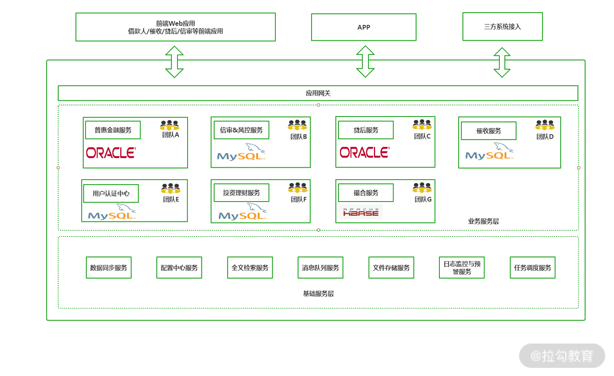
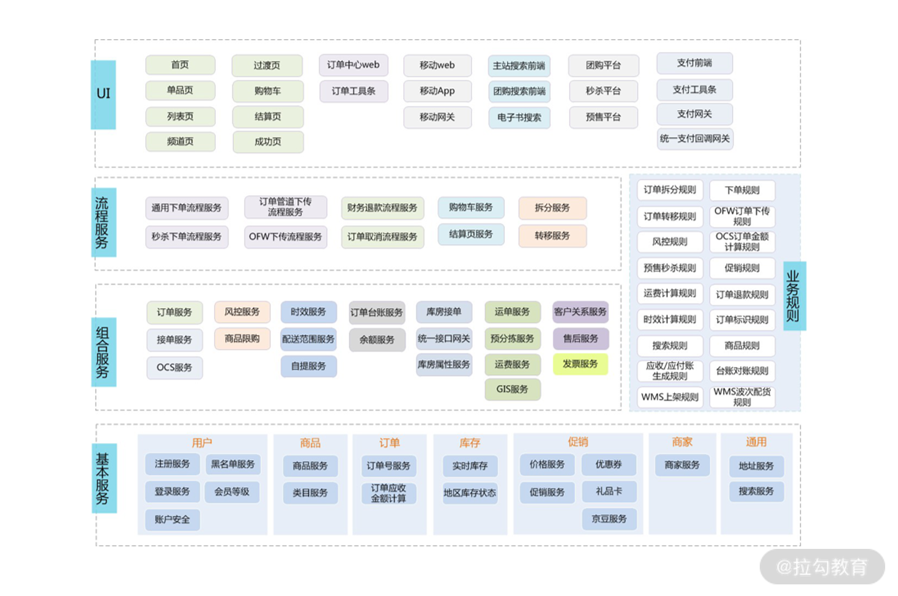
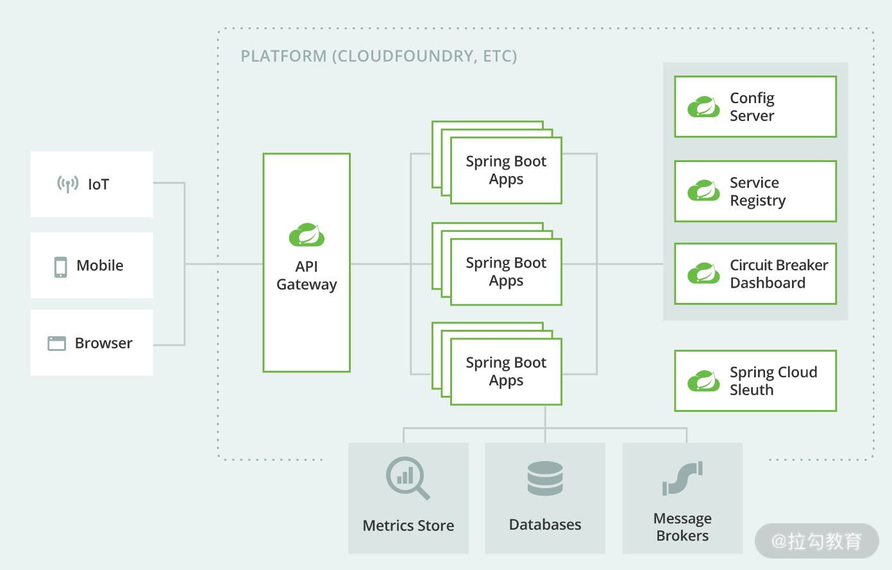
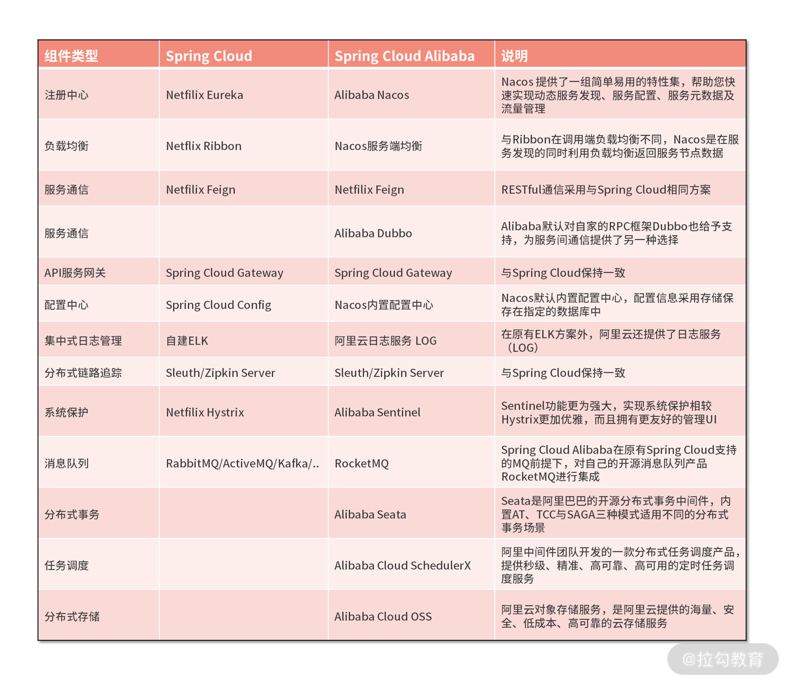
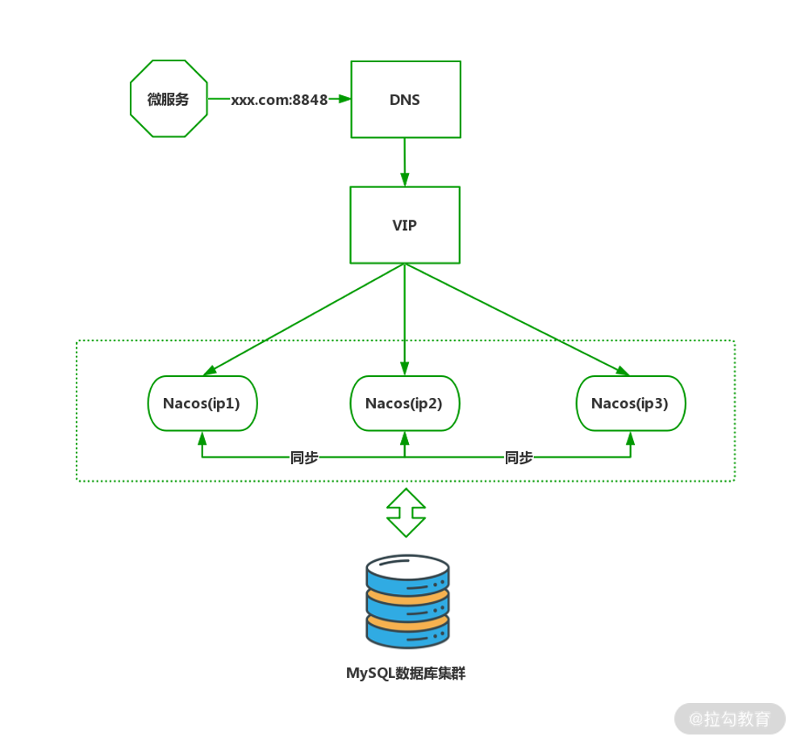
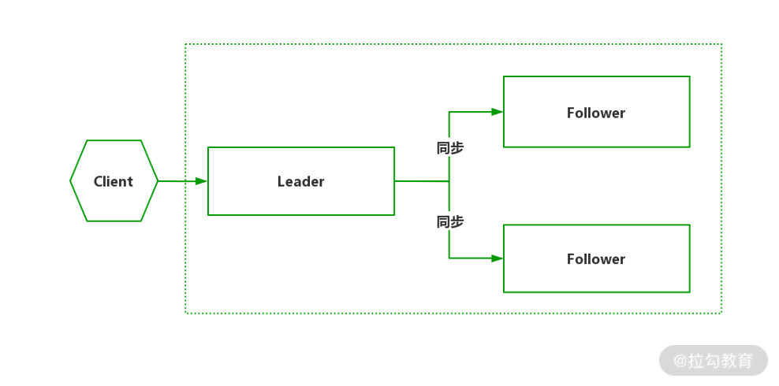
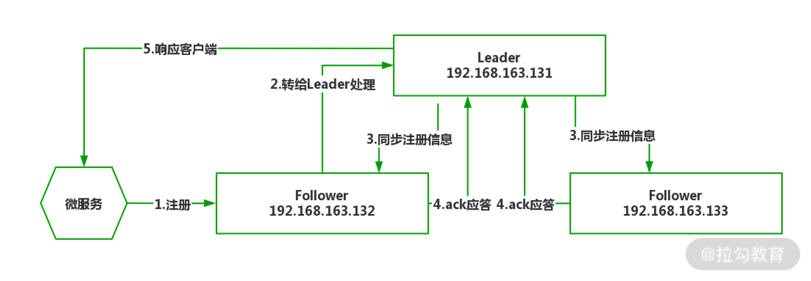
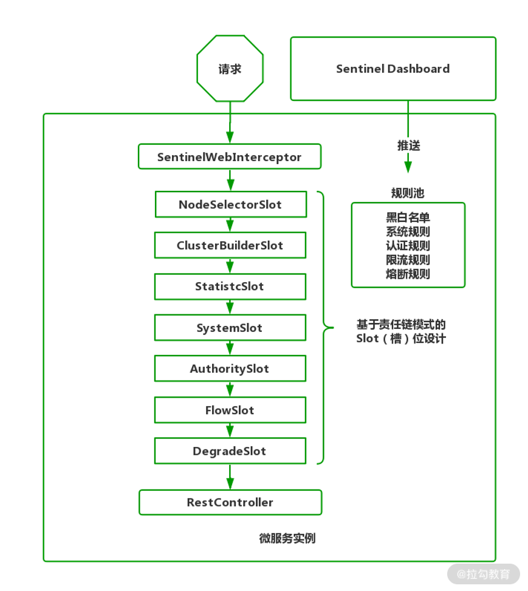

## 一、传统架构和微服务架构

传统架构：

1、系统间通信困难。 假如信审系统需要向贷后系统发送一个调用请求，通过 WebService 来实现，在 WebService 跨进程调用时，需要双方持有相同的传输对象才可以完成数据的交互。但如果服务的提供者，他将接口以及传输对象进行升级后，而客户端没有及时更新的话，此时便会因为对象的状态不一致导致传输失败的情况。要知道在互联网机构，接口的升级与扩展可能是一件频繁发生的事情，如果这类问题一再出现，必然会影响系统的稳定性和团队的协作，这是第一个问题。

2、是系统的内部复杂度对外暴露。 假如信审系统目前需要访问贷后系统，贷后系统为了高可用的要求，提供了 IP 为 10 和 11 的两个节点，作为信审系统客户端持有了这两个静态的 IP 地址。但随着业务的发展，贷后系统的负载越来越大，此时作为贷后系统集群加入了额外的两个节点，它们分别是 12 和 13。如何通知信审系统额外扩展这两个新加入的节点呢？因为在原始并没有设计这样的动态扩展的机制，所以我们必须手动配置信审系统的 IP 列表，以及重启应用才可以做到。这就相当于信审系统必须了解贷后系统每一台服务器的实际运行情况，这显然就增加了两个系统之间的耦合，提高了项目维护的难度。

3、系统间的调用关系复杂。 假设我们有 6 个不同的应用，如果没有提前规划，软件工程师想梳理清系统间的调用关系会非常困难。这里我们急需一种技术帮助我们梳理清系统间的调用关系。

4、过度的重复建设。 在公司进行项目开发时，因为是每一个团队负责独立的系统，而这些系统往往需要一些通用的底层设施。例如：用户认证与权限控制、黑名单白名单、流量控制与系统异常的处理以及系统参数的配置管理等模块。而这些模块在每一个子系统中都要重复的进行开发，这显然是一件费时费力的事情，不利于数据的集中管理。

5、“大一统”的架构设计。 所谓大一统架构设计，是指很多公司希望采用一套统一的架构来适应公司各个不同职能的子系统。比如，之前所有的系统是将数据统一存放在性能强大的 Oracle 数据库集群中。但这里有一个弊端，作为借款人门户系统，需要对用户开放大量的全文检索。如果你对数据检索技术有了解，会明白Oracle这种关系型数据库并不擅长全文检索功能，实际应交给Elasticsearch全文检索引擎进行处理。

等

微服务架构又是如何解决这些问题的：

微服务的特点有三个：

构建基于业务、可重用、职责明确的小型服务；

统一的通信标准，轻量级的通信协议，通常这里的通信协议是指的 RESTful；

可独立运行，独立存储由独立团队进行维护。

当微服务改造以后，我们的架构会变成这个样子。



首先，微服务架构提供了轻松而统一的进程间通信标准。以信审与贷后系统的通信为例，之前采用 WebService，要求客户端和服务端必须持有相同的通信对象。在改为 RESTful 通信后，RESTful 是基于 HTTP 协议的轻量级通信方式。它并不强制要求客户端一定持有通信对象，可以使用 Java 中的 HttpClient或者 OkHttp 组件，发起标准的 HTTP 请求就可以通信，返回的数据也是标准的 JSON 结构。

其次，屏蔽分布式应用的应用复杂度，假设贷后服务额外增加了两个节点，对于微服务架构来说，它有一个关键组件名为注册中心

第三，内建链路跟踪体系。在传统的分布式应用中，要梳理服务间的调用关系，实际是一件很烦琐的事情。到了微服务体系下，这个问题就很好解决。

第四，是减少重复建设，基础数据管理更加集中。在微服务体系中，这里有一个用户认证中心的服务，其本意在前端应用实际发起请求前，对用户的身份和权限来进行判断。不同系统用户认证的过程都是类似的，我们把它抽象出一个通用的用户认证中心，这样做不但可以减少每一个子系统的重复建设，还可以将用户这个信息来进行集中的统一存储。

第五，更有弹性的架构设计。假如借款人门户需要全文检索的支持，那么与之对应的普惠金融服务中，便可以为其专门增加 Elasticsearch 来进行支持。对于某一个服务加入新的特性，并不影响其他服务的运行。

之后随着业务的不断演化，其他服务假如也需要 Elasticsearch 全文检索的话，这时我们便可以进行进一步抽象。剥离出"全文检索服务"基础服务，来为其他服务提供支撑。因为在微服务架构中，我们采用了统一的标准来进行开发，所以它的升级改造工作难度比较小。


## 二、微服务设计时的五条宝贵经验

在著名软件著作《人月神话》中提到，软件世界没有“银弹”，这句话当然适用于架构领域，随着从单体架构过渡到微服务架构，因为将原有系统打散，给系统增加了许多不稳定因素。

下面我从网络、性能、运维成本、组织架构与集成测试五个方面分别进行阐述。

第一点，跨进程通信带来的新问题。 以往单体应用是在单机中进行进程内通信，通信稳定性相当好。但是打散为分布式系统后，变为进程间通信，往往这个过程还伴随着跨设备的网络访问，架构师在设计时必须考虑上下游系统因为网络因素无法通信的情况，要假设网络是不可靠的，并设计微服务在网络异常时也能进行符合预期的异常处理。以支付模块为例，用户支付成功后系统自动调用短信服务向用户手机发送“订单支付成功”的消息，此时架构师就必须假设短信服务在服务或者网络不可用时不会影响到订单业务的正常执行。	

第二点，较高的响应延迟。 相比传统单体架构进程内通信，跨进程、跨网络的微服务通信在网络传输与消息序列化带来的延迟是不可被忽略的，尤其是在五个以上微服务间消息调用时，网络延迟对于实时系统的影响是很大的。有些系统不适合再用分布式。

第三点，运维成本会直线上升。

第四点，组织架构层面的调整。 微服务不但是一种架构风格，同样也是一种软件组织模型，以往软件公司会以职能划分研发、测试、运维部门进行独立管理考核，而在微服务的实施过程中，是以业务模块进行团队划分，每一个团队是内聚的，要求可以独立完成从调研到发版的全流程，尽量减少对外界的依赖。如何将传统的职能团队调整为按业务划分的研发团队，同样是对管理者的巨大挑战，要知道人的思想比架构更难改变。

第五点，服务间的集成测试变得举步维艰。

##### 微服务最佳实践

第一点，微服务的划分原则。 将已有系统拆分为多个微服务，本就没有统一的标准。举个例子，一个初创电商公司，要开发一套电商系统，将“促销活动”单独剥离出来作为“促销服务”是没有问题的。但是如果在“淘宝”“京东”这种体量的电商平台，“促销服务”就显得粒度太粗了。可以继续拆解为“价格服务”“优惠券服务”“京豆服务”等更细粒度的小服务，每个服务有专门团队负责维护。因此，在微服务拆分过程中，我们通常会从业务场景、团队能力、组织架构等多种因素综合考虑，这特别考验架构师的业务能力。一般来说，我们总结出几点通用原则：

1、单一职责原则。 每一个微服务只做好一件事，体现出“高内聚、低耦合”，尽量减少对外界环境的依赖。比如，在公司创业之初，完全可将订单与仓储服务进行合并。因为订单与仓储在业务与数据上紧密相关，如果强行拆分会导致出现跨进程通信带来的数据一致性难题。随着业务的发展，仓储的业务职责扩展，派生出许多与订单无紧密联系的功能，到时再将其剥离形成独立的“仓储服务”。

2、服务依赖原则。 避免服务间的循环引用，在设计时就要对服务进行分级，区分核心服务与非核心服务。比如订单服务与短信服务，显然短信服务是非核心服务，服务间调用要遵循“核心服务”到“非核心服务”的方向，不允许出现反向调用。同时，对于核心服务要做好保护，避免非核心服务出现问题影响核心服务的正常运行。

3、Two Pizza Team原则。 就是说让团队保持在两个比萨能让队员吃饱的小规模的概念。团队要小到让每个成员都能做出显著的贡献，并且相互依赖，有共同目标，以及统一的成功标准。一个微服务团队应涵盖从设计到发布运维的完整生命周期，使团队内部便可以解决大部分任务，从人数上4~6人是比较理想的规模。



第二点，为每一个微服务模块明确使命。 这里推荐一套标准的微服务叙述模板，集中体现“只做好一件事”的原则。

模板
XX 微服务用来
在出现痛点场景的情况下
解决现有的 XX 问题
从而达到了 XXX 的效果
体现了微服务的价值
示例
商品检索微服务用来
在商品数据全量多维度组合查询的情况下
解决了 MySQL 数据库全表扫描查询慢的问题
从而让查询响应降低到 50ms 以下
有效提升了用户体验

通过这种描述，服务的职责与边界就十分明确，团队便以此为目标确认职责。在实施过程中因为我们是以解决问题为目标，切分时可能会比较细碎。经过漫长时间沉淀，系统中出现了类似于“商品检索服务”“订单检索服务”“商铺检索服务”等多个小服务，这时可以对这些服务形成聚合生成新的“通用检索服务”，以此来控制微服务的整体规模。反之，对于庞大的服务，可以考虑拆分为多个小服务进行细粒度的管理。总之，拆与合是伴随着公司业务的演进而变化的，一切以解决问题为准。

第三点，微服务确保独立的数据存储。 数据是任何系统最重要的资产。以往单体应用通常会选择 MySQL 这种关系型数据库作为数据的唯一存储，这样做的好处是涉及多表操作时，利用数据库自带的事务机制便可最大程度保证数据完整性。但这样做却存在诸多问题，不同的微服务对数据存储的需求也是不同的，订单服务需要 MySQL 数据保存订单与订单明细；新闻服务需要Elasticsearch提供全文检索支持；朋友圈需要图数据库表达现实世界人际关系；文件存储服务则需要分布式文件系统。如果将所有数据都揉在 MySQL 中使用会变得十分蹩脚，好的做法是为每一个微服务提供符合自身业务特性的数据库。但理想很丰满现实很骨感，在分库后涉及跨库操作会变的难以处理。比如，订单依赖会员数据，原本单库处理时一条 SQL 语句便可实现。但在微服务架构下，因为数据库绝不允许其他团队访问，关联查询只能变为 API 调用形式，程序实现层面比单库复杂不少。在拆分为服务后，数据被分散到多库，为保证异构多库的数据一致性是所有分布式应用的巨大挑战，

第四点，服务间通信优先采用聚合器模式。在微服务间通信时存在两种消息传递模式：链式模式与聚合器模式。因为请求是按业务流程传递，很容易能被开发人员理解，链式模式成为最常用的服务间通信模式。但链式模式采用串联模式，调用的整体成功率等于单个服务成功率的乘积，假设每个服务可靠性为 90%，一个业务在 4 个服务执行后的最终成功率只有 90%*90%*90%*90%≈58%，有将近一半的请求会处理失败，这是无法接受的。

第五点，不要强行“微服务”化。 其实在我看来，微服务也不过是一种方案，没必要盲从。它也没有违背架构的基本规律：架构是解决当前需求和痛点而演进的。在满足需要的前提下，选择合适的而不是选择最好的，合理降低成本才是好架构师该考虑的事情。

## 三、微服务生态与 Spring Cloud Alibaba

通用的微服务架构应包含哪些组件
相对于单体式架构的简单粗暴，微服务架构将应用打散，形成多个微服务进行独立开发、测试、部署与运维。虽然从管理与逻辑上更符合业务需要，但微服务架构也带来了诸多急需解决的核心问题：

1、如何发现新服务节点以及检查服务节点的状态？

2、如何发现服务及负载均衡如何实现？

3、服务间如何进行消息通信？

4、如何对使用者暴露服务 API？

5、如何集中管理众多服务节点的配置文件？

6、如何收集服务节点的日志并统一管理？

7、如何实现服务间调用链路追踪？

8、如何对系统进行链路保护，避免微服务雪崩？

##### 每种组件的职责。

1、注册中心（Service Registry）：注册中心是微服务架构最核心的组件。它起到新服务节点的注册与状态维护的作用，通过注册中心解决了上述问题 1。微服务节点在启动时会将自身的服务名称、IP、端口等信息在注册中心中进行登记，注册中心会定时检查该节点的运行状态。注册中心通常会采用心跳机制最大程度保证其持有的服务节点列表都是可用的。

2、负载均衡（Load Balance）：负载均衡器解决了问题 2。通常在微服务彼此调用时并不是直接通过IP、端口直接访问，而是首先通过服务名在注册中心查询该服务拥有哪些可用节点，然后注册中心将可用节点列表返回给服务调用者，这个过程称为“服务发现”。因服务高可用的要求，服务调用者会接收到多个可用节点，必须要从中进行选择，因此在服务调用者一端必须内置负载均衡器，通过负载均衡策略选择适合的节点发起实质的通信请求。

3、服务通信（Communication）：服务通信组件解决了问题 3。在微服务定义中阐述服务间通信采用轻量级协议，通常是 HTTP RESTful 风格。但因 RESTful 风格过于灵活，必须加以约束，通常在应用时对其进行上层封装，例如在 Spring Cloud 中就提供了 Feign 和 RestTemplate 两种技术屏蔽底层实现 RESTful 通信细节，所有开发者是基于封装后统一的SDK进行开发，这有利于团队间协作。

4、API 服务网关（API Gateway）：服务网关解决问题 4。对于最终用户来说，微服务的通信与各种实现细节应该是透明的，用户只需关注他要使用的 API 接口即可。因此微服务架构引入服务网关控制用户的访问权限。服务网关是外部环境访问内部微服务的唯一途径，在这个基础上还可以扩展出其他功能，例如：用户认证与授权、容错限流、动态路由、A/B测试、灰度发布等。

5、配置中心（Config Management）：配置中心解决问题 5。微服务架构下，微服务节点都包含自己的各种配置文件，如JDBC地址、自定义配置、环境配置等。要知道互联网公司微服务节点可能是成千上万个，如果这些配置信息分散存储在节点上，如发生配置变更就必须逐个调整，这必将给运维人员带来巨大的工作量。配置中心便因此而生，通过部署配置中心服务器，将原本分散的配置文件从应用中剥离，集中转存到配置中心。一般配置中心会提供 UI 界面，可以方便快捷的实现大规模集群的配置调整。

6、集中式日志管理（Centralized Logging）：集中式日志解决问题 6。因为微服务架构默认将应用日志分散保存在每一个微服务节点上，当系统进行用户行为分析、数据统计时必须收集所有节点日志数据。那如何有效收集所有节点的运行日志，并对其进行分析汇总呢？业内常见的方案有 ELK、EFK，通过搭建独立的日志收集系统，定时抓取增量日志形成有效的统计报表，为决策提供数据支撑。

7、分布式链路追踪（Distributed Tracing）：分布式追踪解决问题 7。一个复杂的业务流程可能需要连续调用多个微服务，我们需要记录一个完整业务逻辑涉及的每一个微服务的运行状态，再通过可视化链路图展现，帮助软件工程师在系统出错时分析解决问题。

8、服务保护（Service Protection）：服务保护解决问题 8。在服务间通信过程中，如果某个微服务出现响应高延迟可能会导致线程池满载，严重时会引起系统崩溃。这里就需要引入服务保护组件实现高延迟服务的快速降级，避免系统崩溃。





## 四、 服务治理：Nacos 如何实现微服务服务治理

Nacos 具备以下职能：

服务发现及管理；

动态配置服务；

动态 DNS 服务。

8848 端口是 Nacos 对客户端提供服务的端口，7848 是 Nacos 集群通信端口，用于Nacos 集群间进行选举，检测等。

1、Nacos 注册中心的心跳机制。

无论是部署 Nacos 服务器还是构建 Sample-Service 微服务，只用了几行代码便实现在 Nacos 注册登记。微服务与 Nacos 服务器之间的通信过程。在微服务启动后每过5秒，会由微服务内置的 Nacos 客户端主动向 Nacos 服务器发起心跳包（HeartBeat）。心跳包会包含当前服务实例的名称、IP、端口、集群名、权重等信息。如果你开启微服务 Debug 日志，会清晰地看到每 5 秒一个心跳请求被发送到 Nacos 的 /nacos/v1/ns/instance/beat 接口，该请求会被 Nacos 服务器内置的 naming 模块处理。

naming 模块收到心跳包做如下流程

（1）首先根据 IP 与端口判断 Nacos 是否存在该服务实例？如果实例信息不存在，在 Nacos 中注册登记该实例。而注册的本质是将新实例对象存储在“实例 Map”集合中；

（2）如果实例信息已存在，记录本次心跳包发送时间；

（3）设置实例状态为“健康”；

（4）推送“微服务状态变更”消息；

（5）naming 模块返回心跳包时间间隔。

## 五、 高可用保证：Nacos 如何有效构建注册中心集群

单点运行是分布式应用的大忌，在分布式架构中，任何单点都可能成为系统的瓶颈，因此在生产环境中 Nacos 都需要通过部署集群来为系统带来高可用性。

如何在生产环境部署 Nacos 集群：

1、微服务并不是直接通过 IP 地址访问后端服务，而是采用域名访问。通过 DNS（域名解析服务）转换为具体的 IP 地址，通过域名方式屏蔽后端容易产生变化的 IP 地址。

2、底层 Nacos 自带集群间节点与数据同步方案，因此需要 Nacos 节点对外暴露 8848 与 7848 端口。其中 8848 端口的作用是对外暴露 API 与集群间数据同步，而 7848 端口则用于节点选举来确定集群领袖（Leader）。同时 Nacos 在集群环境下需要持久化应用配置、用户权限、历史信息等内置数据，因此需要额外部署 MySQL 数据库提供统一存储。

3、在 Nacos 层面，每一台服务器都有独立的 IP。我们并不建议直接将物理 IP 对外暴露，而是额外增加 VIP（虚拟 IP），通过 DNS 服务绑定 VIP，这样的好处是通过 VIP 屏蔽了Nacos集群实际的物理IP地址，同时为访问者提供了统一的接入入口，使微服务的注册接入和Nacos 集群实现细节彼此解耦，提高架构的维护性。



Nacos 集群的部署过程
第一步，环境准备。

Nacos 因为选举算法的特殊性，要求最少三个节点才能组成一个有效的集群



在这三个节点上安装好 JDK1.8，并配置 JAVA_HOME 环境变量.此外还需要额外部署一台 MySQL 数据库用于保存 Nacos 的配置管理、权限控制信息。这里推荐版本为 MySQL5.7 或者 MySQL 8.0。

使用任意 MySQL 客户端工具连接到 192.168.163.100 MySQL 数据库服务器，创建名为nacos_config的数据库，之后使用 MySQL 客户端执行 /usr/local/nacos/conf/nacos-mysql.sql 文件，完成建表工作。

其中比较重要的表我们有必要了解一下。

config_* ：所有 config_ 开头的表都是 Nacos 配置中心使用时保存应用配置的表。

users：系统用户表，在集群环境下用户信息保存在 users 表中，而非在配置文件中。

roles：系统角色表，Nacos 的权限基于 RBAC（基于角色的访问控制）模型设计，此表保存角色数据。

permissions: 系统权限表，说明角色与系统使用权限的对应关系。

配置 Nacos 数据源。

依次打开 3 台 Nacos 服务器中的核心配置文件 application.properties 配置数据库连接

Nacos 集群节点配置

在 /nacos/config 目录下提供了集群示例文件cluster.conf.example

通过 cluster.conf.example 创建集群节点列表

首先利用复制命令创建 cluster.conf 文件。
cp cluster.conf.example cluster.conf
之后打开 cluster.conf，添加所有 Nacos 集群节点 IP 及端口。

```shell
192.168.163.131:8848

192.168.163.132:8848

192.168.163.133:8848

```

Nacos 通过 cluster.conf 了解集群节点的分布情况。

启动 Nacos 服务器。

在 3 台 Nacos 节点上分别执行下面的启动命令。

```shell
sh /usr/local/nacos/bin/startup.sh
```

注意，集群模式下并不需要增加“-m”参数，默认就是以集群方式启动。

启动日志关键内容如下：

```shell
#-Xms2g -Xmx2g 默认运行时 JVM 要求 2G 可用内存
/usr/lib/jvm/java-1.8.0-openjdk-1.8.0.275.b01-0.el7_9.x86_64/bin/java  -server -Xms2g -Xmx2g ...
...

#列出 Nacos 所有集群节点
INFO The server IP list of Nacos is [192.168.163.131:8848, 192.168.163.132:8848, 192.168.163.133:8848]
...
#Nacos 正在启动
INFO Nacos is starting...
...
#集群模式启动成功，采用外置存储 MySQL 数据库
INFO Nacos started successfully in cluster mode. use external storage
```

登录后便可看到集群列表。UP 代表节点已就绪，DOWN 代表节点已离线，目前所有节点均已就绪。

微服务接入。

在 application.properties 配置 Nacos 集群的任意节点都可以完成接入工作，Nacos 内置的数据同步机制会保证各节点数据一致性。

```properties
# 应用名称，默认也是在微服务中注册的微服务 ID
spring.application.name=sample-service
# 配置 192.168.163.131/132/133 都可以接入 Nacos
spring.cloud.nacos.discovery.server-addr=192.168.163.131:8848
#连接 Nacos 服务器使用的用户名、密码，默认为 nacos
spring.cloud.nacos.discovery.username=nacos
spring.cloud.nacos.discvery.password=nacos
#微服务提供 Web 服务的端口号
server.port=9000

```

### Nacos 集群的工作原理

#### Nacos 集群中 Leader 节点是如何产生的

Nacos 集群采用 Raft 算法实现。它是一种比较简单的选举算法，用于选举出 Nacos 集群中最重要的 Leader（领导）节点。

在 Nacos 集群中，每个节点都拥有以下三种角色中的一种。

1. Leader：领导者，集群中最重要的角色，用于向其他节点下达指令。
2. Candidate：参选者，参与竞选 Leader 的节点。
3. Follower：跟随者，用于接收来自 Leader 或者 Candidate 的请求并进行处理。

在集群中选举出 Leader 是最重要的工作，产生选举的时机有三个：

1. 在 Nacos 节点启动后，还没有产生Leader时选举；
2. 集群成员总量变更时重新选举；
3. 当 Leader 停止服务后重新选举。

在开始介绍选举过程前，先理解任期（Term）的含义:

Raft 算法将时间划分成为任意不同长度的任期（Term）。任期用连续的数字进行表示。每一个任期的开始都是一次选举（Election），一个或多个候选人会试图成为 Leader。

为了便于理解，我们使用文字+表格的形式说明选举过程。

**1**. 当最开始的时候，所有 Nacos 节点都没有启动。角色默认为 Follower（跟随者），任期都是 0。

**2**. 当第一个节点（192.168.163.131）启动后，节点角色会变为 Candidate（参选者），131 节点在每一个任期开始时便会尝试向其他节点发出投票请求，征求自己能否成为 Leader（领导者）节点。只有算上自己获得超过半数的选票，这个 Candidate 才能转正为 Leader。在当前案例，因为 131 发起选举投票，但 132/133 两个节点不在线，尽管 131 会投自己一票，但在总 3 票中未过半数，因此无法成为 Leader。因为第一次选举没有产生 Leader，过段时间在下一个任期开始时，131 任期自增加 1，同时会再次向其他节点发起投票请求争取其他节点同意，直到同意票过半。

**3**. 在 Raft 算法中，成为 Leader 的必要条件是某个 Candidate 获得过半选票，如果 132 节点上线，遇到 131 再次发起投票。132 投票给 131 节点，131 获得两票超过半数就会成为 Leader，132 节点自动成为 Follower（跟随者）。之后 133 节点上线，因为集群中已有 Leader，因此自动成为 Follower。

**4**. 当 Leader 节点宕机或停止服务，会在剩余 2 个 Nacos 节点中产生新的 Leader。如下所示133获得两票成为 Leader，132 成为 Follower，131已经下线但角色暂时仍为 Leader。之后 131 恢复上线，但此时 Nacos 集群已有 Leader 存在，131 自动变为 Follower，且任期归0。

对于 Nacos 集群来说，只要 UP 状态节点不少于"1+N/2"，集群就能正常运行。但少于“1+N/2”，集群仍然可以提供基本服务，但已无法保证 Nacos 各节点数据一致性。

以上就是 Nacos 基于 Raft 算法的 Leader 选举过程，确定 Leader 是维持 Nacos 集群数据一致的最重要前提

#### Nacos 节点间的数据同步过程



在 Raft 算法中，只有 Leader 才拥有数据处理与信息分发的权利。因此当微服务启动时，假如注册中心指定为 Follower 节点，则步骤如下：

第一步，Follower 会自动将注册心跳包转给 Leader 节点；

第二步，Leader 节点完成实质的注册登记工作；

第三步，完成注册后向其他 Follower 节点发起“同步注册日志”的指令；

第四步，所有可用的 Follower 在收到指令后进行“ack应答”，通知 Leader 消息已收到；

第五步，当 Leader 接收过半数 Follower 节点的 “ack 应答”后，返回给微服务“注册成功”的响应信息。

此外，对于其他无效的 Follower 节点，Leader 仍会不断重新发送，直到所有 Follower 的状态与 Leader 保持同步。

以上便是 Nacos 节点间的数据同步主体流程，


## 六、负载均衡：Ribbon 如何保证微服务的高可用

负载均衡顾名思义，是指通过软件或者硬件措施。它将来自客户端的请求按照某种策略平均的分配到集群的每一个节点上，保证这些节点的 CPU、内存等设备负载情况大致在一条水平线，避免由于局部节点负载过高产生宕机，再将这些处理压力传递到其他节点上产生系统性崩溃。

负载均衡按实现方式分类可区分为：**服务端负载均衡**与**客户端负载均衡**。

服务端负载均衡顾名思义，在架构中会提供专用的负载均衡器，由负载均衡器持有后端节点的信息，服务消费者发来的请求经由专用的负载均衡器分发给服务提供者，进而实现负载均衡的作用。目前常用的负载均衡器软硬件有：F5、Nginx、HaProxy 等。

客户端负载均衡是指，在架构中不再部署额外的负载均衡器，在每个服务消费者内部持有客户端负载均衡器，由内置的负载均衡策略决定向哪个服务提供者发起请求。说到这，我们的主角登场了，Netfilx Ribbon 是 Netflix 公司开源的一个负载均衡组件，是属于客户端负载均衡器。目前Ribbon 已被 Spring Cloud 官方技术生态整合，运行时以 SDK 形式内嵌到每一个微服务实例中，为微服务间通信提供负载均衡与高可用支持。为了更容易理解，我们通过应用场景说明 Ribbon 的执行流程。假设订单服务在查询订单时需要附带对应商品详情，这就意味着订单服务依赖于商品服务，两者必然产生服务间通信，

1. 订单服务（order-service）与商品服务（goods-service）实例在启动时向 Nacos 注册；
2. 订单服务向商品服务发起通信前，Ribbon 向 Nacos 查询商品服务的可用实例列表；
3. Ribbon 根据设置的负载策略从商品服务可用实例列表中选择实例；
4. 订单服务实例向商品服务实例发起请求，完成 RESTful 通信；


Ribbon 与 RestTemplate 两个组件。Ribbon 提供了客户端负载均衡，而 RestTemplate 则封装了 HTTP 的通讯，简化了发送请求的过程。两者相辅相成构建了服务间的高可用通信。

不过在使用后，你也应该会发现 RestTemplate，它只是对 HTTP 的简单封装，像 URL、请求参数、请求头、请求体这些细节都需要我们自己处理，如此底层的操作都暴露出来这肯定不利于项目团队间协作，因此就需要一种封装度更高、使用更简单的技术屏蔽通信底层复杂度。好在 Spring Cloud 团队提供了 OpenFeign 技术，大幅简化了服务间高可用通信处理过程。

## 七、REST消息通信：如何使用 OpenFeign 简化服务间通信

Feign 与 OpenFeign
Spring Cloud OpenFeign 并不是独立的技术。它底层基于 Netflix Feign，Netflix Feign 是 Netflix 设计的开源的声明式 WebService 客户端，用于简化服务间通信。Netflix Feign 采用“接口+注解”的方式开发，通过模仿 RPC 的客户端与服务器模式（CS），采用接口方式开发来屏蔽网络通信的细节。OpenFeign 则是在 Netflix Feign 的基础上进行封装，结合原有 Spring MVC 的注解，对 Spring Cloud 微服务通信提供了良好的支持。使用 OpenFeign 开发的方式与开发 Spring MVC Controller 颇为相似。

openFeign执行过程

1.在第一次访问 WarehouseServiceFeignClient（通过feign client的定义调用远程的接口） 接口时，Spring 自动生成接口的实现类并实例化对象。

2.当调用 getStock() 方法时，Ribbon 获取 warehouse-service 可用实例信息，根据负载均衡策略选择合适实例。

3.OpenFeign 根据方法上注解描述的映射关系生成完整的 URL 并发送 HTTP 请求，如果请求方法是 @PostMapping，则参数会附加在请求体中进行发送。

4.warehouse-service 处理完毕返回 JSON 数据，消费者端 OpenFeign 接收 JSON 的同时反序列化到 Stock 对象，并将该对象返回。

#### 生产环境 OpenFeign 的配置事项：

##### 如何更改 OpenFeign 默认的负载均衡策略：

在 OpenFeign 使用时默认引用 Ribbon 实现客户端负载均衡。那如何设置 Ribbon 默认的负载均衡策略呢？在 OpenFeign 环境下，配置方式其实与之前 Ribbon+RestTemplate 方案完全相同，只需在 application.yml 中调整微服务通信时使用的负载均衡类即可。

```properties
warehouse-service: #服务提供者的微服务ID
  ribbon:
    #设置对应的负载均衡类
    NFLoadBalancerRuleClassName: com.netflix.loadbalancer.RandomRule 

```

##### 开启默认的 OpenFeign 数据压缩功能

在 OpenFeign 中，默认并没有开启数据压缩功能。但如果你在服务间单次传递数据超过 1K 字节，强烈推荐开启数据压缩功能。默认 OpenFeign 使用 Gzip 方式压缩数据，对于大文本通常压缩后尺寸只相当于原始数据的 10%~30%，这会极大提高带宽利用率。但有一种情况除外，如果应用属于计算密集型，CPU 负载长期超过 70%，因数据压缩、解压缩都需要 CPU 运算，开启数据压缩功能反而会给 CPU 增加额外负担，导致系统性能降低，这是不可取的。

```properties
feign:
  compression:
    request:
      # 开启请求数据的压缩功能
      enabled: true
      # 压缩支持的MIME类型
      mime-types: text/xml,application/xml, application/json
      # 数据压缩下限 1024表示传输数据大于1024 才会进行数据压缩(最小压缩值标准)
      min-request-size: 1024
    # 开启响应数据的压缩功能
    response:
      enabled: true
```

##### 替换默认通信组件

OpenFeign 默认使用 Java 自带的 URLConnection 对象创建 HTTP 请求，但接入生产时，如果能将底层通信组件更换为 Apache HttpClient、OKHttp 这样的专用通信组件，基于这些组件自带的连接池，可以更好地对 HTTP 连接对象进行重用与管理。作为 OpenFeign 目前默认支持 Apache HttpClient 与 OKHttp 两款产品。我以OKHttp配置方式为例，为你展现配置方法。

1.引入 feign-okhttp 依赖包。

```xml
<dependency>
    <groupId>io.github.openfeign</groupId>
    <artifactId>feign-okhttp</artifactId>
    <version>11.0</version>
</dependency>

```

2.在应用入口，利用 Java Config 形式初始化 OkHttpClient 对象。

```java
@SpringBootApplication
@EnableFeignClients
public class OrderServiceApplication {
    //Spring IOC容器初始化时构建okHttpClient对象
    @Bean
    public okhttp3.OkHttpClient okHttpClient(){
        return new okhttp3.OkHttpClient.Builder()
                //读取超时时间
                .readTimeout(10, TimeUnit.SECONDS)
                //连接超时时间
                .connectTimeout(10, TimeUnit.SECONDS)
                //写超时时间
                .writeTimeout(10, TimeUnit.SECONDS)
                //设置连接池
                .connectionPool(new ConnectionPool())
                .build();
    }
    public static void main(String[] args) {
        SpringApplication.run(OrderServiceApplication.class, args);
    }
}
```

3.在 application.yml 中启用 OkHttp。

```yaml
feign:
  okhttp:
    enabled: true

```

## 八、RPC 消息：Dubbo 与 Nacos 体系如何协同作业

### RESTful 与 RPC 的区别

在微服务定义中提道，每个小服务运行在自己的进程中，并以**轻量级的机制**进行通信。这里并没有明确给出具体的通信方式，只是要求以轻量级的机制进行通信，虽然作者推荐使用 RESTful 作为首选方案，但微服务间通信本身还有另一个轻量级的选择：以 Dubbo 为代表的 RPC通信方式。

那什么是 RPC 呢？RPC 是远程过程调用（Remote Procedure Call）的缩写形式，RPC 与 RESTful 最大的不同是，RPC 采用**客户端（Client) - 服务端（Server）** 的架构方式实现跨进程通信，实现的通信协议也没有统一的标准，具体实现依托于研发厂商的设计。

RESTful 通信更适合调用延时不敏感、短连接的场景。而 RPC 则拥有更好的性能，适用于长连接、低延时系统。两者本质是互补的，并不存在孰优孰劣。在微服务架构场景下，因为大多数服务都是轻量级的，同时 90%的任务通过短连接就能实现，因此马丁福勒更推荐使用 RESTful 通信。这只是因为应用场景所决定的，并不代表 RPC 比 RESTful 落后。

Dubbo 是典型的 RPC 框架的代表，通过客户端/服务端结构实现跨进程应用的高效二进制通信。

Apache Dubbo 提供了六大核心能力：

- 面向接口代理的高性能 RPC 调用；
- 智能容错和负载均衡；
- 服务自动注册和发现；
- 高度可扩展能力；
- 运行期流量调度；
- 可视化的服务治理与运维。

Dubbo 架构中，包含 5 种角色。

1. **Provider**：RPC服务提供者，Provider 是消息的最终处理者。
2. **Container**：容器，用于启动、停止 Provider 服务。这里的容器并非 Tomcat、Jetty 等 Web 容器，Dubbo 也并不强制要求 Provider 必须具备 Web 能力。Dubbo 的容器是指对象容器，例如 Dubbo 内置的 SpringContainer 容器就提供了利用 Spring IOC 容器管理 Provider 对象的职能。
3. **Consumer**：消费者，调用的发起者。Consumer 需要在客户端持有 Provider 的通信接口才能完成通信过程。
4. **Registry**：注册中心，Dubbo 架构中注册中心与微服务架构中的注册中心职责类似，提供了 Dubbo Provider 的注册与发现职能，Consumer通过 Registry 可以获取Provider 可用的节点实例的 IP、端口等，并产生直接通信。需要注意的是，前面我们讲解的 Alibaba Nacos 除了可以作为微服务架构中的注册中心外，同样对自家的 Dubbo 提供了 RPC 调用注册发现的职责，这是其他 Spring Cloud 注册中心所不具备的功能。
5. **Monitor**：监控器，监控器提供了Dubbo的监控职责。在 Dubbo 产生通信时，Monitor 进行收集、统计，并通过可视化 UI 界面帮助运维人员了解系统进程间的通信状况。Dubbo Monitor 主流产品有 Dubbo Admin、Dubbo Ops 等。

## 九、Spring Cloud Gateway 如何把好微服务的大门

基于 OpenFeign 的 RESTful 通信，还是基于 Dubbo 的 RPC 通信，它们都在强调的是微服务间的信息传递，属于微服务架构内部的事情。而对于用户端从外侧访问微服务如何有效管理，微服务又是如何将接口暴露给用户呢？这就需要通过 API 网关实现需求了

##### API 网关的作用

对于整个微服务来说如果将每一个微服务的接口直接暴露给用户是错误的做法，这里主要体现出三个问题：

- 服务将所有 API 接口对外直接暴露给用户端，这本身就是不安全和不可控的，用户可能越权访问不属于它的功能，例如普通的用户去访问管理员的高级功能。
- 后台服务可能采用不同的通信方式，如服务 A 采用 RESTful 通信，服务 B 采用 RPC 通信，不同的接入方式让用户端接入困难。尤其是 App 端接入 RPC 过程更为复杂。
- 在服务访问前很难做到统一的前置处理，如服务访问前需要对用户进行鉴权，这就必须将鉴权代码分散到每个服务模块中，随着服务数量增加代码将难以维护。

当引入 API 网关后，在用户端与微服务之间建立了一道屏障，通过 API 网关为微服务访问提供了统一的访问入口，所有用户端的请求被 API 网关拦截并在此基础上可以实现额外功能，例如：

- 针对所有请求进行统一鉴权、熔断、限流、日志等前置处理，让微服务专注自己的业务。
- 统一调用风格，通常 API 网关对外提供 RESTful 风格 URL 接口。用户传入请求后，由 API 网关负责转换为后端服务需要的 RESTful、RPC、WebService 等方式，这样便大幅度简化用户的接入难度。
- 更好的安全性，在通过 API 网关鉴权后，可以控制不同角色用户访问后端服务的权利，实现了服务更细粒度的权限控制。
- API 网关是用户端访问 API 的唯一入口，从用户的角度来说只需关注 API 网关暴露哪些接口，至于后端服务的处理细节，用户是不需要知道的。从这方面讲，微服务架构通过引入 API 网关，将用户端与微服务的具体实现进行了解耦。

##### Spring Cloud Gateway 的执行原理:

按执行顺序可以拆解以下几步：

1、Spring Cloud Gateway 启动时基于 Netty Server 监听指定的端口（该端口可以通过 server.port 属性自定义）。当前端应用发送一个请求到网关时，进入 Gateway Handler Mapping 处理过程，网关会根据当前 Gateway 所配置的谓词（Predicate）来决定是由哪个微服务进行处理。

2、确定微服务后，请求向后进入 Gateway Web Handler 处理过程，该过程中 Gateway 根据过滤器（Filters）配置，将请求按前后顺序依次交给 Filter 过滤链进行前置（Pre）处理，前置处理通常是对请求进行前置检查，例如：判断是否包含某个指定请求头、检查请求的 IP 来源是否合法、请求包含的参数是否正确等。

3、当过滤链前置（Pre）处理完毕后，请求会被 Gateway 转发到真正的微服务实例进行处理，微服务处理后会返回响应数据，这些响应数据会按原路径返回被 Gateway 配置的过滤链进行后置处理（Post），后置处理通常是对响应进行额外处理，例如：将处理过程写入日志、为响应附加额外的响应头或者流量监控等。

可以看到，在整个处理过程中谓词（Predicate）与过滤器（Filter）起到了重要作用，谓词决定了路径的匹配规则，让 Gateway 确定应用哪个微服务，而 Filter 则是对请求或响应作出实质的前置、后置处理。

在项目中功能场景多种多样，像日常的用户身份鉴权、日志记录、黑白名单、反爬虫等基础功能都可以通过自定义 Filter 为 Gateway 进行功能扩展，

##### 自定义全局过滤器

在 Spring Cloud Gateway 中，自定义过滤器分为两种，全局过滤器与局部过滤器。两者唯一的区别是：全局过滤器默认应用在所有路由（Route）上，而局部过滤器可以为指定的路由绑定。

## 十、 系统保护：微服务架构雪崩效应与服务限流

在微服务环境下受制于网络、机器性能、算法、程序各方面影响，运行异常的情况也在显著提升，如果不做好异常保护，微服务架构就像空中楼阁一样随时可能会崩溃。

在微服务项目中指由于突发流量导致某个服务不可用，从而导致上游服务不可用，并产生级联效应，最终导致整个系统不可用，使用雪崩这个词来形容这一现象最合适不过。

发现了问题根源，解决也就简单了，经过多方权衡在以下几方面作出应对：

1、提高可用性，将单台设备转为多台负载均衡集群。

2、提高性能，检查慢 SQL、优化算法、引入缓存来缩短单笔业务的处理时间。

3、预防瞬时 TPS 激增，将系统限流作为常态加入系统架构。

4、完善事后处理，遇到长响应，一旦超过规定窗口时间，服务立即返回异常，中断当前处理。

5、加强预警与监控，引入 ELK，进行流量实时监控与风险评估，及时发现系统风险。

6、完善制度，要求客户单据当日录入系统。

刚才所描述的是一次典型的雪崩效应，下面我们来梳理下分布式架构为什么会产生雪崩？

假如服务 I 因为优化问题，导致需要 20 秒才能返回响应，这就必然会导致 20 秒内该请求线程会一直处于阻塞状态。但是，如果这种状况放在高并发场景下，就绝对不允许出现，假如在 20 秒内有 10 万个请求通过应用访问到后端微服务。容器会因为大量请求阻塞积压导致连接池爆满，而这种情况后果极其严重！轻则“服务无响应”，重则前端应用直接崩溃。

##### 避免雪崩

雪崩效应是因为出现瞬间大流量+微服务响应慢造成的。针对这两点在架构设计时要采用不同方案。

1、采用限流方式进行预防：可以采用限流方案，控制请求的流入，让流量有序的进入应用，保证流量在一个可控的范围内。

2、采用服务降级与熔断进行补救：针对响应慢问题，可以采用服务降级与熔断进行补救。服务降级是指当应用处理时间超过规定上限后，无论服务是否处理完成，便立即触发服务降级，响应返回预先设置的异常信息。

比如：在用户支付完成后，通过消息通知服务向用户邮箱发送“订单已确认”的邮件。假设消息通知服务出现异常，需要 10 秒钟才能完成发送请求， 这是不能接受的。为了预防雪崩，我们可以在微服务体系中增加服务降级的功能，预设 2 秒钟有效期，如遇延迟便最多允许 2 秒，2 秒内服务未处理完成则直接降级并返回响应，此时支付服务会收到“邮件发送超时”的错误信息。这也就意味着消息通知服务最多只有两秒钟的处理时间。处理结果，要么发送成功，要么超时降级。 因此阻塞时间缩短，产生雪崩的概率会大大降低。

##### Alibaba Sentinel

在 Spring Cloud Alibaba 生态中有一个重要的流控组件 Sentinel。Sentinel 以流量为切入点，从流量控制、熔断降级、系统负载保护等多个维度保护服务的稳定性。

Sentinel 具有以下特征。

丰富的应用场景：Sentinel 承接了阿里巴巴近 10 年的双十一大促流量的核心场景，例如秒杀（即突发流量控制在系统容量可以承受的范围）、消息削峰填谷、集群流量控制、实时熔断下游不可用应用等。

完备的实时监控：Sentinel 同时提供实时的监控功能。您可以在控制台中看到接入应用的单台机器秒级数据，甚至 500 台以下规模的集群的汇总运行情况。

广泛的开源生态：Sentinel 提供开箱即用的与其他开源框架/库的整合模块，例如与 Spring Cloud、Dubbo、gRPC 整合只需要引入相应的依赖并进行简单的配置即可快速地接入 Sentinel。

完善的 SPI 扩展点：Sentinel 提供简单易用、完善的 SPI 扩展接口。您可以通过实现扩展接口来快速地定制逻辑。例如定制规则管理、适配动态数据源等。

Sentinel 分为两个部分：Sentinel Dashboard和Sentinel 客户端。

1、Sentinel Dashboard：Sentinel Dashboard 是 Sentinel 配套的可视化控制台与监控仪表盘套件，它支持节点发现，以及健康情况管理、监控（单机和集群）、规则管理和推送的功能。Sentinel Dashboard 是基于 Spring Boot 开发的 WEB 应用，打包后可以直接运行，

2、Sentinel 客户端：Sentinel 客户端需要集成在 Spring Boot 微服务应用中，用于接收来自 Dashboard 配置的各种规则，并通过 Spring MVC Interceptor 拦截器技术实现应用限流、熔断保护。

预估生产流量的3个办法： 1. 询问产品了解客户体量 2. 进行压测确定接口并发 3. 采用二八原则，将日常平均访问量*4，基本就是峰值 4. 做好监控和动态调整机制，如遇突发自动上调

## 十一、 限流与熔断：Sentinel 在项目中的最佳实践

#### Sentinel Dashboard通信与降级原理：

Sentinel Dashboard 是Sentinel的控制端，是新的限流与熔断规则的创建者。当内置在微服务内的 Sentinel Core（客户端）接收到新的限流、熔断规则后，微服务便会自动启用的相应的保护措施。

按执行流程，Sentinel 的执行流程分为三个阶段：

Sentinel Core 与 Sentinel Dashboard 建立连接；

Sentinel Dashboard 向 Sentinel Core 下发新的保护规则；

Sentinel Core 应用新的保护规则，实施限流、熔断等动作。

第一步，建立连接。

Sentine Core 在初始化的时候，通过 application.yml 参数中指定的 Dashboard 的 IP地址，会主动向 dashboard 发起连接的请求。

该请求是以心跳包的方式定时向 Dashboard 发送，包含 Sentinel Core 的 AppName、IP、端口信息。这里有个重要细节：Sentinel Core为了能够持续接收到来自 Dashboard的数据，会在微服务实例设备上监听 8719 端口，在心跳包上报时也是上报这个 8719 端口，

第二步，推送新规则。

如果在 Dashboard 页面中设置了新的保护规则，会先从当前的 MachineInfo 中提取符合要求的微服务实例信息，之后通过 Dashboard内置的 transport 模块将新规则打包推送到微服务实例的 Sentinel Core，Sentinel Core收 到新规则在微服务应用中对本地规则进行更新，这些新规则会保存在微服务实例的 JVM 内存中。

第三步，处理请求。

Sentinel Core 为服务限流、熔断提供了核心拦截器 SentinelWebInterceptor，这个拦截器默认对所有请求 /** 进行拦截，然后开始请求的链式处理流程，在对于每一个处理请求的节点被称为 Slot（槽），通过多个槽的连接形成处理链，在请求的流转过程中，如果有任何一个 Slot 验证未通过，都会产生 BlockException，请求处理链便会中断，并返回“Blocked by sentinel" 异常信息。



