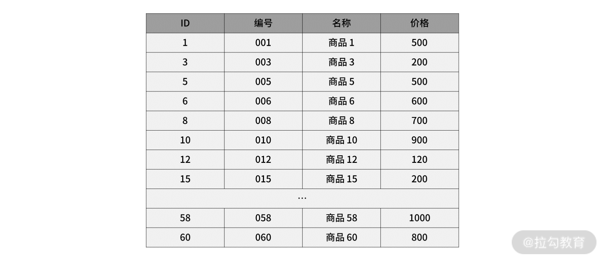
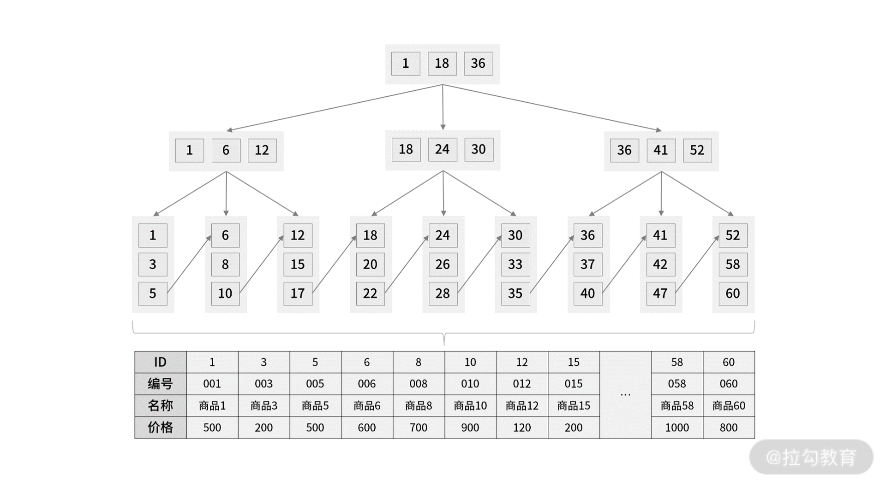
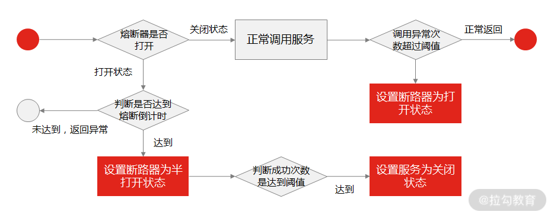

## 架构设计面试精讲

## 一、三个技术认知

#### 对架构设计的认知

关于架构设计的问题，一定要立足于点、连接成线、扩散成面，用这样的思路回答才能让面试官满意。

例子
我曾面试过一名研发工程师，他在介绍过往经历时，称自己在重构一个负责交易流程的系统时，将其拆分成报价系统、促销系统，以及订单系统，而当时他们只有两个人负责交易系统的开发工作。

针对他的经历，我的问题是：你们只有两个人负责这个交易系统，为什么还要做系统架构拆分？而且拆分之后会带来其他的复杂度，你是怎么考虑的？

系统拆分的架构设计问题，在面试中很常见，候选人给出了四个层面的回答。

从订单系统层面来看，由于交易流程中的订单系统相对来说业务稳定，不存在很多的迭代需求，如果耦合到整个交易系统中，在其他功能发布上线的时候会影响订单系统，比如订单中心的稳定性。基于这样的考虑，需要拆分出一个独立的子系统。

2、从促销系统层面来看，由于促销系统是交易流程中的非核心系统，出于保障交易流程稳定性的考虑，将促销系统单独拆分出来，在发生异常的时候能让促销系统具有可降级的能力。

3、从报价系统层面来看，报价是业务交易流程中最为复杂和灵活的系统，出于专业化和快速迭代的考虑，拆分出一个独立的报价系统，目的就是为了快速响应需求的变化。

4、从复杂度评估层面来看，系统拆分虽然会导致系统交互更加复杂，但在规范了 API 的格式定义和调用方式后，系统的复杂度可以维持在可控的范围内。

这样的回答很好地表达了应聘者对系统设计的思考与理解。因为他说出了原有系统中关于订单、促销和报价功能耦合在一起带来的实际问题，这是立足于点，又从交易流程的角度做系统设计串联起三个系统的拆分逻辑，这是连接成线，最后从复杂度和成本考量的方向夯实了设计的原则，这是扩展成面。

分析：

那这个问题的底层逻辑到底是什么呢？有这样四点。

为什么做架构拆分？通常最直接目的就是做系统之间解耦、子系统之间解耦，或模块之间的解耦。

为什么要做系统解耦？系统解耦后，使得原本错综复杂的调用逻辑能有序地分布到各个独立的系统中，从而使得拆封后的各个系统职责更单一，功能更为内聚。

为什么要做职责单一？因为职责单一的系统功能逻辑的迭代速度会更快，会提高研发团队响应业务需求的速度，也就是提高了团队的开发效率。

为什么要关注开发效率？研发迭代效率的提升是任何一家公司在业务发展期间都最为关注的问题，所以从某种程度上看，架构拆分是系统提效最直接的手段。

所以，架构拆分其实是管理在技术上提效的一种手段，认识到这一点后，就不难理解为什么很多架构师在做系统架构时，会做系统设计上的拆分，甚至认为架构的本质就是拆分了。


#### 对分析问题的认知

在实际工作中，技术人员在做系统设计时需要与公司或部门的战略定位对齐，才能让你的技术有价值。因为对于系统技术架构升级的问题，业务方、管理者和技术人员的关注点是不同的。

业务方的诉求是在技术升级后，系统有能力迭代功能来满足市场的要求，所以关注点在系统能力。

管理者的诉求是在技术升级后，系统研发团队的开发效能得到提升，所以关注点在人效管理。

作为技术人员的你，需要找到自己做系统设计的立足点，来满足不同人对技术的诉求，而这个立足点通常就是系统设计原则。

所以你应该认识到，系统的设计原则不是乱提出来的，而是针对系统现阶段业务发展带来的主要矛盾提出，才会更有价值且被认可。

例子
之前我做过一个对原有老系统进行架构改造的系统设计，当时的背景是这样的。

早期，业务发展比较简单，团队规模也不是很大，单体系统可以支撑业务的早期规模，但当业务不断发展，团队规模越来越大时，之前的一个业务团队逐渐发展成了多个业务团队，这时每个业务团队都会提出自己的功能需求。

然而，系统现状仍然是单体架构，研发同学都在同一个系统里进行开发，使得系统逻辑复杂，代码耦合，功能迭代和交付变得非常缓慢，牵一发而动全身，研发同学都不敢轻易修改代码。

这个时期系统的主要矛盾就变成了：多人协作进行复杂业务，导致速度缓慢，但业务需求又快速迭代。说白了，就是研发效率不能匹配业务发展的速度，并且单靠加人不能解决问题。

对于这样的一个系统，此阶段的系统架构核心原则就不能随便定义为要保证高性能和高可用。

那么应该怎么做呢？针对这样的问题，我们需要对原有系统进行合理的系统边界拆分，让研发人员有能力提速，来快速响应需求变化，这就要求架构师对业务领域和团队人员有足够的了解。

类似这样的情况也是面试中经常出现的考题，比如面试官在问你历史项目经历的时候，要重点关注你是如何解决系统核心问题的，所以不要一张口就是高性能、高可用，这会让有经验的面试官觉得你很初级。

案例分析
面试中，研发人员在回答系统设计问题的时候，要根据系统所处阶段的主要矛盾来回答架构设计问题，在 20 世纪 60 年代，《人月神话》的作者就分析，软件复杂性来源于两点：本质复杂度和偶然复杂度。开发工具、开发框架、开发模式，以及高性能和高可用这些仅是偶然复杂性，架构最重要的是要解决本质复杂性，这包括人的复杂性和业务的复杂性。

技术是静态的，业务和用户是变化的，具体问题要从具体的业务领域出发。这时有人可能会说，我只想做技术，不想做业务，然而你会慢慢发现，在职业生涯中处理的最有价值的事情，一般都是利用技术解决了业务领域的某阶段的主要问题，这也是最复杂的。

而一个优秀的应聘者，在回答中应该向面试官展现出这样的技术认知。


#### 对能力边界的认知

我在做研发的晋升评审时，常常会问候选人一个问题：你觉得一个高级研发工程师和一个架构师的区别在哪？ 这个问题很多研发同学回答得都不是很好，有些人说需要足够的技术经验，懂得高性能、高可用，也有些人说需要懂得管理，带过团队。如果你真是这么认为的，那就存在一个技术认知的问题。掌握互联网架构设计中的高性能、高可用、高扩展这些非功能性设计方案是基础，但还要看你是站在哪个角色上考虑的。互联网大厂职级体系晋升的一个很重要规则，就是你所做的事情的边界，所能影响到的范围。

比如，研发工程师和架构师能驾驭的边界可以如下概括：

一个中高级研发工程师对系统的驾驭边界至少是模块或者子系统层面；

一个架构师对系统的驾驭边界至少是全系统层面；

一个高级架构师对系统的驾驭边界至少是某一领域层面。

案例分析
我们常说，屁股决定脑袋，不在那个位置就不会真正体会到那个位置带来的问题。没有触达多系统层面的设计，就不会掌握多系统层面带来的复杂度和解决问题的思考逻辑。但是往往研发同学意识不到这样的问题存在，即便能碰到一个通盘考虑架构设计的机会，但价值、眼界、认知的形成，也不是一朝一夕的事儿。

那么，你要怎么做才能让自己更快速地成长呢？你要在工作中养成归纳总结的习惯，形成自己的知识体系，沉淀自己的方法论，提高自己的认知能力，并且跳出舒适区，多争取扩展自己能驾驭系统的边界的机会。

通过三个案例为你讲解了研发工程师在面试中如何提高竞争力，可以总结为三点。

首先要提高你对系统架构设计的认知能力，一个好的架构师的架构设计不是仅仅停留在技术解决方案上。

其次要提高你分析系统问题的认知能力，做架构设计要具备根据现阶段的主要矛盾来分析问题的能力。

最后你要扩大自己能够驾驭系统的边界，因为只有这样才能遇到之前没经历过的问题层次，注意我这里说的是问题层次，而不是问题数量。

*同一思维层次解决不了同一思维层次上产生的问题*


## 二、研发工程师如何用架构师视角回答架构设计方案？

面试时你是否常被问到这样的问题：“你之前是如何设计这个系统（或子系统/模块/功能）的？请介绍你的思路。”

很多研发同学在听到类似的面试题时，往往忽略“系统设计思路”关键词，而是陷入某个技术点细节里，让面试官听得一头雾水。这样即使技术再好，面试官也很难给你打高分，更可能认为你的设计能力不足，没有全局思维。

案例背景:

在电商中，当用户发表一条商品评论，后台的逻辑是点评系统会调用一系列的远程 API 接口，如调用风控系统、广告系统、消息系统……几个甚至十几个系统的接口。

在业务建设之初，考虑到快速开发与上线，商品评论发布是通过同步 RPC（Remote Procedure Call，远程过程调用）远程调用各系统接口完成的。这种方式在系统少、逻辑简单的阶段很符合实际情况的设计。

但随着业务快速发展，通过 RPC 同步调用的问题逐渐暴露出来。由于过多地依赖其他系统，导致评论发布的接口性能很低，可用性也容易受到其他系统影响。而且每当点评系统需求上线时，其他系统都需要跟着进行联调测试，导致需求迭代速度缓慢。


在做系统架构升级改造时，如果你有互联网设计理念，会很容易想到问题在于系统间的耦合度太高。解决办法就是采用异步化解耦，从而通过引入 MQ 消息管道，在架构上进行系统业务逻辑拆分，将原本强依赖的系统间的同步 RPC 调用变成异步消息触发

案例分析
对于上面的案例，假设你是应聘者，当被问“如何做这个点评系统的改造？”时，你会怎么回答？你会不会直截了当地说“我引入了 MQ 消息队列，做了系统解耦，采用异步消息通知的方式来触发系统调用”呢？

在互联网系统设计方案如此透明的今天，随便在网上搜一下都会有大量类似的解决方案。以上回答不但不会让面试官满意，甚至有可能令人怀疑你的项目经历的真实性。

作为研发工程师，正确的回答方式是要让面试官知道你解决问题的思维。相比一上来就说用了什么技术，阐述解决思维更能证明你的能力，**因为解决技术问题的方法有很多，这是“术”，但解决技术问题的底层思维逻辑是一样的，这是“道”。**

面对此类问题，我总结了如下四个层面的答案：

谈复杂来源；

谈解决方案；

谈评估标准；

说技术实现。


##### 复杂来源

之所以要先分析系统的复杂度，是因为只有正确分析后才能明确设计原则，进而设计架构方案，整体项目才不会找错方向。

如果一个系统本来因业务逻辑复杂导致功能耦合严重，你却设计了一个 TPS（Transactions Per Second，每秒事务处理量）达到 10000/秒 的高性能架构，那么即使架构性能再优秀，也没有现实意义，因为技术设计没有解决主要问题的复杂度。这是很多研发工程师的通病，设计偏离了方向，只是为了设计而设计。

那么如何正确评估系统的复杂度呢？ 互联网软件通常分为功能性的复杂度和非功能性的复杂度两种。我将分析过程制作成了一张图片。


从功能性复杂度方面来看，你可以从案例中得知，产品业务发展快速、系统越来越多、协作效率越来越低。作为系统负责人，你敏锐地发现问题根源在架构上各业务子系统强耦合。于是你引入消息队列解耦各系统，这是系统业务领域带来的本质上的复杂度，也就是功能性的复杂度，解决的是系统效率的问题。

此外，对于互联网系统设计，还需要考虑非功能性的复杂度，例如高性能、高可用和扩展性等的复杂度的设计。

从非功能性复杂度方面来看，我们假设系统用户每天发送 100 万条点评，那么点评的消息管道一天会产生 100 万条消息，再假设平均一条消息有 10 个子系统读取，那么每秒的处理数据，即点评消息队列系统的 TPS 和 QPS（Queries Per Second，每秒查询次数）就分别是 11（1000000/60*60*24）和 115（10000000/60*60*24）。

不过系统的读写不是完全平均的，设计的目标应该以峰值来计算，即取平均值的 4 倍。于是点评消息队列系统的 TPS 变成了 44，QPS 变成了 460，这个量级的数据意味着并不需要设计高性能架构方案。

接着还要考虑业务规模发展。架构设计的目标应该满足未来业务增长，我们把未来业务增长的预估峰值设定为目前峰值的 4 倍，这样最终的性能要求分别是：TPS 为 176，QPS 是 1840。这样的读写指标还达不到系统压测的性能基线，所以可以确定的是点评系统的复杂度并不在高性能问题上。

对于点评系统来说，还需要考虑高可用的问题。假设点评系统的消息队列挂掉，将导致用户评论发送失败，当然在用户体验层面，解决方式可以在页面端提示用户重新操作，但如果问题影响到了点评消息的读取，导致评论没有走风控策略，就会造成严重的影响。所以高可用性是点评系统的设计复杂度之一，包括点评写入、点评存储，以及点评消息的读取，都需要保证高可用性。

为了方便理解非功能性的复杂度，我只分析了“高性能”和“高可用”这两点，在实际应用中，不同的公司或者团队可能还有其他方面的复杂度分析。例如有的公司会考虑安全性，有的公司会考虑成本等。

所以综合分析来看，点评系统改造的复杂度来源于两点。

功能性复杂度：要解决业务发展带来的系统耦合、开发效率缓慢问题。

非功能性复杂度：要保证系统的高可用性。

**解决方案**
在确定了系统面临的主要复杂度问题后，就有了明确的方案设计目标，这时就可以开始进行架构方案设计了。我同样会结合本文的案例场景，谈谈点评系统消息管道的架构设计解决方案。

采用开源的 MQ 消息管道。目前 MQ 消息管道有很多开源解决方案，比如 Kafka、RocketMQ、RabbitMQ 等。在实际项目中，你可以根据不同的应用场景选择合适的成熟开源消息队列方案，这是很多公司常用的做法。

采用开源的 Redis 实现消息队列。方案 1 虽然应用了开源 MQ 实现点评消息的通信，但是因为引入一个消息中间件就会带来运维成本，所以方案 2 可以基于轻量级的 Redis 实现，以降低系统的维护成本和实现复杂度。

采用内存队列 + MySQL 来实现。方案 2 中虽然应用了较为轻量级的 Redis 来实现，但是还需要引入一个缓存系统，同样也会带来运维成本，所以方案 3 是直接基于 MySQL 实现，即基于内存队列的方式，异步持久化到数据库，然后通过定时任务读取 MySQL 中的消息并处理。

一般情况，你至少要设计两到三套备选方案，考虑通过不同的技术方式来解决问题。方案设计不用过于详细，而是要确定技术的可行性和优缺点。

**评估标准**
设计完三套解决方案之后，摆在眼前的问题就是需要选择最合适的一个。这就需要一套评估标准了。

在互联网软件架构中，架构师常常会把一些通用的设计原则写到设计文档中，比如设计松耦合、系统可监控，这些原则似乎不常用，但好的架构师会通过设计原则来控制项目的技术风险。比如系统无单点，限制了系统技术方案不可出现单点服务的设计；再如系统可降级，限制了系统有具备降级的能力，进而约束了开发人员需要设计数据兜底的技术方案。

这些看似不重要的设计原则，其实是评估架构解决方案的重要手段。做系统架构，需要站在更高的层面考虑系统的全局性关注点，比如性能、可用性、IT 成本、投入资源、实现复杂度、安全性、后续扩展性等。这在不同场景的不同阶段会起到决定性作用。

那么针对案例中的点评系统来说，要如何评估方案呢？这要从点评系统的复杂度来源进行评估。

##### 点评系统功能性复杂度

点评系统的功能性复杂度问题，本质上是随着业务发展带来的系统开发效率问题。解决这个问题要试着站得更高一些，以部门负责人的视角，考虑现有研发团队的能力素质、IT 成本、资源投入周期等因素是否匹配上面三种架构解决方案。

点评系统非功能性复杂度

为了解决系统的高可用，可以参考三个设计原则。

第一个是系统无单点原则。首先要保证系统各节点在部署的时候至少是冗余的，没有单点。很显然三种设计方案都支持无单点部署方式，都可以做到高可用。

第二个是可水平扩展原则。对于水平扩展，MQ 和 Redis 都具有先天的优势，但内存队列 + MySQL 的方式则需要做分库分表的开发改造，并且还要根据业务提前考虑未来的容量预估。

第三个是可降级原则。降级处理是当系统出现故障的时候，为了系统的可用性，选择有损的或者兜底的方式提供服务。

常用手段主要有三种。

限流，即抛弃超出预估流量外的用户。

降级，即抛弃部分不重要的功能，让系统提供有损服务，如商品详情页不展示宝贝收藏的数量，以确保核心功能不受影响。

熔断，即抛弃对故障系统的调用。一般情况下熔断会伴随着降级处理，比如展示兜底数据。

针对案例场景中三个解决方案的降级策略，在一般的情况下，我们默认数据库是不可降级的，MQ 和 Redis 都可以通过降级到数据库的方式做容灾处理。所以案例中的三个解决方案，MQ 和 Redis 要考虑降级到 MySQL 或其他方式，这里就还需要根据情况投入降级的开发成本。

##### 技术实现

在确定了具体的架构解决方案之后，需要进一步说明技术上的落地实现方式和深层原理，如果你最终选择基于 Redis 来实现消息队列，那么可以有几种实现方式？各自的优缺点有哪些？对于这些问题，要做到心里有数。比如，基于 Redis List 的 LPUSH 和 RPOP 的实现方式、基于 Redis 的订阅或发布模式，或者基于 Redis 的有序集合（Sorted Set）的实现方式

一个是从what到how再到why，但很多人往往只到了how就截止了，部分人接触到了一点why。另一个是从why到how再到what，这是从本质出发的所谓的第一性原理的模型，然而往往要洞悉why，很多时候需要了解来龙去脉，这在设计过程中可能就需要站在全局的角度去思考，然后经过迭代的考虑和抽象得到why，也就有了最后直击问题本质的解决方案how，最后可以给这个方案定义为某个系统某个阶段的合适的解决方案也就是what。现在想想，回答一个问题，也就是回到解决问题最初的思考模型。

## 三、CAP理论

相信只要学习过分布式技术的相关知识，基本上都知道 CAP 理论指的是什么：C（Consistency）是数据一致性、A（Availability）是服务可用性、P（Partition tolerance）是分区容错性。C、A、P 只能同时满足两个目标，而由于在分布式系统中，P 是必须要保留的，所以要在 C 和 A 间进行取舍。假如要保证服务的可用性，就选择 AP 模型，而要保证一致性的话，就选择 CP 模型。

很多候选者如果发现面试题（比如“为了数据容灾，我们会做数据的主从备份，那么主从节点的数据一致性对调用端有什么影响呢？”）涉及了对“CAP 的理解和思考”，会下意识地做出类似的答案：“ CAP 理论描述了在出现网络分区的情况下，要在 C 和 A 之间做取舍，所以会影响站在调用端的视角看系统是不可用的”。如果是我的话，大概会给个及格分，并认为这样的回答，只能证明你有准备，不能证明你有能力。

在分布式系统中，由于网络问题导致的网络分区是常态。也就是说出现网络分区时，根据 CAP 理论，需要在 A 和 C 中进行取舍，即要么保证系统的可用性，要么保证数据一致性。

这里你要注意了，上面的例子有个大前提，就是系统出现了网络分区，但实际情况是，在绝大多数时间里并不存在网络分区（网络不会经常出现问题）。那么还要进行三选二吗（CP 或者 AP）？

其实，不同的分布式系统要根据业务场景和业务需求在 CAP 三者中进行权衡。CAP 理论用于指导在系统设计时需要衡量的因素，而非进行绝对地选择。

实践经验
你要意识到，互联网分布式的设计方案是数据一致性和系统可用性的权衡，并不是非此即彼，这一点尤为重要。所以即使无法做到强一致性（简单来讲强一致性就是在任何时刻所有的用户查询到的数据都是最新的），也可以根据自身的业务特点，采用适当的方式来使系统达到最终一致性。

这时就要引出 BASE 理论，它是 CAP 理论的延伸。BASE 是 Basically Available（基本可用）、Soft State（软状态）和 Eventually Consistent（最终一致性）三个单词的简写，作用是保证系统的可用性，然后通过最终一致性来代替强一致性，它是目前分布式系统设计中最具指导意义的经验总结。那么在实际项目中，你如何通过 BASE 理论来指导设计实践呢？

BASE 中的基本可用指的是保障核心功能的基本可用，其实是做了“可用性”方面的妥协，比如：

电商网站在双十一大促等访问压力较大的时候，关闭商品排行榜等次要功能的展示，从而保证商品交易主流程的可用性，这也是我们常说的服务降级；

为了错开双十一高峰期，电商网站会将预售商品的支付时间延后十到二十分钟，这就是流量削峰；

在你抢购商品的时候，往往会在队列中等待处理，这也是常用的延迟队列。

软状态和最终一致性指的是允许系统中的数据存在中间状态，这同样是为了系统可用性而牺牲一段时间窗内的数据一致性，从而保证最终的数据一致性的做法。

目前这种处理数据的方式几乎成了互联网的标配设计模式，最经典的例子是在用户下单的时候不需要真正地扣减库存，而是仅在前台计个数，然后通过异步任务在后台批量处理。

```
例如商品下单之后的通知其他系统，异步通知，就是为了保证商品下单的可用性，而牺牲了数据一致性。
再比如，排行榜，我看的上周，上月排行榜里面其他人的头像名称可能并不是当前这些人的实时数据，但是作为客户也不关心，所以我们就是牺牲了数据一致性，为了系统可用性（快速返回）。如果非要保证的话，可以通过定时任务保证最终一致性即可。其实是不关心的。
比如：前端有一个页面，这个页面都是些统计的数字，所以对前端同学来说通过一个接口返回就可以了。后端呢当然写一个接口也行，分开写也行，但是这就是取舍的问题。通过多个接口可能页面整体加载慢，但是一个接口一个太慢了。所以就是根据实际情况做取舍
```

先充分理解理论原理，不能仅浮在概念上（这一点需要你课下下功夫）；

其次需要有自己的思考，表现出你思考能力的不同；

然后将理论结合于实践，讨论实际中处理问题时的思考逻辑。

技术认知
如果你应聘的是高级研发工程师或架构师，在回答时，还要尽可能地展示知识体系和技术判断力，这是这两个岗位的基本素质。 因为分布式技术错综复杂，各种技术又相互耦合，在面试中，如果你能通过一个 CAP 理论的知识点，扩展出一个脉络清晰的分布式核心技术知识体系，就会与其他人拉开差距。

分布式系统看起来就像一个计算机。计算机包括五大体系结构（即冯诺依曼结构），它有五大部件：分别是控制器、运算器、存储器、输入及输出。你可以这么理解：一个分布式系统也包含这五大部件，其中最重要的是计算与存储。计算与存储由一系列网络节点组成，每个节点之间的通信就是输入与输出，各节点之间的调度管理就是控制器。

这么看来，分布式系统就像一个网络计算机，它的知识体系包括四个角度：

存储器，即分布式存储系统，如 NoSQL 数据库存储；

运算器，即分布式计算，如分布式并行计算；

输入输出，即分布式系统通信，如同步 RPC 调用和异步消息队列；

控制器，即调度管理，如流量调度、任务调度与资源调度。

那么具体的解题思路是什么呢？ 还是以“Redis 是否可以作为分布式锁”为例，咱们一起来分析一下问题背后隐藏的分布式理论知识，以及作为高级研发工程师的解题思路。

解题思路
说明现实存在的问题

一般使用 setnx 方法，通过 Redis 实现锁和超时时间来控制锁的失效时间。但是在极端的情况下，当 Reids 主节点挂掉，但锁还没有同步到从节点时（通过网络同步有时间延时，这就是网络分区），根据哨兵机制，从就变成了主，继续提供服务。这时，另外的线程可以再来请求锁，此时就会出现两个线程拿到了锁的情况。

总结
CAP 理论看似简单，但在面试中，对它的理解深度可以从侧面反映出你对分布式系统的整体理解能力和驾驭能力。

所以你不但要掌握如何在面试中回答案例中 CAP 原理的问题，而且还要掌握回答问题的思路，以后遇到类似的理论性知识的考察，都可以从三个层面回答。

展示理论深度。你可以从一个熟知的知识点出发，深入浅出地回答，比如它的工作原理、优劣势、适用场景等。

结合落地经验。你不能仅停留在理论理解，还要结合落地方案的技术实现，这样才能体现你的技术闭环思维。

展示知识体系，这是任何一个程序员向上发展的基础能力。理论深度和落地经验体现了作为程序员的基本素质，而知识体系和技术判断力则体现了你是否达到架构师的能力边界。

技术人，要有落于地的能力，还要有浮上天的本事

## 四、分布式存储原理

如何设计一个支持海量商品存储的高扩展性架构？

在做分库分表时，基于 Hash 取模和一致性 Hash 的数据分片是如何实现的？

在电商大促时期，如何对热点商品数据做存储策略 ？

强一致性和最终一致性的数据共识算法是如何实现的 ？

在分布式系统中，核心的考察点包括了分布式系统中数据的存储、分布、复制，以及相关协议和算法，上述问题都与此相关。

所以分布式数据存储的问题可以分成：数据分片、数据复制，以及数据一致性带来的相关问题。

1、哈希分片

Hash 分片的优点在于可以保证数据非常均匀地分布到多个分片上，并且实现起来简单，但扩展性很差，因为分片的计算方式就是直接用节点取模，节点数量变动，就需要重新计算 Hash，就会导致大规模数据迁移的工作。如何解决 Hash 分片的缺点，既保证数据均匀分布，又保证扩展性？它是指将存储节点和数据都映射到一个首尾相连的哈希环上。存储节点一般可以根据 IP 地址进行 Hash 计算，数据的存储位置是从数据映射在环上的位置开始，依照顺时针方向所找到的第一个存储节点。一致性 Hash 分片的优点是数据可以较为均匀地分配到各节点，其并发写入性能表现也不错。

要知道，虽然一致性 Hash 提升了稳定性，使节点的加入和退出不会造成大规模的数据迁移，但本质上 Hash 分片是一种静态的分片方式，必须要提前设定分片的最大规模，而且无法避免单一热点问题。某一数据被海量并发请求后，不论如何进行 Hash，数据也只能存在一个节点上，这势必会带来热点请求问题。比如案例中的电商商品，如果某些商品卖得非常火爆，通过 Hash 分片的方式很难针对热点商品做单独的架构设计。

如何解决单一热点问题？

答案是做 Range（范围）分片。 与 Hash 分片不同的是，Range 分片能结合业务逻辑规则，例如，我们用 “Category（商品类目）” 作为关键字进行分片时，不是以统一的商品一级类目为标准，而是可以按照一、二、三级类目进行灵活分片。例如，对于京东强势的 3C 品类，可以按照 3C 的三级品类设置分片；对于弱势品类，可以先按照一级品类进行分片，这样会让分片间的数据更加平衡。

要达到这种灵活性，前提是要有能力控制数据流向哪个分区，一个简单的实现方式是：预先设定主键的生成规则，根据规则进行数据的分片路由，但这种方式会侵入商品各条线主数据的业务规则，更好的方式是基于分片元数据（不过架构设计没有好坏，只有适合与否，所以在面试场景中，我建议你用擅长的解决方案来回答问题）。

基于分片元数据的方式，就是调用端在操作数据的时候，先问一下分片元数据系统数据在哪，然后在根据得到的地址操作数据。元数据中存储的是数据分片信息，分片信息就是数据分布情况。在一个分布式存储系统中，承担数据调度功能的节点是分片元数据，当客户端收到请求后，会请求分片元数据服务，获取分片对应的实际节点地址，才能访问真正的数据。而请求分片元数据获取的信息也不仅仅只有数据分片信息，还包括数据量、读写 QPS 和分片副本的健康状态等。

这种方式的灵活性在于分片规则不固定，易扩展，但是高灵活性就会带来高复杂性，从存储的角度看，元数据也是数据，特殊之处在于它类似一个路由表，每一次请求都要访问它，所以分片元数据本身就要做到高可用。如果系统支持动态分片，那么分片信息的变更数据还要在节点之间进行同步，这又带来多副本之间的一致性问题，以此延伸出如何保证分片元数据服务的可用性和数据一致性？

最直接的方式是专门给元数据做一个服务集群，并通过一致性算法复制数据。在实现方式上，就是将元数据服务的高可用和数据一致性问题转嫁给外围协调组件，如 ETCD 集群，这样既保证了系统的可靠，数据同步的成本又比较低。

ETCD 是如何解决数据共识问题的？为什么要选择这种数据复制方式呢？

对于这类问题，你要从一致性算法原理层面解答，思路是：清楚 ETCD 的共识算法是什么，还有哪些常用的共识算法，以及为什么 ETCD 会做这样的选型。

ETCD 的共识算法是基于 Raft 协议实现的强一致性算法，同类的强一致性算法还有 Paxos，在面试过程中，面试官很可能让你从自己的角度理解一下这两个算法，当然也会直接问：为什么没有选择 Paxos 而选择了 Raft ？

在分布式系统中，造成系统不可用的场景很多，比如服务器硬件损坏、网络数据丢包等问题，解决这些问题的根本思路是多副本，副本是分布式系统解决高可用的唯一手段，也就是主从模式，那么如何在保证一致性的前提下，提高系统的可用性，Paxos 就被用来解决这样的问题，而 Paxos 又分为 Basic Paxos 和 Multi Paxos，然而因为它们的实现复杂，工业界很少直接采用 Paxos 算法，所以 ETCD 选择了 Raft 算法。

Raft 是 Multi Paxos 的一种实现，是通过一切以领导者为准的方式，实现一系列值的共识，然而不是所有节点都能当选 Leader 领导者，Raft 算法对于 Leader 领导者的选举是有限制的，只有最全的日志节点才可以当选。正因为 ETCD 选择了 Raft，为工业界提供了可靠的工程参考，就有更多的工程实现选择基于 Raft，如 TiDB 就是基于 Raft 算法的优化。

既然要解决可用性的问题，根据 Base 理论，需要实现最终一致性，那么 Raft 算法就不适用了，因为 Raft 需要保证大多数节点正常运行后才能运行。这个时候，可以选择基于 Gossip 协议的实现方式。

Gossip 的协议原理有一种传播机制叫谣言传播，指的是当一个节点有了新数据后，这个节点就变成了活跃状态，并周期性地向其他节点发送新数据，直到所有的节点都存储了该条数据。这种方式达成的数据一致性是 “最终一致性”，即执行数据更新操作后，经过一定的时间，集群内各个节点所存储的数据最终会达成一致，很适合动态变化的分布式系统。

## 五、分布式事务一致性

在互联网分布式场景中，原本一个系统被拆分成多个子系统，要想完成一次写入操作，你需要同时协调多个系统，这就带来了分布式事务的问题（分布式事务是指：一次大的操作由多个小操作组成，这些小的操作分布在不同的服务器上，分布式事务需要保证这些小操作要么全部成功，要么全部失败）。那怎么设计才能实现系统之间的事务一致性呢？ 

分布式事务问题，解决方案也很多，有两阶段提交协议（Two-Phase Commit，2PC）、3PC 、TCC 和基于消息队列的实现方式。

所以当很多候选者听到“怎么实现系统之间的分布式一致性？”的问题之后，会信心满满地选择一个方案，回答说：方案很多，可以选择 2PC ，2PC 实现的流程是……

这种答题思路犯了一个很明显的错误，因为在实际工作中，很少采用前几种方案，基本都是基于 MQ 的可靠消息投递的方式来实现。所以一上来就说 2PC、3PC 或者 TCC 会让我觉得你并没有实际做过。那答题的套路是什么呢？

我建议你先介绍目前主流实现分布式系统事务一致性的方案（也就是基于 MQ 的可靠消息投递的机制）然后回答出可实现方案和关键知识点。另外，为了和面试官进一步交流，你可以提出 2PC 或 TCC （这是一种交流方案）。因为 2PC 或 TCC 在工业界落地代价很大，不适合互联网场景，所以只有少部分的强一致性业务场景（如金融支付领域）会基于这两种方案实现。而你可以围绕它们的解决思路和方案弊端与面试官讨论，这会让你和面试官由不平等的“面试与被面试”变成平等且友好的“双方沟通”，是一种面试套路。

##### 基于两阶段提交的解决方案：

2PC 是分布式事务教父级协议，它是数据库领域解决分布式事务最典型的协议。它的处理过程分为准备和提交两个阶段，每个阶段都由协调者（Coordinator）和参与者（Participant）共同完成：

协调者就是事务管理器；

参与者就是具体操作执行的资源管理器。

Java 程序员都知道，XA 是由 X/Open 组织提出的分布式事务的规范，规范主要定义了事务管理器（Transaction Manager）和资源管理器（Resource Manager）之间的接口，事务管理器负责全局事务的协调者，资源管理器负责管理实际资源（如 MySQL、Oracle 等数据库）。而Java 平台上事务规范 JTA（Java Transaction API）就是对 XA 分布式事务规范标准的实现。例如在 Spring 中就通过 JtaTransactionManager 来配置分布式事务，然后通过管理多个 ResourceManager 来管理多个数据源，进而操作多个数据库之间的事务。

**准备阶段**，事务管理器首先通知所有资源管理器开启事务，询问是否做好提交事务的准备。如资源管理器此时会将 undo 日志和 redo 日志计入事务日志中，并做出应答，当协调者接收到反馈 Yes 后，则准备阶段结束。

**提交阶段**，当收到所有数据库实例的 Yes 后，事务管理器会发出提交指令。每个数据库接受指令进行本地操作，正式提交更新数据，然后向协调者返回 Ack 消息，事务结束。

**中断阶段**，如果任何一个参与者向协调者反馈了 No 响应，例如用户 B 在数据库 D3 上面的余额在执行其他扣款操作，导致数据库 D3 的数据无法锁定，则只能向事务管理器返回失败。此时，协调者向所有参与者发出 Rollback 请求，参与者接收 Rollback 请求后，会利用其在准备阶段中记录的 undo 日志来进行回滚操作，并且在完成事务回滚之后向协调者发送 Ack 消息，完成事务回滚操作。

2PC 在准备阶段会**要求每个资源管理器进行资源锁定**，如 MySQL 的行锁。否则如果在提交阶段提交之前数据发生改变，就会出现数据不一致的情况。

还是上面的例子，如果商品库存数据为 1，也就是数据库 D1 为 1，在准备阶段询问是否可以扣减库存，商品数据返回可以，此时如果不锁定数据，在提交阶段之前另外一个请求去扣减了数据库 D1 的数据，这时候，在提交阶段再去扣减库存时，数据库 D1 的数据就会超售变成了负 1。

但正因为要加锁，会导致两阶段提交存在一系列问题，**最严重的就是死锁问题**，一旦发生故障，数据库就会阻塞，尤其在提交阶段，如果发生故障，数据都还处于资源锁定状态，将无法完成后续的事务提交操作。

其次是**性能问题**，数据库（如 MySQL ）在执行过程中会对操作的数据行执行数据行锁，如果此时其他的事务刚好也要操作被锁定的数据行，那它们就只能阻塞等待，使分布式事务出现高延迟和性能低下(分布式的目的是高性能，所以2pc在互联网没有意义)

再有就是**数据不一致性**，在提交阶段，当事务管理器向参与者发送提交事务请求之后，如果此时出现了网络异常，只有部分数据库接收到请求，那么会导致未接收到请求的数据库无法提交事务，整个系统出现数据不一致性。

针对2pc的问题提出了3pc。

相比较2PC而言，3PC对于协调者（**Coordinator**）和参与者（**Partcipant**）都设置了超时时间，而2PC只有协调者才拥有超时机制。这解决了一个什么问题呢？这个优化点，主要是避免了参与者在长时间无法与协调者节点通讯（协调者挂掉了）的情况下，无法释放资源的问题，因为参与者自身拥有超时机制会在超时后，自动进行本地commit从而进行释放资源。而这种机制也侧面降低了整个事务的阻塞时间和范围。

**补偿事务（TCC）**

说起分布式事务的概念，不少人都会搞混淆，似乎好像分布式事务就是TCC。实际上TCC与2PC、3PC一样，只是分布式事务的一种实现方案而已。

TCC事务的处理流程与2PC两阶段提交类似，不过2PC通常都是在跨库的DB层面，而TCC本质上就是一个应用层面的2PC，需要通过业务逻辑来实现。这种分布式事务的实现方式的优势在于，可以让**应用自己定义数据库操作的粒度，使得降低锁冲突、提高吞吐量成为可能**。

而不足之处则在于对应用的侵入性非常强，业务逻辑的每个分支都需要实现try、confirm、cancel三个操作。此外，其实现难度也比较大，需要按照网络状态、系统故障等不同的失败原因实现不同的回滚策略。为了满足一致性的要求，confirm和cancel接口还必须实现幂等。

##### 基于 MQ 的可靠消息投递方案

基于 MQ 的可靠消息队列投递方案是目前互联网最为常用的方式，在应对高并发场景下的分布式事务问题时，种方案通过放弃强一致性，而选择最终一致性，来提高系统的可用性。

还是拿下单场景举例，当订单系统调用优惠券系统时，将扣减优惠券的事件放入消息队列中，最终给优惠券系统来执行，然后只要保证事件消息能够在优惠券系统内被执行就可以了，因为消息已经持久化在消息中间件中，即使消息中间件发生了宕机，我们将它重启后也不会出现消息丢失的问题。

基于 MQ 的可靠消息投递的方案不仅可以解决由于业务流程的同步执行而造成的阻塞问题，还可以实现业务解耦合流量削峰。这种方案中的可选型的 MQ 也比较多，比如基于 RabbitMQ 或者 RocketMQ，但并不是引入了消息队列中间件就万事大吉了，

面试官会着重通过以下两个知识点来考察你对这种方案的掌握程度。

**MQ 自动应答机制导致的消息丢失**

订阅消息事件的优惠券服务在接收订单服务投递的消息后，消息中间件（如 RabbitMQ）默认是开启消息自动应答机制，当优惠券系统消费了消息，消息中间件就会删除这个持久化的消息。

但在优惠券系统执行的过程中，很可能因为执行异常导致流程中断，那这时候消息中间件中就没有这个数据了，进而会导致消息丢失。因此你要采取编程的方式手动发送应答，也就是当优惠券系统执行业务成功之后，消息中间件才能删除这条持久化消息。

另外还有一个高频的问题，就是在大促的时候，瞬时流量剧增，很多没能及时消费的消息积压在 MQ 队列中，这个问题如何解决呢？

**高并发场景下的消息积压导致消息丢失**

分布式部署环境基于网络进行通信，而在网络通信的过程中，上下游可能因为各种原因而导致消息丢失。比如优惠券系统由于流量过大而触发限流，不能保证事件消息能够被及时地消费，这个消息就会被消息队列不断地重试，最后可能由于超过了最大重试次数而被丢弃到死信队列中。

但实际上，你需要人工干预处理移入死信队列的消息，于是在这种场景下，事件消息大概率会被丢弃。而这个问题源于订单系统作为事件的生产者进行消息投递后，无法感知它下游（即优惠券系统）的所有操作，那么优惠券系统作为事件的消费者，是消费成功还是消费失败，订单系统并不知道。

顺着这个思路，如果让订单知道消费执行结果的响应，即使出现了消息丢失的情况，订单系统也还是可以通过定时任务扫描的方式，将未完成的消息重新投递来进行消息补偿。这是基于消息队列实现分布式事务的关键，是一种双向消息确认的机制。

那么如何落地实现呢？你可以先让订单系统把要发送的消息持久化到本地数据库里，然后将这条消息记录的状态设置为代发送，紧接着订单系统再投递消息到消息队列，优惠券系统消费成功后，也会向消息队列发送一个通知消息。当订单系统接收到这条通知消息后，再把本地持久化的这条消息的状态设置为完成。

这样做后，即使最终 MQ 出现了消息丢失，也可以通过定时任务从订单系统的本地数据库中扫描出一段时间内未完成的消息，进行重新投递，最终保证订单系统和优惠券系统的最终事务一致性。

这样做后，即使最终 MQ 出现了消息丢失，也可以通过定时任务从订单系统的本地数据库中扫描出一段时间内未完成的消息，进行重新投递，最终保证订单系统和优惠券系统的最终事务一致性。

基于 MQ 的可靠消息投递的考核点是可落地性，所以你在回答时要抓住“双向确认”的核心原则，只要能实现生产端和消费端的双向确认，这个方案就是可落地了，又因为基于 MQ 来实现，所以天生具有业务解耦合流量削峰的优势。

最后，有一点需要你注意，在实际工作中，并不是所有的业务对事务一致性的要求都那么高。因为更高的要求意味着更多的成本，这也是很多架构复杂度来源之一，所以你要尽可能地站在业务实际场景的立足点来回答分布式事务问题。

使用消息队列规避分布式事务问题：https://www.cnblogs.com/yanggb/p/11818558.html

## 六、分布式系统中，如何回答锁的实现原理？

分布式锁是解决协调分布式系统之间，同步访问共享资源的一种方式。详细来讲：在分布式环境下，多个系统在同时操作共享资源（如写数据）时，发起操作的系统通常会通过一种方式去协调其他系统，然后获取访问权限，得到访问权限后才可以写入数据，其他系统必须等待权限释放。

在分布式系统中涉及共享资源的访问，一些面试官会深挖如何控制并发访问共享资源；如何解决资源争抢等技术细节，这些问题在下单场景、优惠券场景都会被考察到，足以证明“分布式锁”考点的重要性。虽然你可以借助数据库 DB、Redis 和 ZooKeeper 等方式实现分布式锁，但要设计一个分布式锁，就需要明确分布式锁经常出现哪些问题，以及如何解决。

**可用问题**：无论何时都要保证锁服务的可用性（这是系统正常执行锁操作的基础）。

**死锁问题**：客户端一定可以获得锁，即使锁住某个资源的客户端在释放锁之前崩溃或者网络不可达（这是避免死锁的设计原则）。

**脑裂问题**：集群同步时产生的数据不一致，导致新的进程有可能拿到锁，但之前的进程以为自己还有锁，那么就出现两个进程拿到了同一个锁的问题。

总的来说，设计分布式锁服务，至少要解决上面最核心的几个问题，才能评估锁的优劣，从问题本质来回答面试中的提问，以不变应万变。

##### 基于关系型数据库实现分布式锁

基于关系型数据库（如 MySQL） 来实现分布式锁是任何阶段的研发同学都需要掌握的，做法如下：先查询数据库是否存在记录，为了防止幻读取（幻读取：事务 A 按照一定条件进行数据读取，这期间事务 B 插入了相同搜索条件的新数据，事务 A 再次按照原先条件进行读取时，发现了事务 B 新插入的数据 ）通过数据库行锁 select for update 锁住这行数据，然后将查询和插入的 SQL 在同一个事务中提交。

以订单表为例：
select id from order where order_id = xxx for update
基于关系型数据库实现分布式锁比较简单，不过你要注意，基于 MySQL 行锁的方式会出现交叉死锁，比如事务 1 和事务 2 分别取得了记录 1 和记录 2 的排它锁，然后事务 1 又要取得记录 2 的排它锁，事务 2 也要获取记录 1 的排它锁，那这两个事务就会因为相互锁等待，产生死锁。

当然，你可以通过“超时控制”解决交叉死锁的问题，但在高并发情况下，出现的大部分请求都会排队等待，所以“基于关系型数据库实现分布式锁”的方式在性能上存在缺陷，所以如果你回答“基于关系型数据库 MySQL 实现分布式锁”，通常会延伸出下面两个问题。

**数据库的事务隔离级别**

如果你想让系统支持海量并发，那数据库的并发处理能力就尤为重要，而影响数据库并发能力最重要的因素是数据库的事务隔离机制。

数据库的四种隔离级别从低到高分别是：

**读未提交（READ UNCOMMITTED）**；

**读已提交（READ COMMITTED**）；

**可重复读（REPEATABLE READ）**；

**可串行化（SERIALIZABLE）**。

其中，可串行化操作就是按照事务的先后顺序，排队执行，然而一个事务操作可能要执行很久才能完成，这就没有并发效率可言了，所以数据库隔离级别越高，系统的并发性能就越差。

**基于乐观锁的方式实现分布式锁**

在数据库层面，select for update 是悲观锁，会一直阻塞直到事务提交，所以为了不产生锁等待而消耗资源，你可以基于乐观锁的方式来实现分布式锁，比如基于版本号的方式，首先在数据库增加一个 int 型字段 ver，然后在 SELECT 同时获取 ver 值，最后在 UPDATE 的时候检查 ver 值是否为与第 2 步或得到的版本值相同。

##### 基于分布式缓存实现分布式锁

基于 Redis 实现分布式锁的优缺点

**性能高效**（这是选择缓存实现分布式锁最核心的出发点）。

**实现方便**。很多研发工程师选择使用 Redis 来实现分布式锁，很大成分上是因为 Redis 提供了 setnx 方法，实现分布式锁很方便。但是需要注意的是，在 Redis2.6.12 的之前的版本中，由于加锁命令和设置锁过期时间命令是两个操作（不是原子性的），当出现某个线程操作完成 setnx 之后，还没有来得及设置过期时间，线程就挂掉了，就会导致当前线程设置 key 一直存在，后续的线程无法获取锁，最终造成死锁的问题，所以要选型 Redis 2.6.12 后的版本或通过 Lua 脚本执行加锁和设置超时时间（Redis 允许将 Lua 脚本传到 Redis 服务器中执行, 脚本中可以调用多条 Redis 命令，并且 Redis 保证脚本的原子性）。

**避免单点故障**（因为 Redis 是跨集群部署的，自然就避免了单点故障）。

当然，基于 Redis 实现分布式锁也存在缺点，主要是不合理设置超时时间，以及 Redis 集群的数据同步机制，都会导致分布式锁的不可靠性。

如果锁的超时时间设置过长，会影响性能，如果设置的超时时间过短，有可能业务阻塞没有处理完成，能否合理设置超时时间，是基于缓存实现分布式锁很难解决的一个问题。

针对超时时间的设置，要站在实际的业务场景中进行衡量。

Redis 如何解决集群情况下分布式锁的可靠性？

> 由于 Redis 集群数据同步到各个节点时是异步的，如果在 Redis 主节点获取到锁后，在没有同步到其他节点时，Redis 主节点宕机了，此时新的 Redis 主节点依然可以获取锁，所以多个应用服务就可以同时获取到锁。

为了避免 Redis 实例故障导致锁无法工作的问题，Redis 的开发者 Antirez 设计了分布式锁算法 Redlock。Redlock 算法的基本思路，是让客户端和多个独立的 Redis 实例依次请求申请加锁，如果客户端能够和半数以上的实例成功地完成加锁操作，那么我们就认为，客户端成功地获得分布式锁，否则加锁失败。

这样一来，即使有某个 Redis 实例发生故障，因为锁的数据在其他实例上也有保存，所以客户端仍然可以正常地进行锁操作，锁的数据也不会丢失。那 Redlock 算法是如何做到的呢？

我们假设目前有 N 个独立的 Redis 实例， 客户端先按顺序依次向 N 个 Redis 实例执行加锁操作。这里的加锁操作和在单实例上执行的加锁操作一样，但是需要注意的是，Redlock 算法设置了加锁的超时时间，为了避免因为某个 Redis 实例发生故障而一直等待的情况。

当客户端完成了和所有 Redis 实例的加锁操作之后，如果有超过半数的 Redis 实例成功的获取到了锁，并且总耗时没有超过锁的有效时间，那么就是加锁成功。

在面试时，你要分清楚面试官的考查点，并结合工作中的业务场景给出答案，面试官不侧重你是否能很快地给出结果，而是你思考的过程。

对于分布式锁，你要从“解决可用性、死锁、脑裂”等问题为出发点来展开回答各分布式锁的实现方案的优缺点和适用场景。 另外，在设计分布式锁的时候，为了解决可用性、死锁、脑裂等问题，一般还会再考虑一下锁的四种设计原则。

互斥性：即在分布式系统环境下，对于某一共享资源，需要保证在同一时间只能一个线程或进程对该资源进行操作。

高可用：也就是可靠性，锁服务不能有单点风险，要保证分布式锁系统是集群的，并且某一台机器锁不能提供服务了，其他机器仍然可以提供锁服务。

锁释放：具备锁失效机制，防止死锁。即使出现进程在持有锁的期间崩溃或者解锁失败的情况，也能被动解锁，保证后续其他进程可以获得锁。

可重入：一个节点获取了锁之后，还可以再次获取整个锁资源。

zookeeper分布式锁是通过临时顺序节点来实现的，由zab协议保证锁的互斥性和高可用，客户端异常退出后临时顺序节点会失删除，相当于释放锁，并会通知下一个临时节点对应的客户端可以加锁。基于zookeeper的分布式锁需要通过共识算法保证一致性，所以锁的效率不高。


## 08 | MQ：如何回答消息队列的丢失、重复与积压问题

要知道，在互联网面试中，引入 MQ 消息中间件最直接的目的是：做系统解耦合流量控制，追其根源还是为了解决互联网系统的高可用和高性能问题。

系统解耦：用 MQ 消息队列，可以隔离系统上下游环境变化带来的不稳定因素，比如京豆服务的系统需求无论如何变化，交易服务不用做任何改变，即使当京豆服务出现故障，主交易流程也可以将京豆服务降级，实现交易服务和京豆服务的解耦，做到了系统的高可用。

流量控制：遇到秒杀等流量突增的场景，通过 MQ 还可以实现流量的“削峰填谷”的作用，可以根据下游的处理能力自动调节流量。

不过引入 MQ 虽然实现了系统解耦合流量控制，也会带来其他问题。

引入 MQ 消息中间件实现系统解耦，会影响系统之间数据传输的一致性。在分布式系统中，如果两个节点之间存在数据同步，就会带来数据一致性的问题。但是我们考虑的是舍去数据一致性，达到系统解耦以及主要业务系统高可用的目的，然后实现数据最终一致性。

而引入 MQ 消息中间件解决流量控制，会使消费端处理能力不足从而导致消息积压。

所以我们要解决的是两个问题，第一通过mq消息中间件解耦系统，如果达到数据最终一致性（包含消息丢失和重复消费），第二，如何解决消费端处理能力不足从而导致消息的积压。

如何知道有消息丢失？

哪些环节可能丢消息？

如何确保消息不丢失？

我们首先来看消息丢失的环节，一条消息从生产到消费完成这个过程，可以划分三个阶段，分别为消息生产阶段，消息存储阶段和消息消费阶段。

1、消息生产阶段： 从消息被生产出来，然后提交给 MQ 的过程中，只要能正常收到 MQ Broker 的 ack 确认响应，就表示发送成功，所以只要处理好返回值和异常，这个阶段是不会出现消息丢失的。

2、消息存储阶段： 这个阶段一般会直接交给 MQ 消息中间件来保证，但是你要了解它的原理，比如 Broker 会做副本，保证一条消息至少同步两个节点再返回 ack

3、消息消费阶段： 消费端从 Broker 上拉取消息，只要消费端在收到消息后，不立即发送消费确认给 Broker，而是等到执行完业务逻辑后，再发送消费确认，也能保证消息的不丢失。

方案看似万无一失，每个阶段都能保证消息的不丢失，但在分布式系统中，故障不可避免，作为消费生产端，你并不能保证 MQ 是不是弄丢了你的消息，消费者是否消费了你的消息，所以，本着 Design for Failure 的设计原则，你还是需要一种机制，来 Check 消息是否丢失了。

总体方案解决思路为：在消息生产端，给每个发出的消息都指定一个全局唯一 ID，或者附加一个连续递增的版本号，然后在消费端做对应的版本校验。

具体怎么落地实现呢？你可以利用拦截器机制。 在生产端发送消息之前，通过拦截器将消息版本号注入消息中（版本号可以采用连续递增的 ID 生成，也可以通过分布式全局唯一 ID生成）。然后在消费端收到消息后，再通过拦截器检测版本号的连续性或消费状态，这样实现的好处是消息检测的代码不会侵入到业务代码中，可以通过单独的任务来定位丢失的消息，做进一步的排查。这种方式我认为只能避免重复消费。

最简单的实现方案，就是在数据库中建一张消息日志表， 这个表有两个字段：消息 ID 和消息执行状态。这样，我们消费消息的逻辑可以变为：在消息日志表中增加一条消息记录，然后再根据消息记录，异步操作更新用户京豆余额。

因为我们每次都会在插入之前检查是否消息已存在，所以就不会出现一条消息被执行多次的情况，这样就实现了一个幂等的操作。当然，基于这个思路，不仅可以使用关系型数据库，也可以通过 Redis 来代替数据库实现唯一约束的方案。

在这里我多说一句，想要解决“消息丢失”和“消息重复消费”的问题，有一个前提条件就是要实现一个全局唯一 ID 生成的技术方案。这也是面试官喜欢考察的问题，你也要掌握。

当然，除了“怎么解决消息被重复消费的问题？”之外，面试官还会问到你“消息积压”。 原因在于消息积压反映的是性能问题，解决消息积压问题，可以说明候选者有能力处理高并发场景下的消费能力问题。

你在解答这个问题时，依旧要传递给面试官一个这样的思考过程： 如果出现积压，那一定是性能问题，想要解决消息从生产到消费上的性能问题，就首先要知道哪些环节可能出现消息积压，然后在考虑如何解决。

因为消息发送之后才会出现积压的问题，所以和消息生产端没有关系，又因为绝大部分的消息队列单节点都能达到每秒钟几万的处理能力，相对于业务逻辑来说，性能不会出现在中间件的消息存储上面。毫无疑问，出问题的肯定是消息消费阶段，那么从消费端入手，如何回答呢？

如果是线上突发问题，要临时扩容，增加消费端的数量，与此同时，降级一些非核心的业务。通过扩容和降级承担流量，这是为了表明你对应急问题的处理能力。

其次，才是排查解决异常问题，如通过监控，日志等手段分析是否消费端的业务逻辑代码出现了问题，优化消费端的业务处理逻辑。

最后，如果是消费端的处理能力不足，可以通过水平扩容来提供消费端的并发处理能力，但这里有一个考点需要特别注意， 那就是在扩容消费者的实例数的同时，必须同步扩容主题 Topic 的分区数量，确保消费者的实例数和分区数相等。如果消费者的实例数超过了分区数，由于分区是单线程消费，所以这样的扩容就没有效果。

比如在 Kafka 中，一个 Topic 可以配置多个 Partition（分区），数据会被写入到多个分区中，但在消费的时候，Kafka 约定一个分区只能被一个消费者消费，Topic 的分区数量决定了消费的能力，所以，可以通过增加分区来提高消费者的处理能力。

#### 怎么通过架构设计的方式组合在一起实现电商领域的大促抢购场景

实现一个抢购系统大概可以分为四个阶段：

- 商品预约：用户进入商品详情页面，获取购买资格，并等待商品抢购倒计时。
- 等待抢购：等待商品抢购倒计时，直到商品开放抢购。
- 商品抢购：商品抢购倒计时结束，用户提交抢购订单，排队等待抢购结果，抢购成功后，扣减系统库存，生成抢购订单。
- 订单支付：等待用户支付成功后，系统更新订单状态，通知用户购买成功。

这几年，很多电商平台为了方便流量运营，改造了传统秒杀场景，通过先预约再抢购的方式预热商品，并根据预约量调整运营策略。而且在预约抢购的活动中，为了增加商品售卖量，会允许抢购前，预约资格超过实际的库存数量。

1、商品预约：这个阶段预约资格就是个数字 比如100个资格 在数据库中就存 100 ，抢到名额的就减1。这个不能直接通过数据库来保证数据的原子性，因为如果数据库的连接都让抢购给占了，其他业务会瘫痪，这里只能用分布式锁。可以用redis实现分布式锁来实现商品预约的功能。

基于 Redis 实现分布式锁（这是最常用的方式），在加锁的过程中，实际上是给 Key 键设置一个值，为避免死锁，还要给 Key 键设置一个过期时间。这个key比如我们设置为 618_lock_key  value 设置为 unique_value  然后设置一个超时时间避免死锁。

```lua
SET 618_lock_key unique_value NX PX 10000
```

lock_key 就是 key 键；

unique_value 是客户端生成的唯一的标识；

NX 代表只在 lock_key 不存在时，才对 lock_key 进行设置操作；

PX 10000 表示设置 lock_key 的过期时间为 10s，这是为了避免客户端发生异常而无法释放锁。

而解锁的过程就是将 lock_key 键删除，但不能乱删，要保证执行操作的客户端就是加锁的客户端。而这个时候， unique_value 的作用就体现出来，你可以通过 Lua 脚本判断 unique_value 是否为加锁客户端。

选用 Lua 脚本是为了保证解锁操作的原子性。因为 Redis 在执行 Lua 脚本时，可以以原子性的方式执行，保证了锁释放操作的原子性。

```lua
// 释放锁时，先比较 unique_value 是否相等，避免锁的误释放
if redis.call("get",KEYS[1]) == ARGV[1] then
    return redis.call("del",KEYS[1])
else
    return 0
end
```

这样一来，就通过使用 SET 命令和 Lua 脚本在 Redis 单节点上完成了分布式锁的加锁和解锁。但你要注意，此方案是基于单节点的 Redis 实例实现的，如果此时 Redis 实例发生故障宕机，那么锁变量就没有了，客户端也就无法进行锁操作，就会影响到业务的正常执行。
所以，基于 Redis 实现分布式锁时，你还要掌握如何保证锁的可靠性，也就是怎么基于多个 Redis 节点实现分布式锁

2、等待抢购阶段

用户预约成功之后，在商品详情页面中，会存在一个抢购倒计时，这个倒计时的初始时间是从服务端获取的，用户点击购买按钮时，系统还会去服务端验证是否已经到了抢购时间。

在等待抢购阶段，流量突增，因为在抢购商品之前（尤其是临近开始抢购之前的一分钟内），大部分用户会频繁刷新商品详情页，**商品详情页面的读请求量剧增，** 如果商品详情页面没有做好流量控制，就容易成为整个预约抢购系统中的性能瓶颈点。

那么问题来了：如何解决等待抢购时间内的流量突增问题呢？有两个解决思路。

**1、页面静态化**：提前对抢购商品的详情页面做静态化，生成一个静态页面，再把页面放到距离用户最近的 CDN 节点中，这样一来，当浏览器访问页面时，就会自动缓存该页面的静态资源文件

**2、服务端限流**：对商品详情页中的动态请求接口设置最大并发访问数量（具体的数量根据上线前的性能压测为准），防止超出预期的请求集中访问系统，造成系统压力过载。操作上，你可以在商品详情页的后端系统入口层（如网关系统）中进行接口限流，如果使用 Nginx 来做反向代理，可以直接基于 Nginx 配置限流算法，比如 Nginx 的 ngx_http_limit_req_module（限制单位时间内所有 IP 的请求数量）和 ngx_stream_limit_conn_module（限制单位时间内单个 IP 的请求数量）两个模块就提供了限流控制的功能，所以你还要提前掌握限流策略的原理，如令牌桶算法的原理。

3、商品抢购阶段

在商品抢购阶段，用户会点击提交订单，这时，抢购系统会先校验库存，当库存足够时，系统会先扣减库存，然后再生成订单。在这个过程中，短时间之内提交订单的写流量非常高，所以为了做流量削峰，会将提单请求暂存在消息队列中，并提示用户“抢购排队中……”然后再由后端服务异步处理用户的请求。

而你可以基于数据库和缓存两种方式，来实现校验库存和扣减库存的操作。

但因为抢购场景的瞬时流量极高，一般不会直接基于数据库来实现（因为每次操作数据库，即使通过消息队列做了流量削峰，对数据库来说压力也很大，会产生性能瓶颈）。如果非要基于数据库的话，你要通过分布式锁来优化扣减库存的并发操作，但此阶段的分布式锁对可靠性的要求会极高（因为在大促抢购阶段，小的可用性故障，都可能造成大的线上事故），所以基于单节点 Redis 实现的分布式锁不合适，你要选择多节点 Redis 实现分布式锁，或者选型 ZooKeeper。

为了避免上述问题，我们一般基于缓存来存储库存，实现扣减库存的操作。这样在提交订单时，库存的查询和锁定就不会给数据库带来性能瓶颈。不过你仍要注意，基于缓存（如 Redis）的库存扣减操作，仍要考虑缓存系统的单点问题，就算是多节点存储库存，也要引入锁的策略，保证 Redis 实现库存的一致性。

实现了校验库存和扣减库存之后，最后一步是生成抢购订单。由于数据库表会承载订单数据，一旦出现瞬时流量，磁盘 I/O、数据库请求连接数等资源都会出现性能瓶颈，你可以考虑对订单表分库分表，通过对用户 ID 字段进行 Hash 取模，实现分库分表，提高系统的并发能力。当然还有一个容易忽略的问题：带宽的影响。由于抢购入口的请求量会非常大，可能会占用大量带宽，为了不影响提交订单的请求，有时会从网络工程的角度解决，通过单独的子域名绑定独立的网络服务器，这里就会涉及 DNS 的设计与优化手段。

4、订单支付阶段

在用户支付订单完成之后，一般会由支付平台回调系统接口，更新订单状态。在支付回调成功之后，抢购系统还会通过异步通知的方式，实现订单更新之外的非核心业务处理，比如积分累计、短信通知等，此阶段可以基于 MQ 实现业务的异步操作。

总结：

- **商品预约阶段**：要掌握如何在高并发的场景下通过锁的方式，让每一个用户都获取到抢购资格，结合业务场景对于并发控制的需求诉求和成本的考虑，在商品预约阶段，你可以基于 Redis 来实现分布式锁。
- **等待抢购阶段**：此阶段对页面的查询请求会很高，尤其是临近抢购倒计时的流量突增，解决方案是做页面静态化和服务端限流。
- **商品抢购阶段**：商品抢购是整个流程中涉及技术点最多的阶段，瞬时流量会带来极大的压力，所以通过 MQ 做了同步转异步，实现对流量的削峰，从而让请求排队等待，然后有序且有限地进入到后端服务，而你必须掌握消息队列的丢失、重复和积压问题的解决方案；另外在扣减库存的时候，为了解决扣减存储不超售的问题，同样还需要引入锁的机制。
- **订单支付阶段**：在用户支付完成后，系统通常还需要处理一些非核心操作，你可以通过 MQ 通知的方式来实现系统间的解耦和异步通信，但依旧要保证消息的可靠性（当然也可以通过 RPC 同步调用的方式来实现），所以你也要掌握 RPC 和 MQ 的相关知识点。

## 09 | 如何回答 MySQL 的索引原理与优化问题？

**假设面试官问你：** 在电商平台的订单中心系统中，通常要根据商品类型、订单状态筛选出需要的订单，并按照订单创建的时间进行排序，**那针对下面这条 SQL，你怎么通过索引来提高查询效率呢？**

```sql
select * from order where status = 1 order by create_time asc
```

有的同学会认为，单独给 status 建立一个索引就可以了。

但是更优的方式是建立一个 status 和 create_time 组合索引，这是为了避免 MySQL 数据库发生文件排序。因为在查询时，你只能用到 status 的索引，但如果要对 create_time 排序，就要用文件排序 filesort，也就是在 SQL 执行计划中，Extra 列会出现 Using filesort。

所以你要利用索引的有序性，在 status 和 create_time 列建立联合索引，这样根据 status 筛选后的数据就是按照 create_time 排好序的，避免在文件排序。

问题：

- 数据库索引底层使用的是什么数据结构和算法呢？
- 为什么 MySQL InnoDB 选择 B+Tree 当默认的索引数据结构？
- 如何通过执行计划查看索引使用详情？
- 有哪些情况会导致索引失效？
- 平时有哪些常见的优化索引的方法？

#### MySQL InnoDB 的索引原理

**从数据结构的角度来看，** MySQL 常见索引有 B+Tree 索引、HASH 索引、Full-Text 索引。

在实际应用中，InnoDB 是 MySQL 建表时默认的存储引擎，B+Tree 索引类型也是 MySQL 存储引擎采用最多的索引类型。

在创建表时，InnoDB 存储引擎默认使用表的主键作为主键索引，该主键索引就是聚簇索引（Clustered Index），如果表没有定义主键，InnoDB 就自己产生一个隐藏的 6 个字节的主键 ID 值作为主键索引，而创建的主键索引默认使用的是 B+Tree 索引。

```sql
CREATE TABLE `product`  (
  `id` int(11) NOT NULL,
  `product_no` varchar(20)  DEFAULT NULL,
  `name` varchar(255) DEFAULT NULL,
  `price` decimal(10, 2) DEFAULT NULL,
  PRIMARY KEY (`id`) USING BTREE
) CHARACTER SET = utf8 COLLATE = utf8_general_ci ROW_FORMAT = Dynamic;
```



**通过主键查询（主键索引）商品数据的过程**

此时当我们使用主键索引查询商品 15 的时候，那么按照 B+Tree 索引原理，是如何找到对应数据的呢？

```sql
select * from product where id = 15
```

我们可以通过数据手动构建一个 B+Tree，它的每个节点包含 3 个子节点（B+Tree 每个节点允许有 M 个子节点，且 M>2），根节点中的数据值 1、18、36 分别是子节点（1，6，12），（18，24，30）和（36，41，52）中的最小值。

每一层父节点的数据值都会出现在下层子节点的数据值中，因此在叶子节点中，包括了所有的数据值信息，并且每一个叶子节点都指向下一个叶子节点，形成一个链表。如图所示：



我们举例讲解一下 B+Tree 的查询流程，比如想要查找数据值 15，B+Tree 会自顶向下逐层进行查找：

- 将 15 与根节点的数据 (1，18，36) 比较，15 在 1 和 18 之间，所以根据 B+Tree的搜索逻辑，找到第二层的数据块 (1，6，12)；
- 在第二层的数据块 (1，6，12) 中进行查找，因为 15 大于 12，所以找到第三层的数据块 (12，15，17)；
- 在叶子节点的数据块 (12，15，17) 中进行查找，然后我们找到了数据值 15；
- 最终根据数据值 15 找到叶子节点中存储的数据。

那么问题来了，如果你当前查询数据时候，不是通过主键 ID，而是用商品编码查询商品，那么查询过程又是怎样的呢？

- **通过非主键（辅助索引）查询商品数据的过程**

如果你用商品编码查询商品（即使用辅助索引进行查询），会先检索辅助索引中的 B+Tree 的 商品编码，找到对应的叶子节点，获取主键值，然后再通过主键索引中的 B+Tree 树查询到对应的叶子节点，然后获取整行数据。**这个过程叫回表。**


#### 为什么 MySQL InnoDB 选择 B+Tree 作为默认的索引数据结构？MySQL 常见的优化索引的方法有哪些？

索引的目的就是为了提高查询速度，而树形结构就是为了查询快而设计的数据结构，树形接口有传统的二叉树，平衡二叉树，也就是我们说的B树，还有B+树，二叉树的结构不适合，因为二叉树增加一个节点需要把整个树都加载到内存中，还有就是二叉树因为每个根节点只能有两个叶子节点，所以树的高度太高，**这样逻辑上很近的节点实际可能非常远，无法很好的利用磁盘预读（局部性原理）**，所以这类平衡二叉树在数据库和文件系统上的选择就被 pass 了。

- **B+Tree 相对于 B 树 索引结构的优势**

B+Tree 只在叶子节点存储数据，而 B 树 的非叶子节点也要存储数据，所以 B+Tree 的单个节点的数据量更小，在相同的磁盘 I/O 次数下，就能查询更多的节点。

另外，B+Tree 叶子节点采用的是双链表连接，适合 MySQL 中常见的基于范围的顺序查找，而 B 树无法做到这一点。

- **B+Tree 相对于二叉树索引结构的优势**

对于有 N 个叶子节点的 B+Tree，其搜索复杂度为O(logdN)，其中 d 表示节点允许的最大子节点个数为 d 个。在实际的应用当中， d 值是大于100的，这样就保证了，即使数据达到千万级别时，B+Tree 的高度依然维持在 3~4 层左右，也就是说一次数据查询操作只需要做 3~4 次的磁盘 I/O 操作就能查询到目标数据（这里的查询参考上面 B+Tree 的聚簇索引的查询过程）。

而二叉树的每个父节点的儿子节点个数只能是 2 个，意味着其搜索复杂度为 O(logN)，这已经比 B+Tree 高出不少，因此二叉树检索到目标数据所经历的磁盘 I/O 次数要更多。

- **B+Tree 相对于 Hash 表存储结构的优势**

我们知道范围查询是 MySQL 中常见的场景，但是 Hash 表不适合做范围查询，它更适合做等值的查询，这也是 B+Tree 索引要比 Hash 表索引有着更广泛的适用场景的原因。

至此，你就知道“为什么 MySQL 会选择 B+Tree 来做索引”了。在回答时，你要着眼于 B+Tree 的优势，然后再引入索引原理的查询过程（掌握这些知识点，这个问题其实比较容易回答）。

#### 通过执行计划查看索引使用详情

对于执行计划，参数有 possible_keys 字段表示可能用到的索引，key 字段表示实际用的索引，key_len 表示索引的长度，rows 表示扫描的数据行数。

**这其中需要你重点关注 type 字段，** 表示数据扫描类型，也就是描述了找到所需数据时使用的扫描方式是什么，常见扫描类型的执行效率从低到高的顺序为（考虑到查询效率问题，全表扫描和全索引扫描要尽量避免）：

- ALL（全表扫描）；
- index（全索引扫描）；
- range（索引范围扫描）；
- ref（非唯一索引扫描）；
- eq_ref（唯一索引扫描）；
- const（结果只有一条的主键或唯一索引扫描）。

#### 索引失效的常见情况：

分析like语句索引失效：

**我们结合普通索引的 B+Tree 结构看一下索引失效的原因：** 当 MySQL 优化器根据 name like ‘%路由器’ 这个条件，到索引 index_name 的 B+Tree 结构上进行查询评估时，发现当前节点的左右子节点上的值都有可能符合 '%路由器' 这个条件，于是优化器判定当前索引需要扫描整个索引，并且还要回表查询，不如直接全表扫描。

当然，还有其他类似的索引失效的情况：

- 索引列上做了计算、函数、类型转换操作，这些情况下索引失效是因为查询过程需要扫描整个索引并回表，代价高于直接全表扫描；
- like 匹配使用了前缀匹配符 '%abc'；
- 字符串不加引号导致类型转换；

如果 MySQL 查询优化器预估走索引的代价比全表扫描的代价还要大，则不走对应的索引，直接全表扫描，如果走索引比全表扫描代价小，则使用索引。

#### 常见优化索引的方法

- **前缀索引优化**

前缀索引就是用某个字段中，字符串的前几个字符建立索引，比如我们可以在订单表上对商品名称字段的前 5 个字符建立索引。使用前缀索引是为了减小索引字段大小，可以增加一个索引页中存储的索引值，有效提高索引的查询速度。在一些大字符串的字段作为索引时，使用前缀索引可以帮助我们减小索引项的大小。

但是，前缀索引有一定的局限性，例如 order by 就无法使用前缀索引，无法把前缀索引用作覆盖索引。

- **覆盖索引优化**

覆盖索引是指 SQL 中 query 的所有字段，在索引 B+tree 的叶子节点上都能找得到的那些索引，从辅助索引中查询得到记录，而不需要通过聚簇索引查询获得。假设我们只需要查询商品的名称、价格，有什么方式可以避免回表呢？

我们可以建立一个组合索引，即商品ID、名称、价格作为一个组合索引。如果索引中存在这些数据，查询将不会再次检索主键索引，从而避免回表。所以，使用覆盖索引的好处很明显，即不需要查询出包含整行记录的所有信息，也就减少了大量的 I/O 操作。

- **联合索引**

联合索引时，存在**最左匹配原则**，也就是按照最左优先的方式进行索引的匹配。比如联合索引 (userpin, username)，如果查询条件是 WHERE userpin=1 AND username=2，就可以匹配上联合索引；或者查询条件是 WHERE userpin=1，也能匹配上联合索引，但是如果查询条件是 WHERE username=2，就无法匹配上联合索引。

另外，建立联合索引时的字段顺序，对索引效率也有很大影响。越靠前的字段被用于索引过滤的概率越高，实际开发工作中建立联合索引时，要把区分度大的字段排在前面，这样区分度大的字段越有可能被更多的 SQL 使用到。

另外，你在了解索引优势的同时，也要了解索引存在的问题：索引会带来数据的写入延迟，引入额外的空间消耗；在海量数据下，想要通过索引提升查询效率也是有限的。


## 10 | 如何回答 MySQL 的事务隔离级别和锁的机制

MySQL 的事务隔离级别（Isolation Level），是指：当多个线程操作数据库时，数据库要负责隔离操作，来保证各个线程在获取数据时的准确性。它分为四个不同的层次，按隔离水平高低排序，**读未提交 < 读已提交 < 可重复度 < 串行化**。

- **读未提交（Read uncommitted）**：隔离级别最低、隔离度最弱，脏读、不可重复读、幻读三种现象都可能发生。所以它基本是理论上的存在，实际项目中没有人用，但性能最高。
- **读已提交（Read committed）**：它保证了事务不出现中间状态的数据，所有数据都是已提交且更新的，解决了脏读的问题。但读已提交级别依旧很低，它允许事务间可并发修改数据，所以不保证再次读取时能得到同样的数据，也就是还会存在不可重复读、幻读的可能。
- **可重复读（Repeatable reads）**：MySQL InnoDB 引擎的默认隔离级别，保证同一个事务中多次读取数据的一致性，解决脏读和不可重复读，但仍然存在幻读的可能。
- **可串行化（Serializable）**：选择“可串行化”意味着读取数据时，需要获取共享读锁；更新数据时，需要获取排他写锁；如果 SQL 使用 WHERE 语句，还会获取区间锁。换句话说，事务 A 操作数据库时，事务 B 只能排队等待，因此性能也最低。

至于数据库锁，分为悲观锁和乐观锁，“悲观锁”认为数据出现冲突的可能性很大，“乐观锁”认为数据出现冲突的可能性不大。那悲观锁和乐观锁在基于 MySQL 数据库的应用开发中，是如何实现的呢？

- 悲观锁一般利用 SELECT … FOR UPDATE 类似的语句，对数据加锁，避免其他事务意外修改数据。
- 乐观锁利用 CAS 机制，并不会对数据加锁，而是通过对比数据的时间戳或者版本号，实现版本判断。

#### 举例说明什么是脏读、不可重复度和幻读（三者虽然基础，但很多同学容易弄混）？

**脏读**：假设有 A 和 B 两个事务，在并发情况下，事务 A 先开始读取商品数据表中的数据，然后再执行更新操作，如果此时事务 A 还没有提交更新操作，但恰好事务 B 开始，然后也需要读取商品数据，此时事务 B 查询得到的是刚才事务 A 更新后的数据。

如果接下来事务 A 触发了回滚，那么事务 B 刚才读到的数据就是过时的数据，这种现象就是脏读。

1. 脏读对应的隔离级别是“读未提交”，只有该隔离级别才会出现脏读。
2. 脏读的解决办法是升级事务隔离级别，比如“读已提交”。

**不可重复读：** 事务 A 先读取一条数据，然后执行逻辑的过程中，事务 B 更新了这条数据，事务 A 再读取时，发现数据不匹配，这个现象就是“不可重复读”。

1. 简单理解是两次读取的数据中间被修改，对应的隔离级别是“读未提交”或“读已提交”。
2. 不可重复读的解决办法就是升级事务隔离级别，比如“可重复度”。

**幻读：** 在一个事务内，同一条查询语句在不同时间段执行，得到不同的结果集。

事务 A 读了一次商品表，得到最后的 ID 是 3，事务 B 也同样读了一次，得到最后 ID 也是 3。接下来事务 A 先插入了一行，然后读了一下最新的 ID 是 4，刚好是前面 ID 3 加上 1，然后事务 B 也插入了一行，接着读了一下最新的 ID 发现是 5，而不是 3 加 1。

这时，你发现在使用 ID 做判断或做关键数据时，就会出现问题，这种现象就像是让事务 B 产生了幻觉一样，读取到了一个意想不到的数据，所以叫幻读。当然，不仅仅是新增，删除、修改数据也会发生类似的情况。

1. 要想解决幻读不能升级事务隔离级别到“可串行化”，那样数据库也失去了并发处理能力。
2. 行锁解决不了幻读，因为即使锁住所有记录，还是阻止不了插入新数据。
3. 解决幻读的办法是锁住记录之间的“间隙”，为此 MySQL InnoDB 引入了新的锁，叫**间隙锁（Gap Lock）**，所以在面试中，你也要掌握间隙锁，以及间隙锁与行锁结合的 next-key lock 锁。

#### 怎么理解死锁

除了事务隔离级别，很多同学在面试时，经常会被面试官直奔主题地问：“谈谈你对死锁的理解”。要回答这样开放的问题，你就要在脑海中梳理出系统化的回答思路：**死锁是如何产生的，如何避免死锁。**

死锁一般发生在多线程（两个或两个以上）执行的过程中。因为争夺资源造成线程之间相互等待，这种情况就产生了死锁。

比如你有资源 1 和 2，以及线程 A 和 B，当线程 A 在已经获取到资源 1 的情况下，期望获取线程 B 持有的资源 2。与此同时，线程 B 在已经获取到资源 2 的情况下，期望获取现场 A 持有的资源 1。

那么线程 A 和线程 B 就处理了相互等待的死锁状态，在没有外力干预的情况下，线程 A 和线程 B 就会一直处于相互等待的状态，从而不能处理其他的请求。

**死锁产生的四个必要条件**。

**互斥：** 多个线程不能同时使用一个资源。比如线程 A 已经持有的资源，不能再同时被线程 B 持有。如果线程 B 请求获取线程 A 已经占有的资源，那线程 B 只能等待这个资源被线程 A 释放。

**持有并等待：** 当线程 A 已经持有了资源 1，又提出申请资源 2，但是资源 2 已经被线程 C 占用，所以线程 A 就会处于等待状态，但它在等待资源 2 的同时并不会释放自己已经获取的资源 1。

**不可剥夺：** 线程 A 获取到资源 1 之后，在自己使用完之前不能被其他线程（比如线程 B）抢占使用。如果线程 B 也想使用资源 1，只能在线程 A 使用完后，主动释放后再获取。

**循环等待：** 发生死锁时，必然会存在一个线程，也就是资源的环形链。比如线程 A 已经获取了资源 1，但同时又请求获取资源 2。线程 B 已经获取了资源 2，但同时又请求获取资源 1，这就会形成一个线程和资源请求等待的环形图。

死锁只有同时满足**互斥**、**持有并等待**、**不可剥夺**、**循环等待**时才会发生。并发场景下一旦死锁，一般没有特别好的方法，很多时候只能重启应用。**因此，最好是规避死锁，那么具体怎么做呢？答案是：至少破坏其中一个条件**（互斥必须满足，你可以从其他三个条件出发）。

- 持有并等待：我们可以一次性申请所有的资源，这样就不存在等待了。
- 不可剥夺：占用部分资源的线程进一步申请其他资源时，如果申请不到，可以主动释放它占有的资源，这样不可剥夺这个条件就破坏掉了。
- 循环等待：可以靠按序申请资源来预防，也就是所谓的资源有序分配原则，让资源的申请和使用有线性顺序，申请的时候可以先申请资源序号小的，再申请资源序号大的，这样的线性化操作就自然就不存在循环了。


## 11 | 读多写少：MySQL 如何优化数据查询方案

应用缓存的原则之一是保证缓存命中率足够高，不然很多请求会穿透缓存，最终打到数据库上。然而在“订单中心”这样的场景中，每个用户的订单都不同，除非全量缓存数据库订单信息（又会带来架构的复杂度），不然缓存的命中率依旧很低。

随着用户订单不断增多，请求到 MySQL 上的读写流量会越来越多，当单台 MySQL 支撑不了大量的并发请求时，该怎么办？

##### 案例分析

互联网大部分系统的访问流量是读多写少，读写请求量的差距可能达到几个数量级，就好比你在京东上的商品的浏览量肯定远大于你的下单量。

所以你要考虑优化数据库来抗住高查询请求，首先要做的就是区分读写流量区，这样才方便针对读流量做单独扩展，这个过程就是流量的“读写分离”。

读写分离是提升 MySQL 并发的首选方案，因为当单台 MySQL 无法满足要求时，就只能用多个具有相同数据的 MySQL 实例组成的集群来承担大量的读写请求。MySQL 做读写分离的前提，是把 MySQL 集群拆分成“主 + 从”结构的数据集群，这样才能实现程序上的读写分离，并且 MySQL 集群的主库、从库的数据是通过主从复制实现同步的。

##### 案例解答

MySQL 主从复制的原理：

无论是“MySQL 集群如何实现主从复制”还是“当你提交一个事务到 MySQL 集群后，MySQL 集群都执行了哪些操作？”面试官主要是问你：MySQL 的主从复制的过程是怎样的？

总的来讲，MySQL 的主从复制依赖于 binlog ，也就是记录 MySQL 上的所有变化并以二进制形式保存在磁盘上。复制的过程就是将 binlog 中的数据从主库传输到从库上。这个过程一般是异步的，也就是主库上执行事务操作的线程不会等待复制 binlog 的线程同步完成。

为了方便你记忆，我把 MySQL 集群的主从复制过程梳理成 3 个阶段。

写入 Binlog：主库写 binlog 日志，提交事务，并更新本地存储数据。

同步 Binlog：把 binlog 复制到所有从库上，每个从库把 binlog 写到暂存日志中。

回放 Binlog：回放 binlog，并更新存储数据。

但在面试中你不能简单地只讲这几个阶段，要尽可能详细地说明主库和从库的数据同步过程，为的是让面试官感受到你技术的扎实程度（详细过程如下）。

MySQL 主库在收到客户端提交事务的请求之后，会先写入 binlog，再提交事务，更新存储引擎中的数据，事务提交完成后，返回给客户端“操作成功”的响应。

从库会创建一个专门的 I/O 线程，连接主库的 log dump 线程，来接收主库的 binlog 日志，再把 binlog 信息写入 relay log 的中继日志里，再返回给主库“复制成功”的响应。

从库会创建一个用于回放 binlog 的线程，去读 relay log 中继日志，然后回放 binlog 更新存储引擎中的数据，最终实现主从的数据一致性。

在完成主从复制之后，你就可以在写数据时只写主库，在读数据时只读从库，这样即使写请求会锁表或者锁记录，也不会影响读请求的执行。

同时，在读流量比较大时，你可以部署多个从库共同承担读流量，这就是“一主多从”的部署方式，你在垂直电商项目中可以用该方式抵御较高的并发读流量。另外，从库也可以作为一个备库，以避免主库故障导致的数据丢失。

##### MySQL 一主多从

当然，一旦你提及“一主多从”，面试官很容易设陷阱问你：那大促流量大时，是不是只要多增加几台从库，就可以抗住大促的并发读请求了？

当然不是。

因为从库数量增加，从库连接上来的 I/O 线程也比较多，主库也要创建同样多的 log dump 线程来处理复制的请求，对主库资源消耗比较高，同时还受限于主库的网络带宽。所以在实际使用中，一个主库一般跟 2～3 个从库（1 套数据库，1 主 2 从 1 备主），这就是一主多从的 MySQL 集群结构。

其实，你从 MySQL 主从复制过程也能发现，MySQL 默认是异步模式：MySQL 主库提交事务的线程并不会等待 binlog 同步到各从库，就返回客户端结果。这种模式一旦主库宕机，数据就会发生丢失。

而这时，面试官一般会追问你“**MySQL 主从复制还有哪些模型？”**主要有三种。

同步复制：事务线程要等待所有从库的复制成功响应。

异步复制：事务线程完全不等待从库的复制成功响应。

半同步复制：MySQL 5.7 版本之后增加的一种复制方式，介于两者之间，事务线程不用等待所有的从库复制成功响应，只要一部分复制成功响应回来就行，比如一主二从的集群，只要数据成功复制到任意一个从库上，主库的事务线程就可以返回给客户端。

但如果面试官想挖掘你的架构设计能力，还会从架构设计上考察你怎么解决 MySQL 主从复制延迟的问题，比如问你“在系统设计上有哪些方案可以解决主从复制的延迟问题？”

##### 从架构上解决主从复制延迟

我们来结合实际案例设计一个主从复制延迟的解决方案。

在电商平台，每次用户发布商品评论时，都会先调用评论审核，目的是对用户发布的商品评论进行如言论监控、图片鉴黄等操作。

评论在更新完主库后，商品发布模块会异步调用审核模块，并把评论 ID 传递给审核模块，然后再由评论审核模块用评论 ID 查询从库中获取到完整的评论信息。此时如果主从数据库存在延迟，在从库中就会获取不到评论信息，整个流程就会出现异常。

这是主从复制延迟导致的查询异常，解决思路有很多，我提供给你几个方案。

**使用数据冗余**

可以在异步调用审核模块时，不仅仅发送商品 ID，而是发送审核模块需要的所有评论信息，借此避免在从库中重新查询数据（这个方案简单易实现，推荐你选择）。但你要注意每次调用的参数大小，过大的消息会占用网络带宽和通信时间。

**使用缓存解决**

可以在写入数据主库的同时，把评论数据写到 Redis 缓存里，这样其他线程再获取评论信息时会优先查询缓存，也可以保证数据的一致性。

**直接查询主库**

该方案在使用时一定要谨慎，你要提前明确查询的数据量不大，不然会出现主库写请求锁行，影响读请求的执行，最终对主库造成比较大的压力。

当然了，面试官除了从架构上考察你对 MySQL 主从复制延迟的理解，还会问你一些扩展问题，比如：当 MySQL 做了主从分离后，对于数据库的使用方式就发生了变化，以前只需要使用一个数据库地址操作数据库，现在却要使用一个主库地址和多个从库地址，并且还要区分写入操作和查询操作，那从工程代码上设计，怎么实现主库和从库的数据访问呢？

##### 实现主库和从库的数据库访问

一种简单的做法是：提前把所有数据源配置在工程中，每个数据源对应一个主库或者从库，然后改造代码，在代码逻辑中进行判断，将 SQL 语句发送给某一个指定的数据源来处理。

这个方案简单易实现，但 SQL 路由规则侵入代码逻辑，在复杂的工程中不利于代码的维护。

另一个做法是：独立部署的代理中间件，如 MyCat，这一类中间件部署在独立的服务器上，一般使用标准的 MySQL 通信协议，可以代理多个数据库。

该方案的优点是隔离底层数据库与上层应用的访问复杂度，比较适合有独立运维团队的公司选型；缺陷是所有的 SQL 语句都要跨两次网络传输，有一定的性能损耗，再就是运维中间件是一个专业且复杂的工作，需要一定的技术沉淀。

#### 技术认知

以上就是你在应聘初中级工程师时需要掌握的内容，如果你应聘的是高级研发工程师，在回答问题时，还要尽可能地展示自己对 MySQL 数据复制的抽象能力。因为在网络分布式技术错综复杂的今天，如果你能将技术抽象成一个更高层次的理论体系，很容易在面试中脱颖而出。

以 Raft 协议为例，其内部是通过日志复制同步的方式来实现共识的，例如在领导者选举成功后，它就会开始接收客户端的请求，此时每一个客户端请求都将被解析成一条指令日志，然后并行地向其他节点发起通知，要求其他节点复制这个日志条目，并最终在各个节点中回放日志，实现共识。

> 如果客户端将要执行的命令发送给集群中的一台服务器，那么这台服务器就会以日志的方式记录这条命令，然后将命令发送给集群内其他的服务，并记录在其他服务器的日志文件中，注意，只要保证各个服务器上的日志是相同的，并且各服务器都能以相同的顺序执行相同的命令的话，那么集群中的每个节点的执行结果也都会是一样的。

这种数据共识的机制就叫复制状态机，目的是通过日志复制和回放的方式来实现集群中所有节点内的状态一致性。

其实 MySQL 中的主从复制，通过 binlog 操作日志来实现从主库到从库的数据复制的，就是应用了这种复制状态机的机制。所以这种方式不是 MySQL 特有的。

除了我上面提到的 Raft 协议以外，在 Redis Cluster 中也用到了 backlog 来实现主从节点的数据复制，其方式和 MySQL 一模一样。

可以这么说，几乎所有的存储系统或数据库，基本都用了这样一套方法来解决数据复制和备份恢复等问题。这一点你可以在学习中进一步体会。

如果主库在写binlog日志的时候宕机了，这时候有什么办法吗？

通过redolog恢复数据


## 12 | 写多读少：MySQL 如何优化数据存储方案？

案例背景
假设在这样的背景下，面试官出了一道考题：

> 公司现有业务不断发展，流量剧增，交易数量突破了千万订单，但是订单数据还是单表存储，主从分离后，虽然减少了缓解读请求的压力，但随着写入压力增加，数据库的查询和写入性能都在下降，这时你要怎么设计架构？
>
> 这个问题可以归纳为：数据库写入请求量过大，导致系统出现性能与可用性问题。

要想解决该问题，你可以对存储数据做分片，常见的方式就是对数据库做“分库分表”，在实现上有三种策略：垂直拆分、水平拆分、垂直水平拆分。所以一些候选人通常会直接给出这样的回答“可以分库分表，比如垂直拆分、水平拆分、垂直水平拆分”。

这么回答真的可以吗？

#### 案例分析

虽然分库分表技术方案很常见，但是在面试中回答好并不简单。因为面试官不会单纯浮于表面问你“分库分表的思路”，而是会站在业务场景中，当数据出现写多读少时，考察你做分库分表的整体设计方案和技术实现的落地思路。一般会涉及这样几个问题：

什么场景该分库？什么场景该分表？

复杂的业务如何选择分片策略？

如何解决分片后的数据查询问题？

#### 案例解答

如何确定分库还是分表？

针对“如何确定分库还是分表？”的问题，你要结合具体的场景。

##### 何时分表

当数据量过大造成事务执行缓慢时，就要考虑分表，因为减少每次查询数据总量是解决数据查询缓慢的主要原因。你可能会问：“查询可以通过主从分离或缓存来解决，为什么还要分表？”但这里的查询是指事务中的查询和更新操作。

##### 何时分库

为了应对高并发，一个数据库实例撑不住，即单库的性能无法满足高并发的要求，就把并发请求分散到多个实例中去（这种应对高并发的思路我之前也说过）。

总的来说，分库分表使用的场景不一样： 分表是因为数据量比较大，导致事务执行缓慢；分库是因为单库的性能无法满足要求。

#### 如何选择分片策略？

在明确分库分表的场景后，面试官一般会追问“怎么进行分片？”换句话说就是按照什么分片策略对数据库进行分片？

##### 垂直拆分

垂直拆分是根据数据的业务相关性进行拆分。比如一个数据库里面既存在商品数据，又存在订单数据，那么垂直拆分可以把商品数据放到商品库，把订单数据放到订单库。一般情况，垂直拆库常伴随着系统架构上的调整。

对数据库进行垂直拆分最常规，优缺点也很明显。

垂直拆分可以把不同的业务数据进行隔离，让系统和数据更为“纯粹”，更有助于架构上的扩展。但它依然不能解决某一个业务的数据大量膨胀的问题，一旦系统中的某一个业务库的数据量剧增，比如商品系统接入了一个大客户的供应链，对于商品数据的存储需求量暴增，在这个时候，就要把数据拆分到多个数据库和数据表中，也就是对数据做水平拆分。

##### 水平拆分

垂直拆分随架构改造而拆分，关注点在于业务领域，而水平拆分指的是把单一库表数据按照规则拆分到多个数据库和多个数据表中，比如把单表 1 亿的数据按 Hash 取模拆分到 10 个相同结构的表中，每个表 1 千万的数据。并且拆分出来的表，可以分别存放到不同的物理数据库中，关注点在于数据扩展。拆分的规则就是哈希分片和范围分片

#### 如何解决数据查询问题？

> 分库分表引入的另外一个问题就是数据查询的问题（比较常见），比如面试官会问类似的问题：
>
> 在未分库分表之前，我们查询数据总数时，可以直接通过 SQL 的 count() 命令，现在数据分片到多个库表中，如何解决呢？
>

解题思路很多，你可以考虑其他的存储方案，比如聚合查询使用频繁时，可以将聚合查询的数据同步到 ES 中，或者将计数的数据单独存储在一张表里。如果是每日定时生成的统计类报表数据，也可以将数据同步到 HDFS 中，然后用一些大数据技术来生成报表。

#### 技术认知

不夸张地说，MySQL 是每个后端开发人员都要精通的数据库，因为其开源、轻量级，且有着金融级别的事务保证，所以一直是互联网项目的标配。

但是随着近些年技术的发展，下一代存储技术上出现了 NewSQL ，我觉得未来它可能会取代 MySQL ：

NewSQL 是新一代的分布式数据库，不但具备分布式存储系统的高性能、高可用，弹性扩容等能力，还兼容传统关系型数据库的 SQL 标准。并且，还提供了和传统关系型数据库不相上下的事务保证，是具备了支撑未来交易类业务能力的。

为了能体现你个人的技术视野，我希望你在面试的过程中，也谈一些与存储这个技术领域有关的内容，比如 NewSQL 的发展和相关开源产品，如 CockroachDB、TiDB。你可以在面试前熟悉一下 NewSQL 数据库的原理，然后以其和现有关系型的区别为切入点，和面试官讨论即可。

**做数据库分片时，比如对商品表进行分片，那么商品的关联表如何处理呢？**

冗余存储关联信息 或者 关联信息拆分成独立的数据源，业务层二次组装，所以垂直拆分，尽量少弄关系表，关系放在实体表中。

## 13 | 缓存原理：应对面试你要掌握 Redis 哪些原理？

#### 案例背景

我们现在就模拟一场面试，假如我是面试官，你是候选人，我问你：

Redis 属于单线程还是多线程？

这道题其实就在考察 Redis 的线程模型（这几乎是 Redis 必问的问题之一）。

#### 案例分析

很多初级研发工程师基本都知道 Redis 是单线程的，并且能说出 Redis 单线程的一些优缺点，比如，实现简单，可以在无锁的情况下完成所有操作，不存在死锁和线程切换带来的性能和时间上的开销，但同时单线程也不能发挥多核 CPU 的性能。

很明显，如果你停留在上面的回答思路上，只能勉强及格，因为对于这样一道经典的面试题，你回答得没有亮点，几乎丧失了机会。一个相对完整的思路应该基于 Redis 单线程，补充相关的知识点，比如：

##### Redis 只有单线程吗？

Redis 是单线程的，主要是指 Redis 的网络 I/O 线程，以及键值的 SET 和 GET 等读写操作都是由一个线程来完成的。但 Redis 的持久化、集群同步等操作，则是由另外的线程来执行的。

##### Redis 采用单线程为什么还这么快？

一般来说，单线程的处理能力应该要比多线程差才对，但为什么 Redis 还能达到每秒数万级的处理能力呢？主要有如下几个原因。

首先，一个重要的原因是，Redis 的大部分操作都在内存中完成，并且采用了高效的数据结构，比如哈希表和跳表。

其次，因为是单线程模型避免了多线程之间的竞争，省去了多线程切换带来的时间和性能上的开销，而且也不会导致死锁问题。

最后，也是最重要的一点， Redis 采用了 I/O 多路复用机制，处理大量的客户端 Socket 请求，这让 Redis 可以高效地进行网络通信，因为基于非阻塞的 I/O 模型，就意味着 I/O 的读写流程不再阻塞。

但是因为 Redis 不同版本的特殊性，所以对于 Redis 的线程模型要分版本来看。

Redis 4.0 版本之前，使用单线程速度快的原因就是上述的几个原因；

Redis 4.0 版本之后，Redis 添加了多线程的支持，但这时的多线程主要体现在大数据的异步删除功能上，例如 unlink key、flushdb async、flushall async 等。

Redis 6.0 版本之后，为了更好地提高 Redis 的性能，新增了多线程 I/O 的读写并发能力，但是在面试中，能把 Redis 6.0 中的多线程模型回答上来的人很少，如果你能在面试中补充 Redis 6.0 多线程的原理，势必会增加面试官对你的认可。

你可以在面试中这样补充：

> 虽然 Redis 一直是单线程模型，但是在 Redis 6.0 版本之后，也采用了多个 I/O 线程来处理网络请求，这是因为随着网络硬件的性能提升，Redis 的性能瓶颈有时会出现在网络 I/O 的处理上，所以为了提高网络请求处理的并行度，Redis 6.0 对于网络请求采用多线程来处理。但是对于读写命令，Redis 仍然使用单线程来处理。


**关于持久化和数据复制，面试官不会问得很直白，比如“Redis 的持久化是怎么做的？”而是立足在某一个问题点：**

**Redis 是如何实现数据不丢失的（考察持久化）？**

**Redis 是如何实现服务高可用的（考察数据复制）？**

#### 案例解答

#### Redis 如何实现数据不丢失？

我们知道，缓存数据库的读写都是在内存中，所以它的性能才会高，但在内存中的数据会随着服务器的重启而丢失，为了保证数据不丢失，要把内存中的数据存储到磁盘，以便缓存服务器重启之后，还能够从磁盘中恢复原有的数据，这个过程就是 Redis 的数据持久化。

这也是 Redis 区别于其他缓存数据库的优点之一（比如 Memcached 就不具备持久化功能）。Redis 的数据持久化有三种方式。

**AOF 日志（Append Only File，文件追加方式）**：记录所有的操作命令，并以文本的形式追加到文件中。

**RDB 快照（Redis DataBase）**：将某一个时刻的内存数据，以二进制的方式写入磁盘。

**混合持久化方式**：Redis 4.0 新增了混合持久化的方式，集成了 RDB 和 AOF 的优点。

#### AOF 日志是如何实现的？

通常情况下，关系型数据库（如 MySQL）的日志都是“写前日志”（Write Ahead Log, WAL），也就是说，在实际写数据之前，先把修改的数据记到日志文件中，以便当出现故障时进行恢复，比如 MySQL 的 redo log（重做日志），记录的就是修改后的数据。

而 AOF 里记录的是 Redis 收到的每一条命令，这些命令是以文本形式保存的，不同的是，Redis 的 AOF 日志的记录顺序与传统关系型数据库正好相反，它是写后日志，“写后”是指 Redis 要先执行命令，把数据写入内存，然后再记录日志到文件。

那么面试的考察点来了：Reids 为什么先执行命令，在把数据写入日志呢？为了方便你理解，我整理了关键的记忆点：

- 因为 ，Redis 在写入日志之前，不对命令进行语法检查；
- 所以，只记录执行成功的命令，避免了出现记录错误命令的情况；
- 并且，在命令执行完之后再记录，不会阻塞当前的写操作。

当然，这样做也会带来风险（这一点你也要在面试中给出解释）。

- 数据可能会丢失： 如果 Redis 刚执行完命令，此时发生故障宕机，会导致这条命令存在丢失的风险。
- 可能阻塞其他操作： 虽然 AOF 是写后日志，避免阻塞当前命令的执行，但因为 AOF 日志也是在主线程中执行，所以当 Redis 把日志文件写入磁盘的时候，还是会阻塞后续的操作无法执行。

又因为 Redis 的持久化离不开 AOF 和 RDB，所以我们就需要学习 RDB。

#### 那么 RDB 快照是如何实现的呢？

因为 AOF 日志记录的是操作命令，不是实际的数据，所以用 AOF 方法做故障恢复时，需要全量把日志都执行一遍，一旦日志非常多，势必会造成 Redis 的恢复操作缓慢。

为了解决这个问题，Redis 增加了 RDB 内存快照（所谓内存快照，就是将内存中的某一时刻状态以数据的形式记录在磁盘中）的操作，它即可以保证可靠性，又能在宕机时实现快速恢复。

和 AOF 不同的是，RDB 记录 Redis 某一时刻的数据，而不是操作，所以在做数据恢复时候，只需要直接把 RDB 文件读入内存，完成快速恢复。

以上是 RDB 的主要原理，这里存在两个考点。

##### RDB 做快照时会阻塞线程吗？

因为 Redis 的单线程模型决定了它所有操作都要尽量避免阻塞主线程，所以对于 RDB 快照也不例外，这关系到是否会降低 Redis 的性能。

为了解决这个问题，Redis 提供了两个命令来生成 RDB 快照文件，分别是 save 和 bgsave。save 命令在主线程中执行，会导致阻塞。而 bgsave 命令则会创建一个子进程，用于写入 RDB 文件的操作，避免了对主线程的阻塞，这也是 Redis RDB 的默认配置。

##### RDB 做快照的时候数据能修改吗？

这个问题非常重要，考察候选人对 RDB 的技术掌握得够不够深。你可以思考一下，如果在执行快照的过程中，数据如果能被修改或者不能被修改都会带来什么影响？

1. 如果此时可以执行写操作：意味着 Redis 还能正常处理写操作，就可能出现正在执行快照的数据是已经被修改了的情况；
2. 如果此时不可以执行写操作：意味着 Redis 的所有写操作都得等到快照执行完成之后才能执行，那么就又出现了阻塞主线程的问题。

那Redis 是如何解决这个问题的呢？ 它利用了 bgsave 的子进程，具体操作如下：

1. 如果主线程执行读操作，则主线程和 bgsave 子进程互相不影响；
2. 如果主线程执行写操作，则被修改的数据会复制一份副本，然后 bgsave 子进程会把该副本数据写入 RDB 文件，在这个过程中，主线程仍然可以直接修改原来的数据。

要注意，Redis 对 RDB 的执行频率非常重要，因为这会影响快照数据的完整性以及 Redis 的稳定性，所以在 Redis 4.0 后，增加了 AOF 和 RDB 混合的数据持久化机制： 把数据以 RDB 的方式写入文件，再将后续的操作命令以 AOF 的格式存入文件，既保证了 Redis 重启速度，又降低数据丢失风险。

我们来总结一下，当面试官问你“Redis 是如何实现数据不丢失的”时，你首先要意识到这是在考察你对 Redis 数据持久化知识的掌握程度，那么你的回答思路是：先说明 Redis 有几种持久化的方式，然后分析 AOF 和 RDB 的原理以及存在的问题，最后分析一下 Redis 4.0 版本之后的持久化机制。


#### Redis 如何实现服务高可用？

另外，Redis 不仅仅可以用来当作缓存，很多时候也会直接作为数据存储，那么你就要一个高可用的 Redis 服务，来支撑和保证业务的正常运行。那么你怎么设计一个不宕机的 Redis 高可用服务呢？

思考一下，解决数据高可用的手段是什么？是副本。那么要想设计一个高可用的 Redis 服务，一定要从 Redis 的多服务节点来考虑，比如 Redis 的主从复制、哨兵模式，以及 Redis 集群。这三点是你一定要在面试中回答出来的。

- ##### 主从同步 (主从复制)

这是 Redis 高可用服务的最基础的保证，实现方案就是将从前的一台 Redis 服务器，同步数据到多台从 Redis 服务器上，即一主多从的模式，这样我们就可以对 Redis 做读写分离了，来承载更多的并发操作，这里和 MySQL 的主从复制原理上是一样的。

- ##### Redis Sentinel（哨兵模式）

在使用 Redis 主从服务的时候，会有一个问题，就是当 Redis 的主从服务器出现故障宕机时，需要手动进行恢复，为了解决这个问题，Redis 增加了哨兵模式（因为哨兵模式做到了可以监控主从服务器，并且提供自动容灾恢复的功能）。


- ##### Redis Cluster（集群）

Redis Cluster 是一种分布式去中心化的运行模式，是在 Redis 3.0 版本中推出的 Redis 集群方案，它将数据分布在不同的服务器上，以此来降低系统对单主节点的依赖，从而提高 Redis 服务的读写性能。

为什么要实现Redis Cluster

1.主从复制不能实现高可用

 2.随着公司发展，用户数量增多，并发越来越多，业务需要更高的QPS，而主从复制中单机的QPS可能无法满足业务需求 

3.数据量的考虑，现有服务器内存不能满足业务数据的需要时，单纯向服务器添加内存不能达到要求，此时需要考虑分布式需求，把数据分布到不同服务器上

 4.网络流量需求：业务的流量已经超过服务器的网卡的上限值，可以考虑使用分布式来进行分流 

5.离线计算，需要中间环节缓冲等别的需求

总之是单机无法满足业务了。


其结构特点：
 1、所有的redis节点彼此互联(PING-PONG机制),内部使用二进制协议优化传输速度和带宽。
 2、节点的fail是通过集群中超过半数的节点检测失效时才生效。
 3、客户端与redis节点直连,不需要中间proxy层.客户端不需要连接集群所有节点,连接集群中任何一个可用节点即可。
 4、redis-cluster把所有的物理节点映射到[0-16383]slot上（不一定是平均分配）,cluster 负责维护node<->slot<->value。
 5、Redis集群预分好16384个桶，当需要在 Redis 集群中放置一个 key-value 时，根据 CRC16(key) mod 16384的值，决定将一个key放到哪个桶中。

**a.redis cluster节点分配**
 现在我们是三个主节点分别是：A, B, C 三个节点，它们可以是一台机器上的三个端口，也可以是三台不同的服务器。那么，采用哈希槽 (hash slot)的方式来分配16384个slot 的话，它们三个节点分别承担的slot 区间是：

- 节点A覆盖0－5460;

- 节点B覆盖5461－10922;

- 节点C覆盖10923－16383.

  获取数据:
   如果存入一个值，按照redis cluster哈希槽的[算法](http://lib.csdn.net/base/datastructure)： CRC16('key')384 = 6782。 那么就会把这个key 的存储分配到 B 上了。同样，当我连接(A,B,C)任何一个节点想获取'key'这个key时，也会这样的算法，然后内部跳转到B节点上获取数据

  新增一个主节点:
   新增一个节点D，redis cluster的这种做法是从各个节点的前面各拿取一部分slot到D上，我会在接下来的实践中实验。大致就会变成这样：

- 节点A覆盖1365-5460

- 节点B覆盖6827-10922

- 节点C覆盖12288-16383

- 节点D覆盖0-1364,5461-6826,10923-12287

同样删除一个节点也是类似，移动完成后就可以删除这个节点了。

**b.Redis Cluster主从模式**
 redis cluster 为了保证数据的高可用性，加入了主从模式，一个主节点对应一个或多个从节点，主节点提供数据存取，从节点则是从主节点拉取数据备份，当这个主节点挂掉后，就会有这个从节点选取一个来充当主节点，从而保证集群不会挂掉

上面那个例子里, 集群有ABC三个主节点, 如果这3个节点都没有加入从节点，如果B挂掉了，我们就无法访问整个集群了。A和C的slot也无法访问。

所以我们在集群建立的时候，一定要为每个主节点都添加了从节点, 比如像这样, 集群包含主节点A、B、C, 以及从节点A1、B1、C1, 那么即使B挂掉系统也可以继续正确工作。

B1节点替代了B节点，所以Redis集群将会选择B1节点作为新的主节点，集群将会继续正确地提供服务。 当B重新开启后，它就会变成B1的从节点。

不过需要注意，如果节点B和B1同时挂了，Redis集群就无法继续正确地提供服务了。


##### 如何实现 Redis 和 MySQL 的数据一致性？

不管是先写MySQL数据库，再删除Redis缓存；还是先删除缓存，再写库，都有可能出现数据不一致的情况。举一个例子：

1.如果删除了缓存Redis，还没有来得及写库MySQL，另一个线程就来读取，发现缓存为空，则去数据库中读取数据写入缓存，此时缓存中为脏数据。

2.如果先写了库，在删除缓存前，写库的线程宕机了，没有删除掉缓存，则也会出现数据不一致情况。

因为写和读是并发的，没法保证顺序,就会出现缓存和数据库的数据不一致的问题。

**1.第一种方案：采用延时双删策略**

在写库前后都进行redis.del(key)操作，并且设定合理的超时时间。

伪代码如下

```java
public void write(String key,Object data){   
    redis.delKey(key);    
		db.updateData(data);    
    Thread.sleep(500);    
    redis.delKey(key); 
}
```

**2）读取binlog后分析 ，利用消息队列,推送更新各台的redis缓存数据。**


## 14 | 缓存策略：面试中如何回答缓存穿透、雪崩等问题？

#### 缓存穿透问题

解决缓存穿透的通用方案是： 给所有指定的 key 预先设定一个默认值，比如空字符串“Null”，当返回这个空字符串“Null”时，我们可以认为这是一个不存在的 key，在业务代码中，就可以判断是否取消查询数据库的操作，或者等待一段时间再请求这个 key。如果此时取到的值不再是“Null”，我们就可以认为缓存中对应的 key 有值了，这就避免出现请求访问到数据库的情况，从而把大量的类似请求挡在了缓存之中。

#### 缓存并发问题

假设在缓存失效的同时，出现多个客户端并发请求获取同一个 key 的情况，此时因为 key 已经过期了，所有请求在缓存数据库中查询 key 不命中，那么所有请求就会到数据库中去查询，然后当查询到数据之后，所有请求再重复将查询到的数据更新到缓存中。

这里就会引发一个问题，所有请求更新的是同一条数据，这不仅会增加数据库的压力，还会因为反复更新缓存而占用缓存资源，这就叫缓存并发。那你怎么解决缓存并发呢？

通过双重判断锁

#### 缓存雪崩问题

将缓存失效时间随机打散： 我们可以在原有的失效时间基础上增加一个随机值（比如 1 到 10 分钟）这样每个缓存的过期时间都不重复了，也就降低了缓存集体失效的概率。

设置缓存不过期： 我们可以通过后台服务来更新缓存数据，从而避免因为缓存失效造成的缓存雪崩，也可以在一定程度上避免缓存并发问题。

## 15 | 如何向面试官证明你做的系统是高可用的？

**高级研发工程师和架构师的区别不在于掌握了多少技术，而在于你所能驾驭系统的边界。**

这其实也反映了一个研发工程师的成长历程，起初独立负责一个功能，然后负责一个系统模块，再负责一个系统，最后负责多个系统或业务条线。

但是不管你在哪个阶段，有一个问题你肯定逃不开：怎么证明自己负责的系统是高可用的？因为任何一个系统架构初衷，最基本的诉求是要保证系统的稳定性和可用性，然后才是基于高流量的场景下，保证系统的并发承载能力。

- 基础设施监控

  监控报警指标分为两种类型。

  系统要素指标：主要有 CPU、内存，和磁盘。

  网络要素指标：主要有带宽、网络 I/O、CDN、DNS、安全策略、和负载策略。

为什么我们要监控这些指标？因为它们是判断系统的基础环境是否为高可用的重要核心指标。

- 系统应用监控

业务状态监控报警，关注点在于系统自身状态的监控报警。和基础设施监控一样，它也是由监控指标，监控工具，报警策略组成，不同的是，系统应用监控报警的核心监控指标主要有流量、耗时、错误、心跳、客户端数、连接数等 6 个核心指标，监控工具有 CAT、SkyWalking、Pinpoint、Zipkin 等。

- 存储服务监控

一般来讲，常用的第三方存储有 DB、ES、Redis、MQ 等。

对于存储服务的监控，除了基础指标监控之外，还有一些比如集群节点、分片信息、存储数据信息等相关特有存储指标的监控。

##### 如果线上出现告警，你作为核心研发，该怎么做呢？


## 16 | 如何从架构师角度回答系统容错、降级等高可用问题？

#### 熔断设计的原理

而在微服务架构中，服务的熔断机制是指：在服务 A 调用服务 B 时，如果 B 返回错误或超时的次数超过一定阈值，服务 A 的后续请求将不再调用服务 B。这种设计方式就是断路器模式。

在这种模式下，服务调用方为每一个调用的服务维护一个有限状态机，在这个状态机中存在关闭、半打开和打开三种状态。

- 关闭：正常调用远程服务。
- 半打开：尝试调用远程服务。
- 打开：直接返回错误，不调用远程服务。

这三种状态之间切换的过程如下。

- “关闭”转换“打开”：当服务调用失败的次数累积到一定的阈值时，服务熔断状态，将从关闭态切换到打开态。


- “打开”转换“半打开”：当熔断处于打开状态时，我们会启动一个超时计时器，当计时器超时后，状态切换到半打开态。


- “半打开”转换“关闭”：在熔断处于半打开状态时，请求可以达到后端服务，如果累计一定的成功次数后，状态切换到关闭态。


#### 如何设计实现一个断路器



- “关闭”转“打开”： 当请求到来，首先判断是否在熔断中，如果没有熔断，则正常调用系统服务，此时统计系统的调用状态，如果失败次数超过阈值，则断路器“打开”。

```java
// 如果是关闭状态
if(breaker.isClose()) {
    // 失败次数超过阈值
    if(failCount.incrementAndGet() >= FAILS_THRESHOLD) {
        // 设置为打开状态
        breaker.setOpen();
    }
}
```

- “打开”转“半打开”： 如果已经熔断，就初始化一个定时器，定期检测服务状态的可用性，如果服务达到了熔断的倒计时，则设置当前熔断器为“半打开”状态。

```java
// 初始化定时器定期检测服务是否可用
new Timer("Service-Recover", true).scheduleAtFixedRate(new TimerTask() {
    @Override
    public void run() {
        if (breaker.isOpen()) {
            // 设置为半打开态
            breaker.setHalfOpen(); 
        }
    }
}, 0, recoverInterval);
```

- “半打开”转“关闭”： 如果服务状态是半打开，则判断成功次数是否超过阈值，超过则设置断路器的状态为“关闭”。

```java
// 如果断路器是半打开状态
if(breaker.isHalfOpen()) {
    // 判断成功次数是否超过阈值
    if(successCount.incrementAndGet() >= SUCCESS_THRESHOLD) {
        // 设置断路器为关闭状态
        breaker.setClose(); 
    }
}
```

这样，当某一个服务节点出现问题，服务调用者的熔断器就会实时监测到，并且不再请求有问题的服务节点，避免单个节点的故障导致整体系统的雪崩。

#### 降级设计的原理

降级设计本质上是站在系统整体可用性的角度上考虑问题：当资源和访问量出现矛盾时，在有限的资源下，放弃部分非核心功能或者服务，保证整体的可用性。这是一种有损的系统容错方式。

这样看来，熔断也是降级的一种手段（除此之外还有限流、兜底服务等）。

降级的实现手段是：在请求流量突增的情况下，放弃一些非核心流程或非关键业务，释放系统资源，让核心业务正常运行。比如 618 零点大促，电商平台一般会暂时关闭评论、退款功能。

#### 如何设计一个降级机制

从架构设计的角度出发，降级设计就是在做取舍，你要从服务降级和功能降级两方面来考虑。

在实现上，服务降级可以分为读操作降级和写操作降级。

- 读操作降级： 做数据兜底服务，比如将兜底数据提前存储在缓存中，当系统触发降级时，读操作直接降级到缓存，从缓存中读取兜底数据，如果此时缓存中也不存在查询数据，则返回默认值，不在请求数据库。


- 写操作降级： 同样的，将之前直接同步调用写数据库的操作，降级为先写缓存，然后再异步写入数据库。

我们提炼一下这两种情况的设计原则。

- 读操作降级的设计原则，就是取舍非核心服务。


- 写操作降级的设计原则，就是取舍系统一致性：实现方式是把强一致性转换成最终一致性。比如，两个系统服务通过 RPC 来交互，在触发降级时，将同步 RPC 服务调用降级到异步 MQ 消息队列中，然后再由消费服务异步处理。

**而功能降级**就是在做产品功能上的取舍，既然在做服务降级时，已经取舍掉了非核心服务，那么同样的产品功能层面也要相应的进行简化。在实现方式上，可以通过降级开关控制功能的可用或不可用。

另外，在设计降级时，离不开降级开关的配置，一般是通过参数化配置的方式存储在配置中心（如 Zookeeper、nacos），在高并发场景下，手动或自动开启开关，实现系统降级。

如果涉及系统与第三方服务调用的情况下，都需要考虑增加服务熔断和降级方案。当然，高可用的设计方案不仅仅只有熔断和降级，还有如服务冗余、负载均衡、故障隔离、服务限流等设计方式。

总而言之，既然系统出故障是不可避免的，那做架构设计时就要把故障当作不可或缺的一环来处理，因此在分布式系统设计的和开发的过程中，要通过各种架构手段来提高系统可用性。